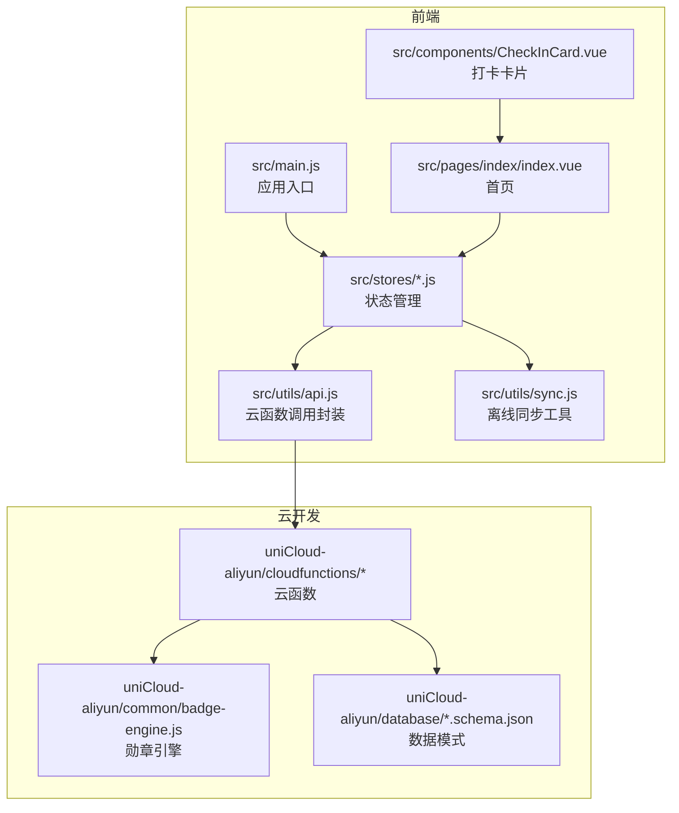
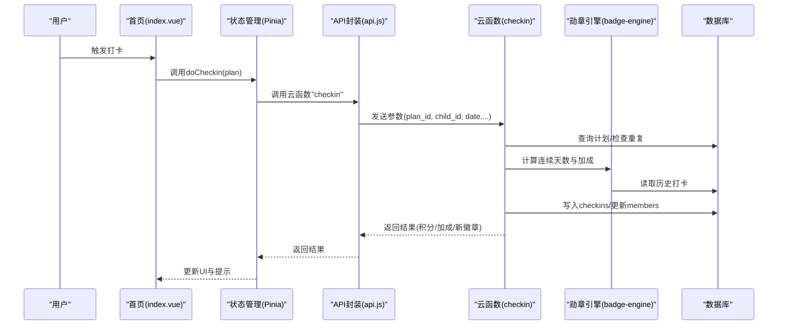
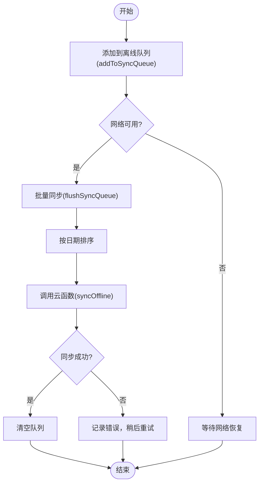
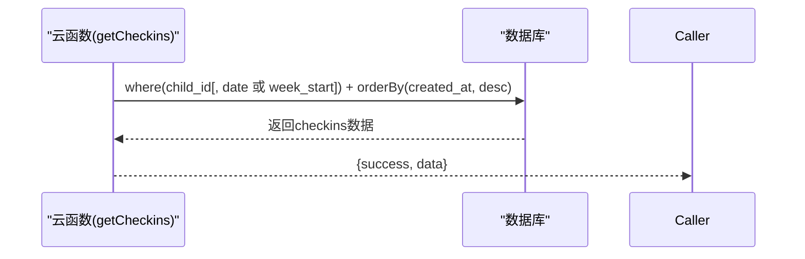
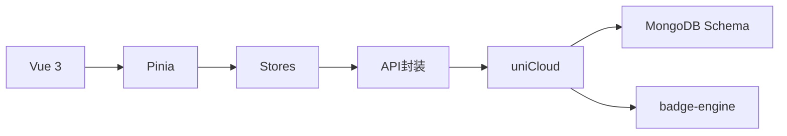
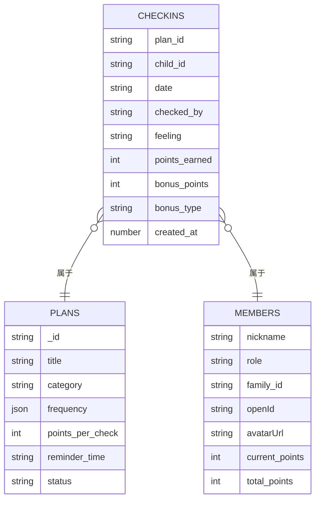

# 性能优化与监控

<cite>
**本文引用的文件**
- [package.json](file://package.json)
- [vite.config.ts](file://vite.config.ts)
- [src/main.js](file://src/main.js)
- [src/utils/api.js](file://src/utils/api.js)
- [src/utils/sync.js](file://src/utils/sync.js)
- [src/stores/checkins.js](file://src/stores/checkins.js)
- [src/stores/plans.js](file://src/stores/plans.js)
- [src/stores/points.js](file://src/stores/points.js)
- [src/stores/offline.js](file://src/stores/offline.js)
- [src/pages/index/index.vue](file://src/pages/index/index.vue)
- [src/components/CheckInCard.vue](file://src/components/CheckInCard.vue)
- [uniCloud-aliyun/cloudfunctions/checkin/index.js](file://uniCloud-aliyun/cloudfunctions/checkin/index.js)
- [uniCloud-aliyun/cloudfunctions/getCheckins/index.js](file://uniCloud-aliyun/cloudfunctions/getCheckins/index.js)
- [uniCloud-aliyun/cloudfunctions/getPoints/index.js](file://uniCloud-aliyun/cloudfunctions/getPoints/index.js)
- [uniCloud-aliyun/common/badge-engine.js](file://uniCloud-aliyun/common/badge-engine.js)
- [uniCloud-aliyun/database/checkins.schema.json](file://uniCloud-aliyun/database/checkins.schema.json)
- [uniCloud-aliyun/database/members.schema.json](file://uniCloud-aliyun/database/members.schema.json)
</cite>

## 目录
1. [简介](#简介)
2. [项目结构](#项目结构)
3. [核心组件](#核心组件)
4. [架构总览](#架构总览)
5. [详细组件分析](#详细组件分析)
6. [依赖关系分析](#依赖关系分析)
7. [性能考虑](#性能考虑)
8. [故障排查指南](#故障排查指南)
9. [结论](#结论)
10. [附录](#附录)

## 简介
本文件面向Star Grow项目，提供系统级性能优化与监控方案。内容覆盖前端与云开发两端：前端包括组件渲染、状态管理、离线同步与网络请求；后端聚焦云函数与数据库查询优化、索引策略与并发控制。文档同时给出性能监控指标、告警机制、基准测试与回归测试流程，帮助团队建立持续的性能治理能力。

## 项目结构
项目采用UniApp多端统一框架，前端使用Vue 3 + Pinia，云开发使用uniCloud（阿里云）。前端通过云函数进行数据访问，状态管理集中在Pinia Store中，页面组件负责UI与交互，离线同步通过本地存储与批量同步队列实现。

图表来源
- [src/main.js:1-11](file://src/main.js#L1-L11)
- [src/utils/api.js:1-18](file://src/utils/api.js#L1-L18)
- [src/utils/sync.js:1-96](file://src/utils/sync.js#L1-L96)
- [src/stores/checkins.js:1-163](file://src/stores/checkins.js#L1-L163)
- [src/stores/plans.js:1-73](file://src/stores/plans.js#L1-L73)
- [src/stores/points.js:1-44](file://src/stores/points.js#L1-L44)
- [src/pages/index/index.vue:1-204](file://src/pages/index/index.vue#L1-L204)
- [src/components/CheckInCard.vue:1-67](file://src/components/CheckInCard.vue#L1-L67)
- [uniCloud-aliyun/cloudfunctions/checkin/index.js:1-83](file://uniCloud-aliyun/cloudfunctions/checkin/index.js#L1-L83)
- [uniCloud-aliyun/common/badge-engine.js:1-125](file://uniCloud-aliyun/common/badge-engine.js#L1-L125)
- [uniCloud-aliyun/database/checkins.schema.json:1-52](file://uniCloud-aliyun/database/checkins.schema.json#L1-L52)
- [uniCloud-aliyun/database/members.schema.json:1-46](file://uniCloud-aliyun/database/members.schema.json#L1-L46)

章节来源
- [package.json:1-74](file://package.json#L1-L74)
- [vite.config.ts:1-8](file://vite.config.ts#L1-L8)
- [src/main.js:1-11](file://src/main.js#L1-L11)

## 核心组件
- 应用入口与状态管理：应用在入口处初始化SSR应用与Pinia；页面通过组合式API与Store交互。
- 云函数调用封装：统一封装uniCloud.callFunction调用，集中错误处理与结果包装。
- 状态管理：计划、积分、打卡、离线队列等均通过Pinia Store管理，支持本地缓存与持久化。
- 离线同步：提供添加到队列、智能同步、批量同步与网络状态检测，保证弱网体验。
- 页面与组件：首页聚合今日任务、进度与离线提示；打卡卡片组件承担交互与样式。

章节来源
- [src/main.js:1-11](file://src/main.js#L1-L11)
- [src/utils/api.js:1-18](file://src/utils/api.js#L1-L18)
- [src/stores/plans.js:1-73](file://src/stores/plans.js#L1-L73)
- [src/stores/points.js:1-44](file://src/stores/points.js#L1-L44)
- [src/stores/checkins.js:1-163](file://src/stores/checkins.js#L1-L163)
- [src/stores/offline.js:1-30](file://src/stores/offline.js#L1-L30)
- [src/utils/sync.js:1-96](file://src/utils/sync.js#L1-L96)
- [src/pages/index/index.vue:1-204](file://src/pages/index/index.vue#L1-L204)
- [src/components/CheckInCard.vue:1-67](file://src/components/CheckInCard.vue#L1-L67)

## 架构总览
前端通过云函数访问数据库，云函数内部调用勋章引擎计算连续打卡与奖励，最终返回给前端展示与状态更新。

图表来源
- [src/pages/index/index.vue:127-136](file://src/pages/index/index.vue#L127-L136)
- [src/stores/checkins.js:26-89](file://src/stores/checkins.js#L26-L89)
- [src/utils/api.js:9-17](file://src/utils/api.js#L9-L17)
- [uniCloud-aliyun/cloudfunctions/checkin/index.js:5-82](file://uniCloud-aliyun/cloudfunctions/checkin/index.js#L5-L82)
- [uniCloud-aliyun/common/badge-engine.js:7-31](file://uniCloud-aliyun/common/badge-engine.js#L7-L31)

## 详细组件分析

### 前端状态管理与离线同步
- 计划列表缓存：本地缓存计划列表，减少重复拉取；失败时回退至本地缓存。
- 打卡状态与本地缓存：当日打卡成功后写入本地缓存；失败或离线时入队，等待网络恢复后批量同步。
- 离线队列管理：暴露待同步数量与同步状态，避免重复同步与竞态。
- 积分状态：本地缓存当前与累计积分，减少频繁请求；历史记录截断保留最近N条。

图表来源
- [src/utils/sync.js:13-53](file://src/utils/sync.js#L13-L53)
- [src/stores/offline.js:14-26](file://src/stores/offline.js#L14-L26)

章节来源
- [src/stores/plans.js:10-28](file://src/stores/plans.js#L10-L28)
- [src/stores/checkins.js:14-24](file://src/stores/checkins.js#L14-L24)
- [src/stores/checkins.js:53-57](file://src/stores/checkins.js#L53-L57)
- [src/stores/checkins.js:77-88](file://src/stores/checkins.js#L77-L88)
- [src/stores/offline.js:6-29](file://src/stores/offline.js#L6-L29)
- [src/utils/sync.js:1-96](file://src/utils/sync.js#L1-L96)
- [src/stores/points.js:14-33](file://src/stores/points.js#L14-L33)

### 云函数与数据库查询
- 打卡云函数：先查计划与重复，再写入checkins，随后计算连续天数与加成，更新成员积分，并检查勋章。
- 获取打卡列表：按日期范围与排序查询checkins，支持按日期或周起始时间过滤。
- 获取积分：按成员ID读取members文档字段。
- 勋章引擎：计算连续天数、自打卡、心情记录员、全类别覆盖等条件，颁发新徽章。

图表来源
- [uniCloud-aliyun/cloudfunctions/getCheckins/index.js:4-18](file://uniCloud-aliyun/cloudfunctions/getCheckins/index.js#L4-L18)

章节来源
- [uniCloud-aliyun/cloudfunctions/checkin/index.js:5-82](file://uniCloud-aliyun/cloudfunctions/checkin/index.js#L5-L82)
- [uniCloud-aliyun/cloudfunctions/getCheckins/index.js:4-18](file://uniCloud-aliyun/cloudfunctions/getCheckins/index.js#L4-L18)
- [uniCloud-aliyun/cloudfunctions/getPoints/index.js:4-17](file://uniCloud-aliyun/cloudfunctions/getPoints/index.js#L4-L17)
- [uniCloud-aliyun/common/badge-engine.js:52-122](file://uniCloud-aliyun/common/badge-engine.js#L52-L122)

### 页面与组件
- 首页：加载计划、获取当日打卡、计算连续天数、显示离线提示与积分；支持一键同步。
- 打卡卡片：根据是否已打卡切换按钮样式；点击触发父组件事件。

章节来源
- [src/pages/index/index.vue:109-125](file://src/pages/index/index.vue#L109-L125)
- [src/pages/index/index.vue:127-136](file://src/pages/index/index.vue#L127-L136)
- [src/components/CheckInCard.vue:36-42](file://src/components/CheckInCard.vue#L36-L42)

## 依赖关系分析
- 前端依赖：Vue 3、Pinia、uView Plus、uni-app生态；构建工具Vite配合@dcloudio/vite-plugin-uni。
- 状态管理依赖：Pinia Store之间通过共享函数与API封装解耦。
- 云函数依赖：依赖uniCloud数据库与公共模块badge-engine；数据库模式定义字段类型与权限。

图表来源
- [package.json:39-59](file://package.json#L39-L59)
- [vite.config.ts:5-7](file://vite.config.ts#L5-L7)
- [src/stores/checkins.js:4](file://src/stores/checkins.js#L4)
- [src/utils/api.js:11](file://src/utils/api.js#L11)
- [uniCloud-aliyun/common/badge-engine.js:2](file://uniCloud-aliyun/common/badge-engine.js#L2)

章节来源
- [package.json:1-74](file://package.json#L1-L74)
- [vite.config.ts:1-8](file://vite.config.ts#L1-L8)

## 性能考虑

### 前端性能优化
- 组件渲染与懒加载
  - 将非首屏组件延迟加载，减少首屏渲染压力；对列表项组件使用虚拟滚动（如需）降低DOM数量。
  - 对图片资源使用WebP格式与按需加载，避免大图阻塞。
- 状态管理与缓存
  - 计划列表与积分数据本地缓存，减少网络请求；对历史记录做截断，避免无限增长。
  - 使用computed与浅层响应式避免不必要的重渲染。
- 网络请求优化
  - 统一错误处理与重试策略；对高频请求合并或节流。
  - 使用智能同步：仅在网络可用且存在待同步数据时执行批量同步，降低无效调用。
- UI交互
  - 打卡卡片按钮使用过渡动画与轻量阴影，避免复杂滤镜影响帧率。
  - 首页进度条与徽章展示使用简单样式，减少重绘。

### 云函数与数据库优化
- 查询优化
  - 在checkins集合上建立复合索引：child_id + date，用于按日期快速检索与去重。
  - 在checkins集合上建立索引：plan_id + child_id + date，用于重复检查与统计。
  - 在members集合上为family_id建立索引，用于计划/报告查询。
- 写入优化
  - 批量同步时按日期排序，减少热点写入；避免同一计划同一天重复写入。
  - 使用原子更新命令（如累加）减少读写竞争。
- 并发与超时
  - 云函数内存与超时合理配置，避免长事务导致超时；对复杂计算拆分为多个云函数。
- 勋章计算
  - 勋章引擎涉及多次查询，建议对近期记录限制查询范围（如最近35条），并在数据库侧增加相应索引。

### 缓存策略
- 前端缓存
  - 计划列表与积分短期缓存；离线队列持久化，确保重启后可继续同步。
- 数据库缓存
  - 对高频统计接口（如周报）增加物化视图或定期聚合任务，减少实时查询成本。

### 监控指标与告警
- 指标
  - 前端：首屏渲染时间、交互响应时间、离线同步成功率、缓存命中率。
  - 云函数：平均/95分位耗时、错误率、超时次数、数据库查询耗时分布。
  - 数据库：索引命中率、慢查询数量、连接池使用率。
- 告警
  - 设置阈值告警：云函数耗时超过阈值、错误率上升、数据库慢查询增多。
  - 周期性报表：生成每日/每周性能报告，追踪趋势。

### 性能测试与基准测试
- 基准测试
  - 使用Vite构建生产包，模拟真实设备运行环境，测量首屏渲染与交互延迟。
  - 对云函数进行压测：构造高并发打卡场景，观察超时与错误率。
- 回归测试
  - 将关键页面与功能加入自动化测试，每次发布前运行性能回归用例。
  - 对离线同步路径进行端到端验证，确保数据一致性。

### 持续监控最佳实践
- 前端埋点：在关键路径（页面进入、API调用、离线同步）埋点，采集耗时与错误。
- 云函数指标：开启平台自带的云函数监控面板，关注冷启动与并发峰值。
- 数据库优化：定期分析慢查询日志，补充缺失索引；对热点表进行分片或读写分离。

## 故障排查指南
- API调用失败
  - 检查云函数返回结构与错误包装；确认网络状态与重试策略。
- 打卡重复
  - 核对数据库索引与查询条件，确保按child_id+date+plan_id的唯一性约束生效。
- 离线同步失败
  - 查看离线队列长度与网络状态；检查批量同步返回的错误信息并定位具体记录。
- 积分不一致
  - 对比members表与checkins表的更新逻辑，确认原子更新命令使用正确。

章节来源
- [src/utils/api.js:9-17](file://src/utils/api.js#L9-L17)
- [src/stores/checkins.js:14-24](file://src/stores/checkins.js#L14-L24)
- [src/stores/checkins.js:77-88](file://src/stores/checkins.js#L77-L88)
- [src/utils/sync.js:25-53](file://src/utils/sync.js#L25-L53)

## 结论
通过前端缓存与离线同步、云函数与数据库索引优化、完善的监控与告警体系，以及持续的性能测试与回归流程，Star Grow可在弱网与高并发场景下保持稳定与流畅的用户体验。建议优先完善数据库索引与云函数超时配置，随后逐步引入前端性能埋点与自动化回归测试，形成闭环的性能治理体系。

## 附录

### 数据模型概览

图表来源
- [uniCloud-aliyun/database/checkins.schema.json:10-50](file://uniCloud-aliyun/database/checkins.schema.json#L10-L50)
- [uniCloud-aliyun/database/members.schema.json:10-43](file://uniCloud-aliyun/database/members.schema.json#L10-L43)