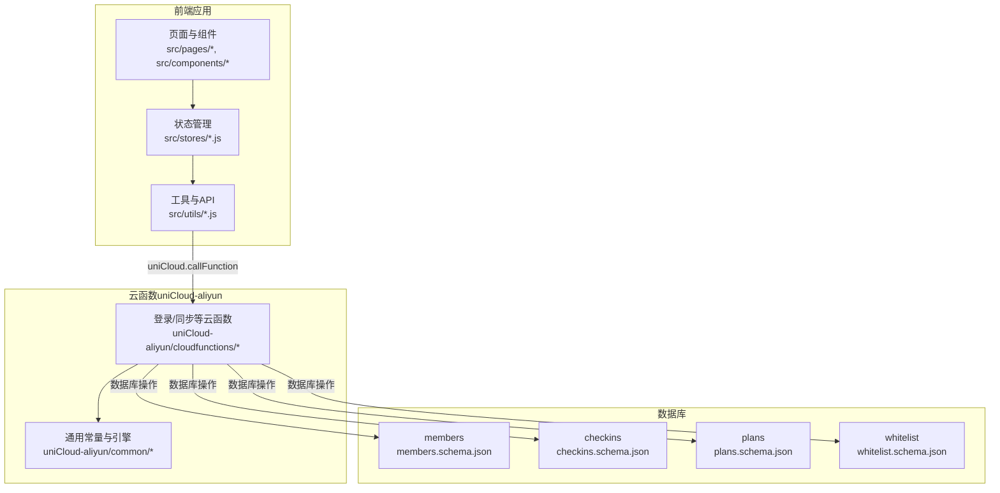
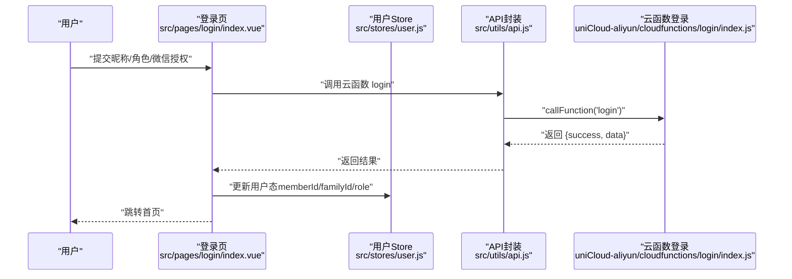
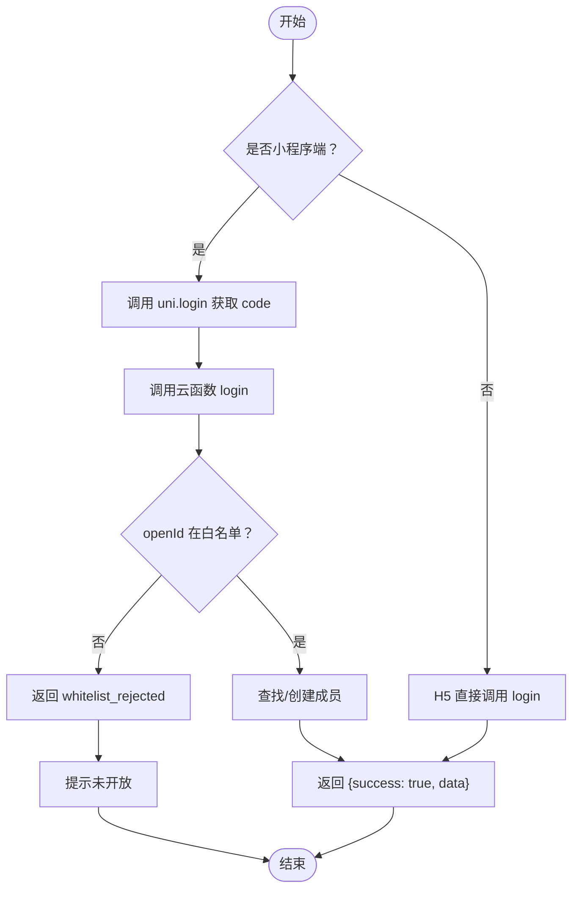
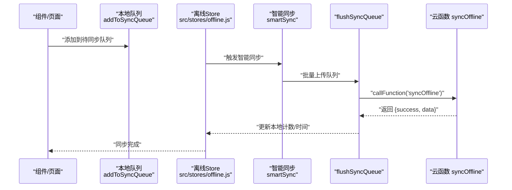
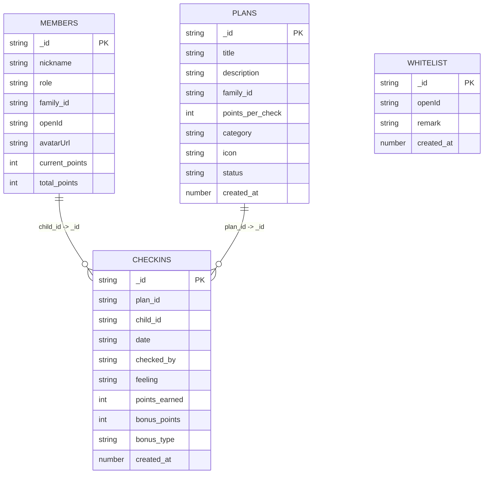
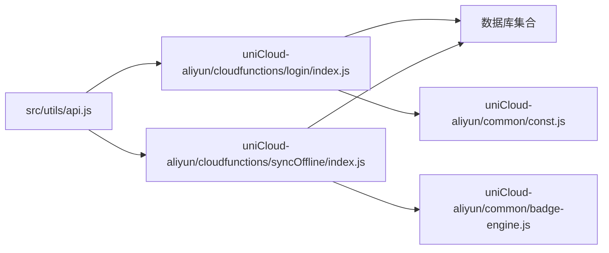
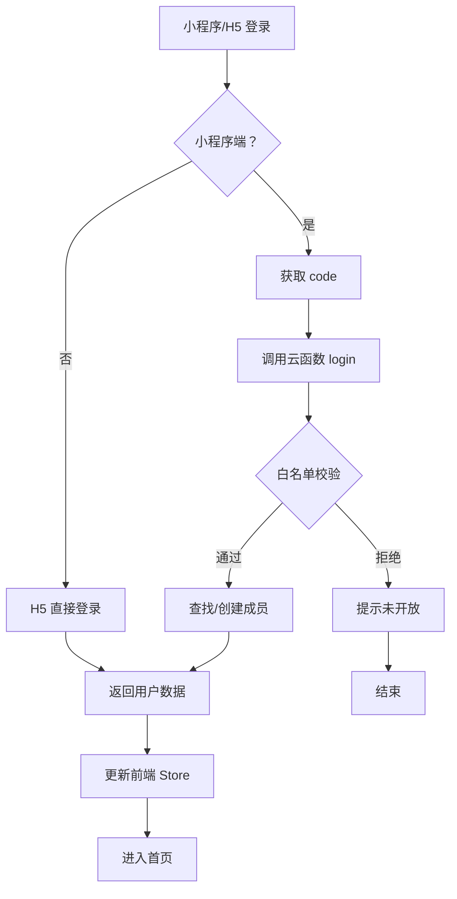
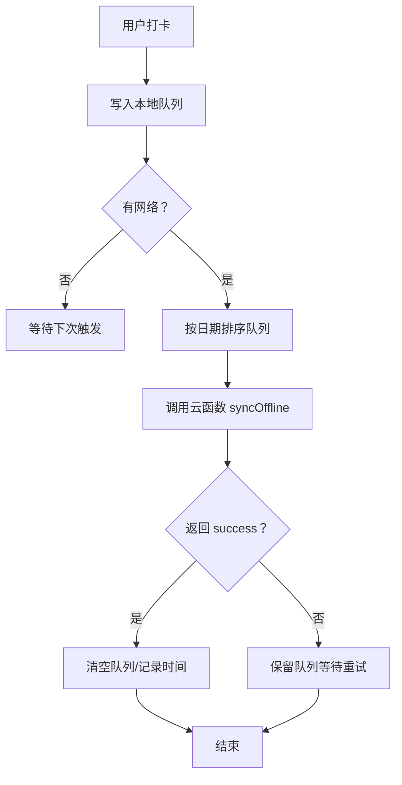

# 故障排除与维护

<cite>
**本文引用的文件**
- [src/main.js](file://src/main.js)
- [src/utils/api.js](file://src/utils/api.js)
- [src/utils/sync.js](file://src/utils/sync.js)
- [src/stores/offline.js](file://src/stores/offline.js)
- [src/pages/login/index.vue](file://src/pages/login/index.vue)
- [src/stores/user.js](file://src/stores/user.js)
- [src/cloudfunctions/login/index.js](file://src/cloudfunctions/login/index.js)
- [src/cloudfunctions/syncOffline/index.js](file://src/cloudfunctions/syncOffline/index.js)
- [uniCloud-aliyun/cloudfunctions/login/index.js](file://uniCloud-aliyun/cloudfunctions/login/index.js)
- [uniCloud-aliyun/cloudfunctions/syncOffline/index.js](file://uniCloud-aliyun/cloudfunctions/syncOffline/index.js)
- [uniCloud-aliyun/common/const.js](file://uniCloud-aliyun/common/const.js)
- [uniCloud-aliyun/common/badge-engine.js](file://uniCloud-aliyun/common/badge-engine.js)
- [uniCloud-aliyun/database/members.schema.json](file://uniCloud-aliyun/database/members.schema.json)
- [uniCloud-aliyun/database/checkins.schema.json](file://uniCloud-aliyun/database/checkins.schema.json)
- [uniCloud-aliyun/database/plans.schema.json](file://uniCloud-aliyun/database/plans.schema.json)
- [uniCloud-aliyun/database/whitelist.schema.json](file://uniCloud-aliyun/database/whitelist.schema.json)
- [package.json](file://package.json)
</cite>

## 目录
1. [简介](#简介)
2. [项目结构](#项目结构)
3. [核心组件](#核心组件)
4. [架构总览](#架构总览)
5. [详细组件分析](#详细组件分析)
6. [依赖关系分析](#依赖关系分析)
7. [性能考虑](#性能考虑)
8. [故障排除指南](#故障排除指南)
9. [结论](#结论)
10. [附录](#附录)

## 简介
本文件面向 Star Grow 项目的运维与开发团队，提供系统化的故障排除与维护指南。内容覆盖登录失败、数据同步异常、API 调用错误、离线模式故障与数据恢复、数据库连接异常与云函数执行错误、版本升级与兼容性、紧急故障应急响应与回滚策略、性能识别与优化、维护窗口与变更管理最佳实践，以及用户反馈处理与问题追踪流程。

## 项目结构
项目采用前端与 uniCloud 分层架构：
- 前端（H5/小程序）：基于 Vue 3 + Pinia，通过 uniCloud 提供的云函数进行数据交互。
- 云函数（uniCloud-aliyun）：实现登录、同步、查询等业务逻辑，并与数据库 schema 对接。
- 数据库 schema：定义集合字段与权限，保障数据一致性与访问控制。

图表来源
- [src/main.js:1-11](file://src/main.js#L1-L11)
- [src/utils/api.js:1-18](file://src/utils/api.js#L1-L18)
- [src/utils/sync.js:1-96](file://src/utils/sync.js#L1-L96)
- [uniCloud-aliyun/cloudfunctions/login/index.js:1-103](file://uniCloud-aliyun/cloudfunctions/login/index.js#L1-L103)
- [uniCloud-aliyun/cloudfunctions/syncOffline/index.js:1-90](file://uniCloud-aliyun/cloudfunctions/syncOffline/index.js#L1-L90)
- [uniCloud-aliyun/common/const.js:1-27](file://uniCloud-aliyun/common/const.js#L1-L27)
- [uniCloud-aliyun/common/badge-engine.js:1-125](file://uniCloud-aliyun/common/badge-engine.js#L1-L125)
- [uniCloud-aliyun/database/members.schema.json:1-46](file://uniCloud-aliyun/database/members.schema.json#L1-L46)
- [uniCloud-aliyun/database/checkins.schema.json:1-52](file://uniCloud-aliyun/database/checkins.schema.json#L1-L52)
- [uniCloud-aliyun/database/plans.schema.json:1-50](file://uniCloud-aliyun/database/plans.schema.json#L1-L50)
- [uniCloud-aliyun/database/whitelist.schema.json:1-28](file://uniCloud-aliyun/database/whitelist.schema.json#L1-L28)

章节来源
- [src/main.js:1-11](file://src/main.js#L1-L11)
- [package.json:1-74](file://package.json#L1-L74)

## 核心组件
- 应用入口与状态：应用通过入口初始化 Vue 与 Pinia；用户状态通过 Pinia store 管理。
- API 封装：统一调用云函数，集中处理错误与返回格式。
- 离线同步：本地存储队列 + 智能同步策略，幂等处理云端冲突。
- 登录流程：微信登录（小程序端）与普通登录（H5 端），白名单校验与成员创建。
- 云函数：登录、离线同步、查询等核心业务逻辑。
- 数据模型：成员、打卡、计划、白名单等集合的 schema 定义。

章节来源
- [src/main.js:1-11](file://src/main.js#L1-L11)
- [src/stores/user.js:1-119](file://src/stores/user.js#L1-L119)
- [src/utils/api.js:1-18](file://src/utils/api.js#L1-L18)
- [src/utils/sync.js:1-96](file://src/utils/sync.js#L1-L96)
- [src/stores/offline.js:1-30](file://src/stores/offline.js#L1-L30)
- [src/pages/login/index.vue:1-289](file://src/pages/login/index.vue#L1-L289)
- [uniCloud-aliyun/cloudfunctions/login/index.js:1-103](file://uniCloud-aliyun/cloudfunctions/login/index.js#L1-L103)
- [uniCloud-aliyun/cloudfunctions/syncOffline/index.js:1-90](file://uniCloud-aliyun/cloudfunctions/syncOffline/index.js#L1-L90)
- [uniCloud-aliyun/database/members.schema.json:1-46](file://uniCloud-aliyun/database/members.schema.json#L1-L46)
- [uniCloud-aliyun/database/checkins.schema.json:1-52](file://uniCloud-aliyun/database/checkins.schema.json#L1-L52)
- [uniCloud-aliyun/database/plans.schema.json:1-50](file://uniCloud-aliyun/database/plans.schema.json#L1-L50)
- [uniCloud-aliyun/database/whitelist.schema.json:1-28](file://uniCloud-aliyun/database/whitelist.schema.json#L1-L28)

## 架构总览
前端通过 uniCloud 的云函数访问数据库，登录与同步是两条关键链路。登录链路包含白名单校验与成员创建；同步链路包含本地队列与云端幂等写入。

图表来源
- [src/pages/login/index.vue:164-230](file://src/pages/login/index.vue#L164-L230)
- [src/stores/user.js:23-53](file://src/stores/user.js#L23-L53)
- [src/utils/api.js:9-17](file://src/utils/api.js#L9-L17)
- [uniCloud-aliyun/cloudfunctions/login/index.js:6-102](file://uniCloud-aliyun/cloudfunctions/login/index.js#L6-L102)

## 详细组件分析

### 组件一：登录与白名单校验
- 小程序端：通过 uni.login 获取 code，调用云函数登录，云端使用 uni-id-co 或 jscode2session 获取 openId，并校验白名单。
- H5 端：直接调用云函数登录，云端根据传入的 memberId 更新或创建成员。
- 白名单拒绝：返回特定错误标识，前端弹窗提示“暂未开放”。

图表来源
- [src/pages/login/index.vue:136-230](file://src/pages/login/index.vue#L136-L230)
- [uniCloud-aliyun/cloudfunctions/login/index.js:6-102](file://uniCloud-aliyun/cloudfunctions/login/index.js#L6-L102)
- [uniCloud-aliyun/common/const.js:20-24](file://uniCloud-aliyun/common/const.js#L20-L24)

章节来源
- [src/pages/login/index.vue:102-230](file://src/pages/login/index.vue#L102-L230)
- [uniCloud-aliyun/cloudfunctions/login/index.js:6-102](file://uniCloud-aliyun/cloudfunctions/login/index.js#L6-L102)
- [uniCloud-aliyun/common/const.js:19-27](file://uniCloud-aliyun/common/const.js#L19-L27)

### 组件二：离线同步与幂等写入
- 本地队列：每次打卡写入本地 Storage，避免阻塞。
- 智能同步：应用前后台切换或启动时检测网络与待同步数量，按日期排序后批量调用云函数。
- 幂等策略：云端按 plan_id+date 去重，已存在则跳过；成功后清空队列并记录最后同步时间。

图表来源
- [src/utils/sync.js:13-53](file://src/utils/sync.js#L13-L53)
- [src/utils/sync.js:84-95](file://src/utils/sync.js#L84-L95)
- [src/stores/offline.js:14-26](file://src/stores/offline.js#L14-L26)
- [uniCloud-aliyun/cloudfunctions/syncOffline/index.js:5-89](file://uniCloud-aliyun/cloudfunctions/syncOffline/index.js#L5-L89)

章节来源
- [src/utils/sync.js:1-96](file://src/utils/sync.js#L1-L96)
- [src/stores/offline.js:1-30](file://src/stores/offline.js#L1-L30)
- [uniCloud-aliyun/cloudfunctions/syncOffline/index.js:1-90](file://uniCloud-aliyun/cloudfunctions/syncOffline/index.js#L1-L90)

### 组件三：数据模型与权限
- members：成员信息，含 openId、头像、积分等。
- checkins：打卡记录，含计划、日期、打卡人、积分等。
- plans：计划信息，含分类、积分、状态等。
- whitelist：白名单，限制可登录 openId。

图表来源
- [uniCloud-aliyun/database/members.schema.json:1-46](file://uniCloud-aliyun/database/members.schema.json#L1-L46)
- [uniCloud-aliyun/database/checkins.schema.json:1-52](file://uniCloud-aliyun/database/checkins.schema.json#L1-L52)
- [uniCloud-aliyun/database/plans.schema.json:1-50](file://uniCloud-aliyun/database/plans.schema.json#L1-L50)
- [uniCloud-aliyun/database/whitelist.schema.json:1-28](file://uniCloud-aliyun/database/whitelist.schema.json#L1-L28)

## 依赖关系分析
- 前端依赖 uniCloud 的云函数能力；API 封装统一了错误处理。
- 云函数依赖 uni-id-co 与数据库；白名单与勋章引擎为通用模块。
- 数据库 schema 作为契约约束字段与权限。

图表来源
- [src/utils/api.js:9-17](file://src/utils/api.js#L9-L17)
- [uniCloud-aliyun/cloudfunctions/login/index.js:6-102](file://uniCloud-aliyun/cloudfunctions/login/index.js#L6-L102)
- [uniCloud-aliyun/cloudfunctions/syncOffline/index.js:5-89](file://uniCloud-aliyun/cloudfunctions/syncOffline/index.js#L5-L89)
- [uniCloud-aliyun/common/const.js:19-27](file://uniCloud-aliyun/common/const.js#L19-L27)
- [uniCloud-aliyun/common/badge-engine.js:1-125](file://uniCloud-aliyun/common/badge-engine.js#L1-L125)

章节来源
- [src/utils/api.js:1-18](file://src/utils/api.js#L1-L18)
- [uniCloud-aliyun/cloudfunctions/login/index.js:1-103](file://uniCloud-aliyun/cloudfunctions/login/index.js#L1-L103)
- [uniCloud-aliyun/cloudfunctions/syncOffline/index.js:1-90](file://uniCloud-aliyun/cloudfunctions/syncOffline/index.js#L1-L90)
- [uniCloud-aliyun/common/const.js:1-27](file://uniCloud-aliyun/common/const.js#L1-L27)
- [uniCloud-aliyun/common/badge-engine.js:1-125](file://uniCloud-aliyun/common/badge-engine.js#L1-L125)

## 性能考虑
- 离线优先：本地写入不阻塞 UI，减少首屏等待。
- 批量上传：按日期排序后批量同步，降低请求次数。
- 幂等写入：云端去重，避免重复积分与重复记录。
- 网络感知：无网络时跳过同步，减少无效调用。
- 勋章计算：按需查询与聚合，避免全表扫描。

章节来源
- [src/utils/sync.js:3-6](file://src/utils/sync.js#L3-L6)
- [src/utils/sync.js:32-35](file://src/utils/sync.js#L32-L35)
- [src/utils/sync.js:84-95](file://src/utils/sync.js#L84-L95)
- [uniCloud-aliyun/cloudfunctions/syncOffline/index.js:19-57](file://uniCloud-aliyun/cloudfunctions/syncOffline/index.js#L19-L57)

## 故障排除指南

### 一、登录失败
- 症状
  - 小程序端：无法获取 code、登录失败、提示“暂未开放”。
  - H5 端：登录后无用户态或积分未更新。
- 排查步骤
  - 检查前端日志与 toast 提示，定位具体阶段。
  - 核对云函数登录逻辑：微信 code 获取、openId 获取、白名单校验、成员创建/更新。
  - 若返回“whitelist_rejected”，确认 whitelist 中是否存在对应 openId。
  - 若 H5 端登录后无态，检查前端 store 是否持久化 memberId/familyId。
- 解决方案
  - 补充 uni-id-co 配置或启用 jscode2session 备选路径。
  - 在 whitelist 中添加 openId 或临时关闭白名单校验进行测试。
  - 确保前端收到云端返回的完整用户数据后再更新 store。

章节来源
- [src/pages/login/index.vue:136-230](file://src/pages/login/index.vue#L136-L230)
- [uniCloud-aliyun/cloudfunctions/login/index.js:12-56](file://uniCloud-aliyun/cloudfunctions/login/index.js#L12-L56)
- [uniCloud-aliyun/common/const.js:20-24](file://uniCloud-aliyun/common/const.js#L20-L24)
- [src/stores/user.js:23-53](file://src/stores/user.js#L23-L53)

### 二、数据同步异常
- 症状
  - 离线打卡后未同步到云端，待同步计数不降为 0。
  - 同步后出现重复记录或积分异常。
- 排查步骤
  - 检查本地队列是否正确写入与去重。
  - 检查网络类型判断与智能同步触发条件。
  - 查看云函数 syncOffline 的去重逻辑与返回数据。
  - 核对 checkins 集合字段与幂等键（plan_id+child_id+date）。
- 解决方案
  - 修复本地队列去重逻辑（按 plan_id+date 判断）。
  - 确保 flushSyncQueue 成功后清空队列并记录最后同步时间。
  - 如出现重复，先在云端清理重复记录，再重试同步。

章节来源
- [src/utils/sync.js:13-20](file://src/utils/sync.js#L13-L20)
- [src/utils/sync.js:25-53](file://src/utils/sync.js#L25-L53)
- [src/utils/sync.js:84-95](file://src/utils/sync.js#L84-L95)
- [uniCloud-aliyun/cloudfunctions/syncOffline/index.js:19-57](file://uniCloud-aliyun/cloudfunctions/syncOffline/index.js#L19-L57)
- [uniCloud-aliyun/database/checkins.schema.json:14-25](file://uniCloud-aliyun/database/checkins.schema.json#L14-L25)

### 三、API 调用错误
- 症状
  - 调用云函数报错或返回 {success: false}。
- 排查步骤
  - 检查 callFunction 的错误捕获与返回格式。
  - 核对云函数名称与参数结构。
  - 查看云函数日志与数据库访问权限。
- 解决方案
  - 在前端统一处理 {success: false} 场景并提示用户。
  - 修复云函数内部异常分支，确保返回标准结构。

章节来源
- [src/utils/api.js:9-17](file://src/utils/api.js#L9-L17)
- [uniCloud-aliyun/cloudfunctions/login/index.js:6-102](file://uniCloud-aliyun/cloudfunctions/login/index.js#L6-L102)
- [uniCloud-aliyun/cloudfunctions/syncOffline/index.js:5-17](file://uniCloud-aliyun/cloudfunctions/syncOffline/index.js#L5-L17)

### 四、离线模式下的故障处理与数据恢复
- 故障场景
  - 无网络导致无法同步；应用重启后仍存在待同步队列。
- 处理策略
  - 智能同步仅在网络可用时触发；待同步队列持久化于本地存储。
  - 同步完成后清空队列并记录最后同步时间；若失败保留队列以便重试。
  - 如出现大量重复记录，建议在云端按幂等键清理后重试。

章节来源
- [src/utils/sync.js:72-79](file://src/utils/sync.js#L72-L79)
- [src/utils/sync.js:84-95](file://src/utils/sync.js#L84-L95)
- [src/stores/offline.js:14-26](file://src/stores/offline.js#L14-L26)

### 五、数据库连接异常与云函数执行错误
- 症状
  - 云函数调用数据库失败；返回超时或权限不足。
- 排查步骤
  - 检查数据库集合权限与字段定义。
  - 核对云函数中数据库操作是否包含必要字段与索引。
  - 查看数据库慢查询与并发写入情况。
- 解决方案
  - 为常用查询字段建立索引（如 checkins 的 plan_id+date+child_id）。
  - 优化批量写入事务，避免长事务锁表。
  - 在云函数中增加更详细的错误日志与重试机制。

章节来源
- [uniCloud-aliyun/database/checkins.schema.json:14-25](file://uniCloud-aliyun/database/checkins.schema.json#L14-L25)
- [uniCloud-aliyun/cloudfunctions/syncOffline/index.js:19-57](file://uniCloud-aliyun/cloudfunctions/syncOffline/index.js#L19-L57)

### 六、版本升级与兼容性问题
- 建议
  - 升级前备份数据库与云函数代码。
  - 使用 package.json 中的构建脚本进行多平台预览与测试。
  - 对 schema 变更采用向后兼容策略，避免删除必填字段。
- 流程
  - 开发环境验证 → 预发布环境灰度 → 正式环境发布 → 回滚预案。

章节来源
- [package.json:4-37](file://package.json#L4-L37)

### 七、紧急故障应急响应与回滚策略
- 应急流程
  - 快速定位：查看前端与云函数日志，确认影响范围。
  - 降级措施：暂时关闭白名单校验、禁用部分功能或回退到上一个稳定版本。
  - 修复上线：修复后在预发布环境验证，再灰度发布。
  - 回滚策略：若修复失败，立即回滚至上一个稳定版本并通知用户。
- 回滚要点
  - 保持数据库 schema 与数据一致。
  - 回滚云函数与前端版本号一致。

章节来源
- [uniCloud-aliyun/common/const.js:20-24](file://uniCloud-aliyun/common/const.js#L20-L24)
- [src/pages/login/index.vue:181-193](file://src/pages/login/index.vue#L181-L193)

### 八、性能问题识别与优化
- 识别手段
  - 前端：监控同步耗时、网络类型变化频率。
  - 云函数：查看数据库查询耗时、写入吞吐。
- 优化建议
  - 批量写入分片、去重合并。
  - 云端缓存热点数据（如计划积分）。
  - 减少不必要的字段读取与排序。

章节来源
- [src/utils/sync.js:32-35](file://src/utils/sync.js#L32-L35)
- [uniCloud-aliyun/cloudfunctions/syncOffline/index.js:30-38](file://uniCloud-aliyun/cloudfunctions/syncOffline/index.js#L30-L38)

### 九、维护窗口与变更管理最佳实践
- 维护窗口
  - 选择低峰时段（夜间或周末）进行发布。
  - 提前通知用户维护计划与潜在影响。
- 变更管理
  - 所有变更必须有变更单与测试报告。
  - 引入灰度发布与自动回滚机制。

### 十、用户反馈处理与问题追踪
- 流程
  - 收集用户反馈与日志。
  - 分类问题（登录、同步、性能等）并分配责任人。
  - 跟踪修复进度并在修复后验证与关闭工单。
- 工具建议
  - 使用日志平台聚合前端与云函数日志。
  - 建立问题看板与自动化告警。

## 结论
本指南从架构、组件、数据模型与流程出发，提供了覆盖登录、同步、API、离线、数据库、版本与应急的全栈故障排除与维护方案。建议团队在日常运维中严格执行变更管理与回滚预案，持续优化性能与稳定性，保障用户体验。

## 附录

### A. 关键流程图汇总
- 登录流程（含白名单校验）

图表来源
- [src/pages/login/index.vue:136-230](file://src/pages/login/index.vue#L136-L230)
- [uniCloud-aliyun/cloudfunctions/login/index.js:12-56](file://uniCloud-aliyun/cloudfunctions/login/index.js#L12-L56)
- [uniCloud-aliyun/common/const.js:20-24](file://uniCloud-aliyun/common/const.js#L20-L24)

### B. 同步流程（离线队列与云端幂等）

图表来源
- [src/utils/sync.js:13-20](file://src/utils/sync.js#L13-L20)
- [src/utils/sync.js:25-53](file://src/utils/sync.js#L25-L53)
- [src/utils/sync.js:84-95](file://src/utils/sync.js#L84-L95)
- [uniCloud-aliyun/cloudfunctions/syncOffline/index.js:19-57](file://uniCloud-aliyun/cloudfunctions/syncOffline/index.js#L19-L57)