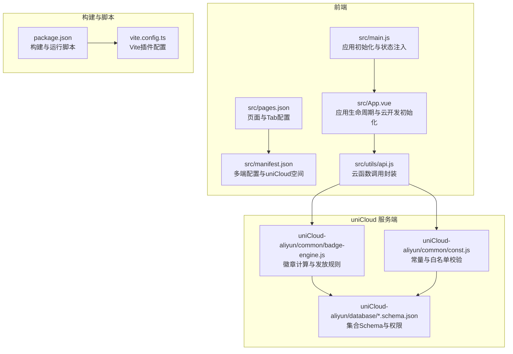
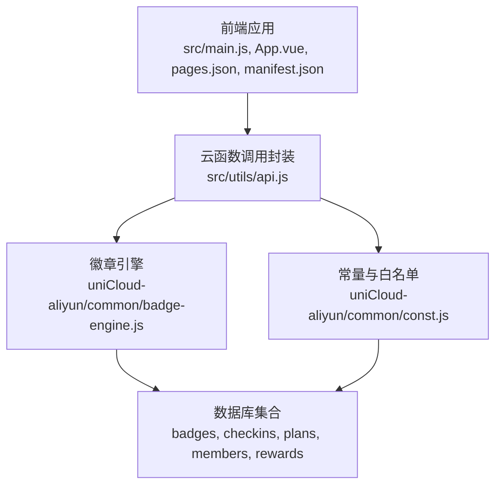
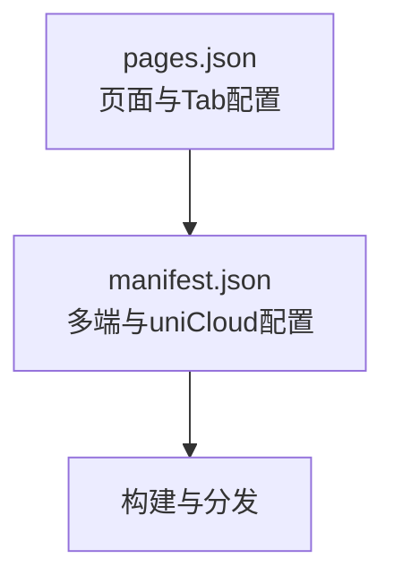
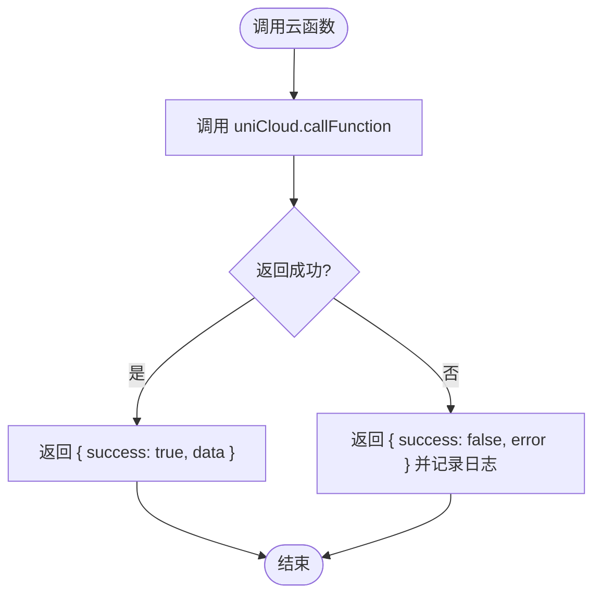
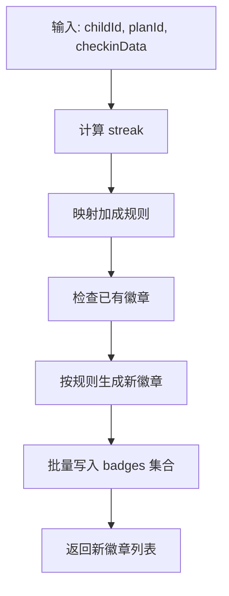
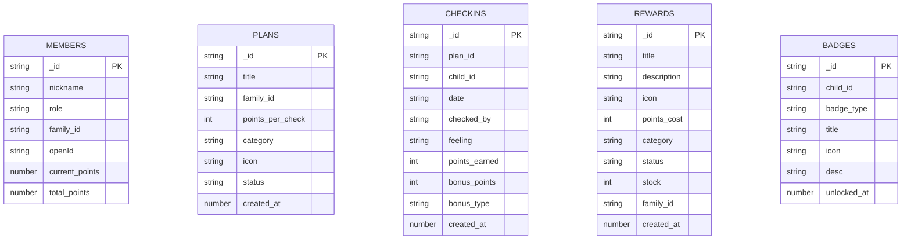
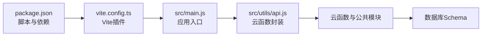

# 维护程序与变更管理

<cite>
**本文引用的文件**
- [package.json](file://package.json)
- [vite.config.ts](file://vite.config.ts)
- [src/main.js](file://src/main.js)
- [src/App.vue](file://src/App.vue)
- [src/manifest.json](file://src/manifest.json)
- [src/pages.json](file://src/pages.json)
- [src/utils/api.js](file://src/utils/api.js)
- [uniCloud-aliyun/common/badge-engine.js](file://uniCloud-aliyun/common/badge-engine.js)
- [uniCloud-aliyun/common/const.js](file://uniCloud-aliyun/common/const.js)
- [uniCloud-aliyun/database/badges.schema.json](file://uniCloud-aliyun/database/badges.schema.json)
- [uniCloud-aliyun/database/checkins.schema.json](file://uniCloud-aliyun/database/checkins.schema.json)
- [uniCloud-aliyun/database/plans.schema.json](file://uniCloud-aliyun/database/plans.schema.json)
- [uniCloud-aliyun/database/members.schema.json](file://uniCloud-aliyun/database/members.schema.json)
- [uniCloud-aliyun/database/rewards.schema.json](file://uniCloud-aliyun/database/rewards.schema.json)
</cite>

## 目录
1. [简介](#简介)
2. [项目结构](#项目结构)
3. [核心组件](#核心组件)
4. [架构总览](#架构总览)
5. [详细组件分析](#详细组件分析)
6. [依赖关系分析](#依赖关系分析)
7. [性能考虑](#性能考虑)
8. [故障排查指南](#故障排查指南)
9. [结论](#结论)
10. [附录](#附录)

## 简介
本文件面向 Star Grow 项目的运维与产品团队，提供一套可落地的“维护程序与变更管理”规范，覆盖日常维护任务、安全更新、配置变更、版本升级流程、审批与回滚策略、维护窗口规划、配置与环境管理、发布管理、审计与日志要求，以及维护人员培训与知识传承方案。文档基于仓库现有源码与配置进行分析与提炼，确保流程与实现一致。

## 项目结构
项目采用 UniApp 多端统一框架，前端通过 Vite 构建，后端使用 uniCloud 阿里云版作为云开发平台，数据库采用集合 Schema 约束。整体结构分为：
- 前端源码：页面、组件、工具、状态管理入口、全局配置与页面路由
- 云函数与公共逻辑：业务规则引擎、常量与权限控制
- 数据库 Schema：定义集合字段、权限与默认值



图表来源
- [src/main.js:1-11](file://src/main.js#L1-L11)
- [src/App.vue:1-64](file://src/App.vue#L1-L64)
- [src/pages.json:1-56](file://src/pages.json#L1-L56)
- [src/manifest.json:1-78](file://src/manifest.json#L1-L78)
- [src/utils/api.js:1-18](file://src/utils/api.js#L1-L18)
- [package.json:1-74](file://package.json#L1-L74)
- [vite.config.ts:1-8](file://vite.config.ts#L1-L8)
- [uniCloud-aliyun/common/badge-engine.js:1-125](file://uniCloud-aliyun/common/badge-engine.js#L1-L125)
- [uniCloud-aliyun/common/const.js:1-27](file://uniCloud-aliyun/common/const.js#L1-L27)
- [uniCloud-aliyun/database/badges.schema.json:1-40](file://uniCloud-aliyun/database/badges.schema.json#L1-L40)
- [uniCloud-aliyun/database/checkins.schema.json:1-52](file://uniCloud-aliyun/database/checkins.schema.json#L1-L52)
- [uniCloud-aliyun/database/plans.schema.json:1-50](file://uniCloud-aliyun/database/plans.schema.json#L1-L50)
- [uniCloud-aliyun/database/members.schema.json:1-46](file://uniCloud-aliyun/database/members.schema.json#L1-L46)
- [uniCloud-aliyun/database/rewards.schema.json:1-53](file://uniCloud-aliyun/database/rewards.schema.json#L1-L53)

章节来源
- [package.json:1-74](file://package.json#L1-L74)
- [vite.config.ts:1-8](file://vite.config.ts#L1-L8)
- [src/main.js:1-11](file://src/main.js#L1-L11)
- [src/App.vue:1-64](file://src/App.vue#L1-L64)
- [src/manifest.json:1-78](file://src/manifest.json#L1-L78)
- [src/pages.json:1-56](file://src/pages.json#L1-L56)
- [src/utils/api.js:1-18](file://src/utils/api.js#L1-L18)
- [uniCloud-aliyun/common/badge-engine.js:1-125](file://uniCloud-aliyun/common/badge-engine.js#L1-L125)
- [uniCloud-aliyun/common/const.js:1-27](file://uniCloud-aliyun/common/const.js#L1-L27)
- [uniCloud-aliyun/database/badges.schema.json:1-40](file://uniCloud-aliyun/database/badges.schema.json#L1-L40)
- [uniCloud-aliyun/database/checkins.schema.json:1-52](file://uniCloud-aliyun/database/checkins.schema.json#L1-L52)
- [uniCloud-aliyun/database/plans.schema.json:1-50](file://uniCloud-aliyun/database/plans.schema.json#L1-L50)
- [uniCloud-aliyun/database/members.schema.json:1-46](file://uniCloud-aliyun/database/members.schema.json#L1-L46)
- [uniCloud-aliyun/database/rewards.schema.json:1-53](file://uniCloud-aliyun/database/rewards.schema.json#L1-L53)

## 核心组件
- 应用初始化与状态注入：在应用启动时创建 SSR App 实例并挂载 Pinia，保证全局状态可用。
- 应用生命周期与云开发初始化：在应用启动时对微信小程序端进行云开发初始化，并在前台显示时触发离线数据同步。
- 页面与导航：通过 pages.json 统一管理页面路径、标题与 Tab 栏配置；manifest.json 定义多端配置与 uniCloud 空间信息。
- 云函数调用封装：通过 api.js 统一封装 uniCloud.callFunction 调用，返回标准化结果并处理错误。
- 徽章引擎与常量：badge-engine.js 提供连续打卡统计、加成计算与徽章发放逻辑；const.js 提供徽章定义、加成规则与白名单校验。
- 数据库 Schema：各集合定义字段、权限与默认值，保障数据一致性与访问控制。

章节来源
- [src/main.js:1-11](file://src/main.js#L1-L11)
- [src/App.vue:1-64](file://src/App.vue#L1-L64)
- [src/pages.json:1-56](file://src/pages.json#L1-L56)
- [src/manifest.json:1-78](file://src/manifest.json#L1-L78)
- [src/utils/api.js:1-18](file://src/utils/api.js#L1-L18)
- [uniCloud-aliyun/common/badge-engine.js:1-125](file://uniCloud-aliyun/common/badge-engine.js#L1-L125)
- [uniCloud-aliyun/common/const.js:1-27](file://uniCloud-aliyun/common/const.js#L1-L27)
- [uniCloud-aliyun/database/badges.schema.json:1-40](file://uniCloud-aliyun/database/badges.schema.json#L1-L40)
- [uniCloud-aliyun/database/checkins.schema.json:1-52](file://uniCloud-aliyun/database/checkins.schema.json#L1-L52)
- [uniCloud-aliyun/database/plans.schema.json:1-50](file://uniCloud-aliyun/database/plans.schema.json#L1-L50)
- [uniCloud-aliyun/database/members.schema.json:1-46](file://uniCloud-aliyun/database/members.schema.json#L1-L46)
- [uniCloud-aliyun/database/rewards.schema.json:1-53](file://uniCloud-aliyun/database/rewards.schema.json#L1-L53)

## 架构总览
前端通过 uniCloud 调用云函数，云函数读取/写入数据库集合，徽章引擎与常量模块提供业务规则与配置。构建阶段由 Vite 插件驱动，多端配置由 manifest.json 管理。



图表来源
- [src/main.js:1-11](file://src/main.js#L1-L11)
- [src/App.vue:1-64](file://src/App.vue#L1-L64)
- [src/pages.json:1-56](file://src/pages.json#L1-L56)
- [src/manifest.json:1-78](file://src/manifest.json#L1-L78)
- [src/utils/api.js:1-18](file://src/utils/api.js#L1-L18)
- [uniCloud-aliyun/common/badge-engine.js:1-125](file://uniCloud-aliyun/common/badge-engine.js#L1-L125)
- [uniCloud-aliyun/common/const.js:1-27](file://uniCloud-aliyun/common/const.js#L1-L27)
- [uniCloud-aliyun/database/badges.schema.json:1-40](file://uniCloud-aliyun/database/badges.schema.json#L1-L40)
- [uniCloud-aliyun/database/checkins.schema.json:1-52](file://uniCloud-aliyun/database/checkins.schema.json#L1-L52)
- [uniCloud-aliyun/database/plans.schema.json:1-50](file://uniCloud-aliyun/database/plans.schema.json#L1-L50)
- [uniCloud-aliyun/database/members.schema.json:1-46](file://uniCloud-aliyun/database/members.schema.json#L1-L46)
- [uniCloud-aliyun/database/rewards.schema.json:1-53](file://uniCloud-aliyun/database/rewards.schema.json#L1-L53)

## 详细组件分析

### 组件A：应用初始化与生命周期
- 初始化流程：创建 SSR App 实例，注入 Pinia，导出 { app }，确保全局状态可用。
- 生命周期：应用启动时初始化云开发（仅微信小程序端），前台显示时尝试同步离线数据。
- 维护要点：云开发环境 ID 配置需在部署前校验；离线同步逻辑需监控异常与重试。

```mermaid
sequenceDiagram
participant U as "用户"
participant APP as "App.vue"
participant PINIA as "Pinia"
participant OFF as "离线存储"
U->>APP : 打开应用
APP->>PINIA : 创建并注入状态
APP->>APP : 初始化云开发(微信小程序)
APP->>OFF : 读取待同步数量
APP->>OFF : 触发同步
OFF-->>APP : 同步结果
```

图表来源
- [src/App.vue:1-64](file://src/App.vue#L1-L64)
- [src/main.js:1-11](file://src/main.js#L1-L11)

章节来源
- [src/main.js:1-11](file://src/main.js#L1-L11)
- [src/App.vue:1-64](file://src/App.vue#L1-L64)

### 组件B：页面与导航配置
- 页面路由：通过 pages.json 统一声明页面路径与导航栏标题。
- Tab 栏：定义 Tab 列表、选中颜色与图标路径。
- 多端配置：manifest.json 中包含各小程序平台 appid、uniCloud 空间与分发配置。



图表来源
- [src/pages.json:1-56](file://src/pages.json#L1-L56)
- [src/manifest.json:1-78](file://src/manifest.json#L1-L78)

章节来源
- [src/pages.json:1-56](file://src/pages.json#L1-L56)
- [src/manifest.json:1-78](file://src/manifest.json#L1-L78)

### 组件C：云函数调用封装
- 功能：统一封装 uniCloud.callFunction，捕获异常并返回 { success, data } 结构。
- 维护要点：调用失败时记录错误信息，便于定位云函数与参数问题。



图表来源
- [src/utils/api.js:1-18](file://src/utils/api.js#L1-L18)

章节来源
- [src/utils/api.js:1-18](file://src/utils/api.js#L1-L18)

### 组件D：徽章引擎与常量
- 连续打卡统计：按日期序列计算 streak，支持今日/昨日边界判断。
- 加成计算：根据 streak 映射到加成点数与类型。
- 徽章发放：检查已有徽章，按规则生成新徽章并批量写入集合。
- 常量与白名单：集中管理徽章定义、加成规则与 openId 白名单查询。



图表来源
- [uniCloud-aliyun/common/badge-engine.js:1-125](file://uniCloud-aliyun/common/badge-engine.js#L1-L125)
- [uniCloud-aliyun/common/const.js:1-27](file://uniCloud-aliyun/common/const.js#L1-L27)

章节来源
- [uniCloud-aliyun/common/badge-engine.js:1-125](file://uniCloud-aliyun/common/badge-engine.js#L1-L125)
- [uniCloud-aliyun/common/const.js:1-27](file://uniCloud-aliyun/common/const.js#L1-L27)

### 组件E：数据库 Schema 与权限
- 集合字段：明确 bsonType、必填项、默认值与权限（读/写/删）。
- 权限控制：不同集合具备不同的读写权限，避免误操作。
- 维护要点：新增字段或修改默认值需走变更评审与灰度发布。



图表来源
- [uniCloud-aliyun/database/members.schema.json:1-46](file://uniCloud-aliyun/database/members.schema.json#L1-L46)
- [uniCloud-aliyun/database/plans.schema.json:1-50](file://uniCloud-aliyun/database/plans.schema.json#L1-L50)
- [uniCloud-aliyun/database/checkins.schema.json:1-52](file://uniCloud-aliyun/database/checkins.schema.json#L1-L52)
- [uniCloud-aliyun/database/rewards.schema.json:1-53](file://uniCloud-aliyun/database/rewards.schema.json#L1-L53)
- [uniCloud-aliyun/database/badges.schema.json:1-40](file://uniCloud-aliyun/database/badges.schema.json#L1-L40)

章节来源
- [uniCloud-aliyun/database/members.schema.json:1-46](file://uniCloud-aliyun/database/members.schema.json#L1-L46)
- [uniCloud-aliyun/database/plans.schema.json:1-50](file://uniCloud-aliyun/database/plans.schema.json#L1-L50)
- [uniCloud-aliyun/database/checkins.schema.json:1-52](file://uniCloud-aliyun/database/checkins.schema.json#L1-L52)
- [uniCloud-aliyun/database/rewards.schema.json:1-53](file://uniCloud-aliyun/database/rewards.schema.json#L1-L53)
- [uniCloud-aliyun/database/badges.schema.json:1-40](file://uniCloud-aliyun/database/badges.schema.json#L1-L40)

## 依赖关系分析
- 构建与运行：package.json 定义多端 dev/build 脚本，vite.config.ts 使用 @dcloudio/vite-plugin-uni 插件。
- 前端依赖：@dcloudio/uni-app、pinia、uview-plus、vue、vue-i18n 等。
- 开发依赖：vite、typescript、vue-tsc 等。
- 运行时：应用通过 uniCloud 调用云函数，云函数依赖数据库集合与公共模块。



图表来源
- [package.json:1-74](file://package.json#L1-L74)
- [vite.config.ts:1-8](file://vite.config.ts#L1-L8)
- [src/main.js:1-11](file://src/main.js#L1-L11)
- [src/utils/api.js:1-18](file://src/utils/api.js#L1-L18)
- [uniCloud-aliyun/common/badge-engine.js:1-125](file://uniCloud-aliyun/common/badge-engine.js#L1-L125)
- [uniCloud-aliyun/common/const.js:1-27](file://uniCloud-aliyun/common/const.js#L1-L27)
- [uniCloud-aliyun/database/badges.schema.json:1-40](file://uniCloud-aliyun/database/badges.schema.json#L1-L40)
- [uniCloud-aliyun/database/checkins.schema.json:1-52](file://uniCloud-aliyun/database/checkins.schema.json#L1-L52)
- [uniCloud-aliyun/database/plans.schema.json:1-50](file://uniCloud-aliyun/database/plans.schema.json#L1-L50)
- [uniCloud-aliyun/database/members.schema.json:1-46](file://uniCloud-aliyun/database/members.schema.json#L1-L46)
- [uniCloud-aliyun/database/rewards.schema.json:1-53](file://uniCloud-aliyun/database/rewards.schema.json#L1-L53)

章节来源
- [package.json:1-74](file://package.json#L1-L74)
- [vite.config.ts:1-8](file://vite.config.ts#L1-L8)
- [src/main.js:1-11](file://src/main.js#L1-L11)
- [src/utils/api.js:1-18](file://src/utils/api.js#L1-L18)
- [uniCloud-aliyun/common/badge-engine.js:1-125](file://uniCloud-aliyun/common/badge-engine.js#L1-L125)
- [uniCloud-aliyun/common/const.js:1-27](file://uniCloud-aliyun/common/const.js#L1-L27)
- [uniCloud-aliyun/database/badges.schema.json:1-40](file://uniCloud-aliyun/database/badges.schema.json#L1-L40)
- [uniCloud-aliyun/database/checkins.schema.json:1-52](file://uniCloud-aliyun/database/checkins.schema.json#L1-L52)
- [uniCloud-aliyun/database/plans.schema.json:1-50](file://uniCloud-aliyun/database/plans.schema.json#L1-L50)
- [uniCloud-aliyun/database/members.schema.json:1-46](file://uniCloud-aliyun/database/members.schema.json#L1-L46)
- [uniCloud-aliyun/database/rewards.schema.json:1-53](file://uniCloud-aliyun/database/rewards.schema.json#L1-L53)

## 性能考虑
- 构建优化：利用 Vite 的按需加载与插件机制，减少打包体积；多端构建脚本按平台启用，避免冗余资源。
- 云函数调用：统一通过 api.js 调用，减少重复网络请求；对高频接口增加缓存与批量写入。
- 数据访问：Schema 已定义字段与权限，建议在查询时限定字段与条件，避免全表扫描。
- 离线同步：在前台显示时触发同步，建议增加节流与失败重试策略，降低对用户体验的影响。

## 故障排查指南
- 云函数调用失败：检查云函数名称与参数，查看 api.js 返回的错误信息；确认 uniCloud 环境配置正确。
- 徽章发放异常：核对徽章规则与已有徽章集合，检查批量写入是否成功；关注边界日期与 streak 计算。
- 数据不一致：核对 Schema 默认值与权限，确认写入时是否遗漏必填字段；必要时进行数据修复与迁移。
- 构建失败：检查 package.json 脚本与依赖版本，确认 Vite 插件配置无误；清理缓存后重试。

章节来源
- [src/utils/api.js:1-18](file://src/utils/api.js#L1-L18)
- [uniCloud-aliyun/common/badge-engine.js:1-125](file://uniCloud-aliyun/common/badge-engine.js#L1-L125)
- [uniCloud-aliyun/common/const.js:1-27](file://uniCloud-aliyun/common/const.js#L1-L27)
- [uniCloud-aliyun/database/badges.schema.json:1-40](file://uniCloud-aliyun/database/badges.schema.json#L1-L40)
- [uniCloud-aliyun/database/checkins.schema.json:1-52](file://uniCloud-aliyun/database/checkins.schema.json#L1-L52)
- [uniCloud-aliyun/database/plans.schema.json:1-50](file://uniCloud-aliyun/database/plans.schema.json#L1-L50)
- [uniCloud-aliyun/database/members.schema.json:1-46](file://uniCloud-aliyun/database/members.schema.json#L1-L46)
- [uniCloud-aliyun/database/rewards.schema.json:1-53](file://uniCloud-aliyun/database/rewards.schema.json#L1-L53)
- [package.json:1-74](file://package.json#L1-L74)
- [vite.config.ts:1-8](file://vite.config.ts#L1-L8)

## 结论
本维护程序与变更管理文档结合项目实际代码与配置，给出了从日常维护到版本升级的全流程规范。通过统一的云函数调用封装、清晰的业务规则模块与严谨的数据库 Schema，项目具备良好的可维护性与扩展性。建议在实施过程中严格执行变更评审、灰度发布与回滚策略，并持续完善日志与审计体系。

## 附录

### 维护程序与变更管理流程（建议模板）

- 日常维护任务
  - 周期性巡检：检查云函数调用成功率、数据库写入延迟、离线同步队列长度。
  - 安全更新：定期更新依赖版本，特别是安全漏洞相关的包；对多端配置与 uniCloud 环境进行安全基线核查。
  - 配置变更：通过 GitOps 管理配置文件，变更前进行本地验证与小范围灰度。

- 版本升级流程
  - 依赖更新：在 dev 分支升级依赖，执行类型检查与单元测试；通过 CI 后合并至 main。
  - 数据库迁移：如需 Schema 变更，先在测试环境验证；灰度发布后回滚策略准备。
  - 配置调整：更新 manifest.json 与 pages.json，确保多端兼容；对云开发环境 ID 进行最终校验。
  - 发布与回滚：采用蓝绿/金丝雀发布；若出现异常，立即回滚至上一个稳定版本。

- 变更管理审批流程
  - 变更申请：填写变更单，说明影响面、风险评估与回滚预案。
  - 技术评审：涉及数据库 Schema、云函数逻辑与多端配置的变更必须双人评审。
  - 测试验证：在测试环境验证，记录测试结果与回归清单。
  - 审批发布：由负责人审批后发布，发布后观察指标与告警。

- 维护窗口规划与执行
  - 窗口设定：选择低峰时段（如凌晨），提前通知相关方。
  - 执行清单：检查构建产物、数据库变更、配置生效与功能自测。
  - 回滚演练：每次变更前准备回滚脚本与数据恢复方案。

- 配置管理与环境管理
  - 配置清单：记录 manifest.json、pages.json、云函数与 Schema 的关键配置项。
  - 环境隔离：dev/test/prod 三套环境，严格区分 uniCloud 空间与数据库集合。
  - 变更追踪：所有配置变更纳入变更记录，保留审批与发布日志。

- 发布管理
  - 发布计划：明确版本号、发布时间、发布内容与回滚责任人。
  - 发布检查：构建产物校验、接口联调、UI 一致性检查。
  - 发布后观察：监控错误率、崩溃率、关键指标与用户反馈。

- 维护日志与审计
  - 日志要求：记录变更时间、变更人、变更内容、影响范围与测试结果。
  - 审计跟踪：对数据库写入、Schema 变更与配置修改进行审计留痕。
  - 审计报告：按月生成审计报告，发现问题及时整改。

- 维护人员培训与知识传承
  - 培训计划：新成员入职培训、变更流程培训、应急演练。
  - 知识库：建立 Wiki，沉淀常见问题、最佳实践与回滚手册。
  - 轮岗机制：关键岗位轮岗，避免知识孤岛；定期复盘与分享。