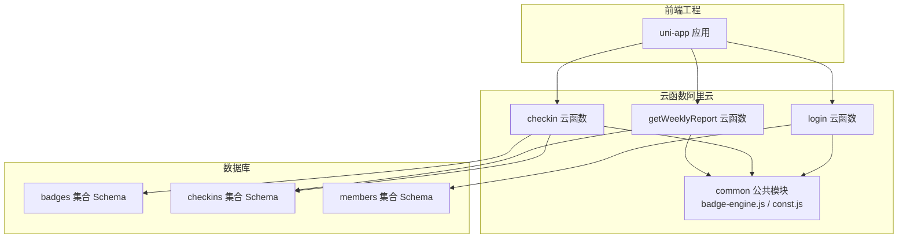
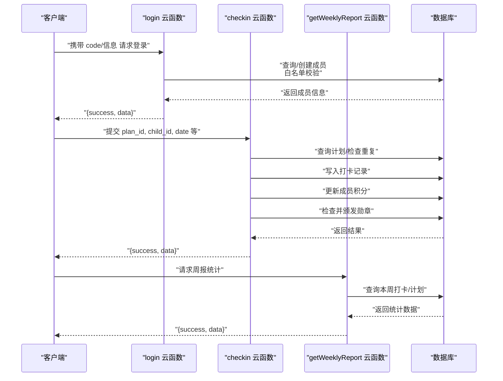
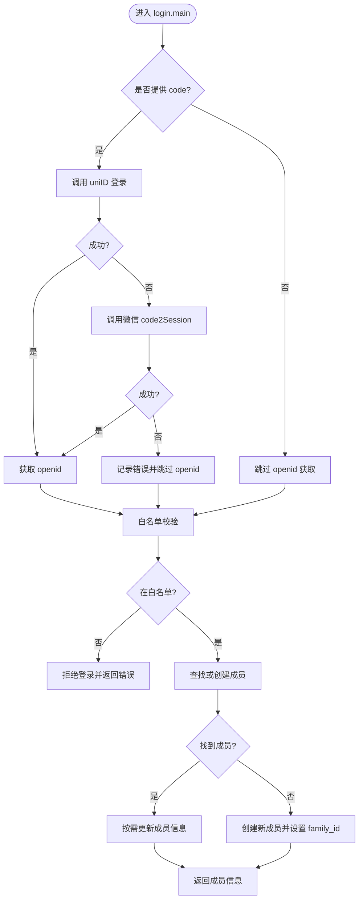
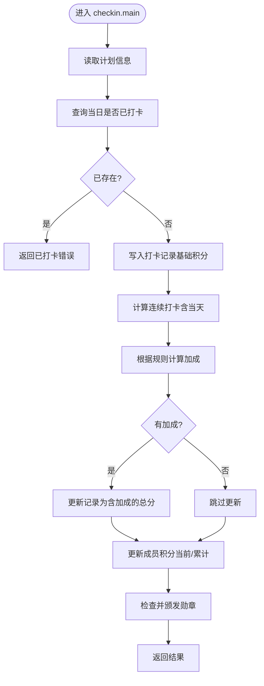
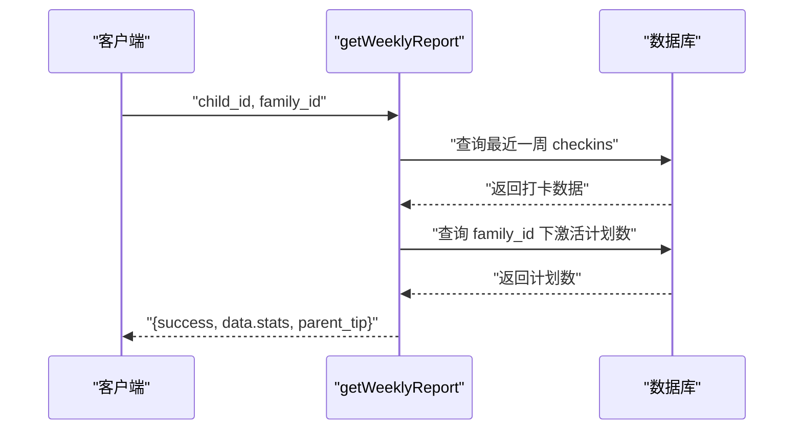
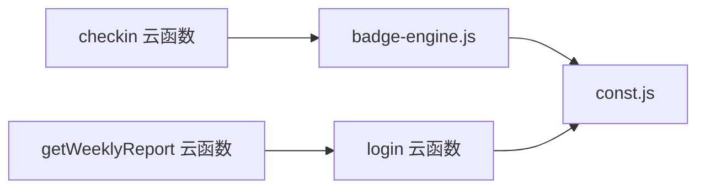
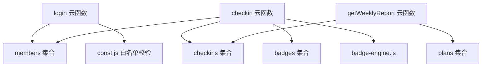

# 云函数部署

<cite>
**本文引用的文件**
- [src/cloudfunctions/checkin/index.js](file://src/cloudfunctions/checkin/index.js)
- [src/cloudfunctions/checkin/package.json](file://src/cloudfunctions/checkin/package.json)
- [src/cloudfunctions/login/index.js](file://src/cloudfunctions/login/index.js)
- [src/cloudfunctions/exchangeReward/index.js](file://src/cloudfunctions/exchangeReward/index.js)
- [src/cloudfunctions/generateReport/index.js](file://src/cloudfunctions/generateReport/index.js)
- [src/cloudfunctions/syncOffline/index.js](file://src/cloudfunctions/syncOffline/index.js)
- [uniCloud-aliyun/cloudfunctions/checkin/index.js](file://uniCloud-aliyun/cloudfunctions/checkin/index.js)
- [uniCloud-aliyun/cloudfunctions/login/index.js](file://uniCloud-aliyun/cloudfunctions/login/index.js)
- [uniCloud-aliyun/cloudfunctions/getWeeklyReport/index.js](file://uniCloud-aliyun/cloudfunctions/getWeeklyReport/index.js)
- [uniCloud-aliyun/cloudfunctions/common/package.json](file://uniCloud-aliyun/cloudfunctions/common/package.json)
- [uniCloud-aliyun/common/badge-engine.js](file://uniCloud-aliyun/common/badge-engine.js)
- [uniCloud-aliyun/common/const.js](file://uniCloud-aliyun/common/const.js)
- [uniCloud-aliyun/database/badges.schema.json](file://uniCloud-aliyun/database/badges.schema.json)
- [uniCloud-aliyun/database/checkins.schema.json](file://uniCloud-aliyun/database/checkins.schema.json)
- [uniCloud-aliyun/database/members.schema.json](file://uniCloud-aliyun/database/members.schema.json)
- [package.json](file://package.json)
</cite>

## 目录
1. [简介](#简介)
2. [项目结构](#项目结构)
3. [核心组件](#核心组件)
4. [架构总览](#架构总览)
5. [详细组件分析](#详细组件分析)
6. [依赖关系分析](#依赖关系分析)
7. [性能考虑](#性能考虑)
8. [故障排查指南](#故障排查指南)
9. [结论](#结论)
10. [附录](#附录)

## 简介
本文件面向Star Grow项目在uniCloud平台（兼容阿里云）上的云函数开发与部署，覆盖以下主题：
- 云函数目录结构与package.json配置
- 开发与本地测试策略
- 云函数与数据库的连接与操作
- 部署到阿里云的步骤与注意事项
- 触发方式与调用时机
- 错误处理与日志记录
- 性能优化与冷启动优化
- 安全配置与权限管理

## 项目结构
项目采用“前端工程 + 多套云函数实现”的组织方式：
- src/cloudfunctions：原生微信云开发风格的云函数示例（用于理解业务逻辑）
- uniCloud-aliyun/cloudfunctions：统一在uniCloud（兼容阿里云）上运行的云函数实现
- uniCloud-aliyun/common：跨云函数复用的公共模块（如勋章引擎、常量）
- uniCloud-aliyun/database：数据库集合的Schema定义（权限与字段约束）

图表来源
- [uniCloud-aliyun/cloudfunctions/login/index.js:1-103](file://uniCloud-aliyun/cloudfunctions/login/index.js#L1-L103)
- [uniCloud-aliyun/cloudfunctions/checkin/index.js:1-83](file://uniCloud-aliyun/cloudfunctions/checkin/index.js#L1-L83)
- [uniCloud-aliyun/cloudfunctions/getWeeklyReport/index.js:1-46](file://uniCloud-aliyun/cloudfunctions/getWeeklyReport/index.js#L1-L46)
- [uniCloud-aliyun/common/badge-engine.js:1-125](file://uniCloud-aliyun/common/badge-engine.js#L1-L125)
- [uniCloud-aliyun/common/const.js:1-27](file://uniCloud-aliyun/common/const.js#L1-L27)
- [uniCloud-aliyun/database/badges.schema.json:1-40](file://uniCloud-aliyun/database/badges.schema.json#L1-L40)
- [uniCloud-aliyun/database/checkins.schema.json:1-52](file://uniCloud-aliyun/database/checkins.schema.json#L1-L52)
- [uniCloud-aliyun/database/members.schema.json:1-46](file://uniCloud-aliyun/database/members.schema.json#L1-L46)

章节来源
- [package.json:1-74](file://package.json#L1-L74)

## 核心组件
- 登录云函数（login）：负责微信登录、白名单校验、成员信息维护与返回
- 打卡云函数（checkin）：负责校验、幂等写入、积分计算与加成、勋章检查
- 周报云函数（getWeeklyReport）：负责统计周维度数据并返回家长提示
- 公共模块（common）：包含连续打卡计算、加成规则、勋章颁发逻辑与白名单校验
- 数据库Schema：对集合字段、权限与默认值进行约束

章节来源
- [uniCloud-aliyun/cloudfunctions/login/index.js:1-103](file://uniCloud-aliyun/cloudfunctions/login/index.js#L1-L103)
- [uniCloud-aliyun/cloudfunctions/checkin/index.js:1-83](file://uniCloud-aliyun/cloudfunctions/checkin/index.js#L1-L83)
- [uniCloud-aliyun/cloudfunctions/getWeeklyReport/index.js:1-46](file://uniCloud-aliyun/cloudfunctions/getWeeklyReport/index.js#L1-L46)
- [uniCloud-aliyun/common/badge-engine.js:1-125](file://uniCloud-aliyun/common/badge-engine.js#L1-L125)
- [uniCloud-aliyun/common/const.js:1-27](file://uniCloud-aliyun/common/const.js#L1-L27)
- [uniCloud-aliyun/database/badges.schema.json:1-40](file://uniCloud-aliyun/database/badges.schema.json#L1-L40)
- [uniCloud-aliyun/database/checkins.schema.json:1-52](file://uniCloud-aliyun/database/checkins.schema.json#L1-L52)
- [uniCloud-aliyun/database/members.schema.json:1-46](file://uniCloud-aliyun/database/members.schema.json#L1-L46)

## 架构总览
下图展示从客户端到云函数再到数据库的整体调用链路与数据流。

图表来源
- [uniCloud-aliyun/cloudfunctions/login/index.js:1-103](file://uniCloud-aliyun/cloudfunctions/login/index.js#L1-L103)
- [uniCloud-aliyun/cloudfunctions/checkin/index.js:1-83](file://uniCloud-aliyun/cloudfunctions/checkin/index.js#L1-L83)
- [uniCloud-aliyun/cloudfunctions/getWeeklyReport/index.js:1-46](file://uniCloud-aliyun/cloudfunctions/getWeeklyReport/index.js#L1-L46)

## 详细组件分析

### 登录云函数（login）
职责与流程
- 接收小程序端传入的登录凭证或成员信息
- 尝试通过uniID或微信接口换取openId
- 白名单校验：仅允许白名单内的openId登录
- 查询或创建成员，必要时生成家庭标识以实现数据隔离
- 返回成员信息给前端

图表来源
- [uniCloud-aliyun/cloudfunctions/login/index.js:1-103](file://uniCloud-aliyun/cloudfunctions/login/index.js#L1-L103)
- [uniCloud-aliyun/common/const.js:1-27](file://uniCloud-aliyun/common/const.js#L1-L27)

章节来源
- [uniCloud-aliyun/cloudfunctions/login/index.js:1-103](file://uniCloud-aliyun/cloudfunctions/login/index.js#L1-L103)
- [uniCloud-aliyun/common/const.js:1-27](file://uniCloud-aliyun/common/const.js#L1-L27)

### 打卡云函数（checkin）
职责与流程
- 校验计划存在性与当日重复
- 写入打卡记录（含基础积分）
- 计算连续打卡并应用加成
- 更新成员积分
- 检查并颁发相关勋章
- 返回本次打卡结果与新增勋章

图表来源
- [uniCloud-aliyun/cloudfunctions/checkin/index.js:1-83](file://uniCloud-aliyun/cloudfunctions/checkin/index.js#L1-L83)
- [uniCloud-aliyun/common/badge-engine.js:1-125](file://uniCloud-aliyun/common/badge-engine.js#L1-L125)
- [uniCloud-aliyun/common/const.js:1-27](file://uniCloud-aliyun/common/const.js#L1-L27)

章节来源
- [uniCloud-aliyun/cloudfunctions/checkin/index.js:1-83](file://uniCloud-aliyun/cloudfunctions/checkin/index.js#L1-L83)
- [uniCloud-aliyun/common/badge-engine.js:1-125](file://uniCloud-aliyun/common/badge-engine.js#L1-L125)
- [uniCloud-aliyun/common/const.js:1-27](file://uniCloud-aliyun/common/const.js#L1-L27)

### 周报云函数（getWeeklyReport）
职责与流程
- 统计最近一周的打卡数量、完成率、积分与自打卡比例
- 返回家长提示语

图表来源
- [uniCloud-aliyun/cloudfunctions/getWeeklyReport/index.js:1-46](file://uniCloud-aliyun/cloudfunctions/getWeeklyReport/index.js#L1-L46)

章节来源
- [uniCloud-aliyun/cloudfunctions/getWeeklyReport/index.js:1-46](file://uniCloud-aliyun/cloudfunctions/getWeeklyReport/index.js#L1-L46)

### 公共模块（common）
- 勋章引擎（badge-engine.js）：封装连续打卡计算、加成规则、勋章颁发逻辑
- 常量（const.js）：集中定义加成规则、勋章定义、白名单校验工具

图表来源
- [uniCloud-aliyun/common/badge-engine.js:1-125](file://uniCloud-aliyun/common/badge-engine.js#L1-L125)
- [uniCloud-aliyun/common/const.js:1-27](file://uniCloud-aliyun/common/const.js#L1-L27)

章节来源
- [uniCloud-aliyun/common/badge-engine.js:1-125](file://uniCloud-aliyun/common/badge-engine.js#L1-L125)
- [uniCloud-aliyun/common/const.js:1-27](file://uniCloud-aliyun/common/const.js#L1-L27)

## 依赖关系分析
- 云函数依赖uniCloud数据库API与公共模块
- 登录云函数依赖白名单校验与成员集合
- 打卡云函数依赖勋章引擎与checkins、members、badges集合
- 周报云函数依赖checkins与plans集合

图表来源
- [uniCloud-aliyun/cloudfunctions/login/index.js:1-103](file://uniCloud-aliyun/cloudfunctions/login/index.js#L1-L103)
- [uniCloud-aliyun/cloudfunctions/checkin/index.js:1-83](file://uniCloud-aliyun/cloudfunctions/checkin/index.js#L1-L83)
- [uniCloud-aliyun/cloudfunctions/getWeeklyReport/index.js:1-46](file://uniCloud-aliyun/cloudfunctions/getWeeklyReport/index.js#L1-L46)
- [uniCloud-aliyun/common/badge-engine.js:1-125](file://uniCloud-aliyun/common/badge-engine.js#L1-L125)
- [uniCloud-aliyun/common/const.js:1-27](file://uniCloud-aliyun/common/const.js#L1-L27)
- [uniCloud-aliyun/database/checkins.schema.json:1-52](file://uniCloud-aliyun/database/checkins.schema.json#L1-L52)
- [uniCloud-aliyun/database/members.schema.json:1-46](file://uniCloud-aliyun/database/members.schema.json#L1-L46)
- [uniCloud-aliyun/database/badges.schema.json:1-40](file://uniCloud-aliyun/database/badges.schema.json#L1-L40)

## 性能考虑
- 冷启动优化
  - 合理拆分公共模块，避免在云函数入口做重型初始化
  - 使用数据库命令（如自增）减少往返次数
  - 对高频查询建立索引（如按child_id/date/plan_id组合）
- 并发与幂等
  - 打卡前先查重，避免重复写入
  - 使用原子更新（如自增）保证积分一致性
- I/O 优化
  - 批量查询/更新时尽量合并为一次请求
  - 减少不必要的字段返回（使用字段投影）
- 缓存策略
  - 对静态规则（加成、勋章定义）可在进程内缓存
- 超时与重试
  - 设置合理的超时时间，对网络请求增加重试与降级

## 故障排查指南
- 日志记录
  - 在关键路径打印日志，便于定位问题
  - 对异常捕获后记录错误堆栈与上下文参数
- 常见问题
  - 登录失败：检查uniID配置、微信接口参数、白名单状态
  - 打卡重复：确认去重逻辑与索引是否生效
  - 积分不一致：核对原子更新与并发场景下的处理
- 调试方法
  - 使用uniCloud控制台的云函数调试功能
  - 本地模拟事件参数，逐步断点验证
  - 分模块单元化测试（公共模块可单独测试）

章节来源
- [uniCloud-aliyun/cloudfunctions/checkin/index.js:1-83](file://uniCloud-aliyun/cloudfunctions/checkin/index.js#L1-L83)
- [uniCloud-aliyun/cloudfunctions/login/index.js:1-103](file://uniCloud-aliyun/cloudfunctions/login/index.js#L1-L103)

## 结论
本项目在uniCloud（阿里云）平台上提供了完整的云函数实现，涵盖登录、打卡、周报等核心能力，并通过公共模块实现代码复用与规则集中管理。结合数据库Schema约束与白名单机制，系统在安全与一致性方面具备良好基础。后续可进一步完善监控与告警、引入更细粒度的权限控制与审计日志。

## 附录

### 云函数目录结构与package.json配置
- 目录结构
  - 每个云函数位于独立目录，包含入口文件与依赖声明
  - 公共模块位于common目录，供多个云函数复用
- package.json
  - 云函数根目录与common目录均包含package.json，用于声明依赖与元信息
  - 原生微信云开发风格的示例位于src/cloudfunctions，便于对照理解

章节来源
- [src/cloudfunctions/checkin/package.json:1-2](file://src/cloudfunctions/checkin/package.json#L1-L2)
- [uniCloud-aliyun/cloudfunctions/common/package.json:1-7](file://uniCloud-aliyun/cloudfunctions/common/package.json#L1-L7)

### 数据库Schema要点
- members：包含昵称、角色、家庭标识、openId、头像、当前与累计积分等字段
- checkins：包含计划ID、成员ID、日期、打卡人、感受、积分、加成、时间戳等字段
- badges：包含勋章类型、标题、图标、描述、解锁时间等字段

章节来源
- [uniCloud-aliyun/database/members.schema.json:1-46](file://uniCloud-aliyun/database/members.schema.json#L1-L46)
- [uniCloud-aliyun/database/checkins.schema.json:1-52](file://uniCloud-aliyun/database/checkins.schema.json#L1-L52)
- [uniCloud-aliyun/database/badges.schema.json:1-40](file://uniCloud-aliyun/database/badges.schema.json#L1-L40)

### 部署到阿里云（uniCloud兼容）步骤与注意事项
- 步骤
  - 在uniCloud控制台创建云空间并绑定阿里云账号
  - 将uniCloud-aliyun目录作为云函数源码上传
  - 配置数据库集合与Schema，开启权限控制
  - 配置白名单集合与规则
  - 部署并测试登录、打卡、周报等云函数
- 注意事项
  - 云函数入口与依赖需符合uniCloud规范
  - 数据库字段与权限需与Schema保持一致
  - 登录流程中的微信接口参数需在控制台正确配置
  - 对高频接口开启缓存与索引优化

### 触发方式与调用时机
- 触发方式
  - 前端通过uniCloud SDK调用云函数
  - 可通过定时任务触发周报等周期性任务
- 调用时机
  - 登录：小程序启动或用户点击登录
  - 打卡：用户完成每日打卡或批量导入
  - 周报：每周固定时间或用户主动请求

### 安全配置与权限管理
- 白名单机制：仅允许白名单内的openId登录
- 数据权限：通过Schema定义集合的读写权限
- 最小权限原则：仅授予云函数执行所需权限
- 审计与监控：启用日志与告警，定期审查访问与错误