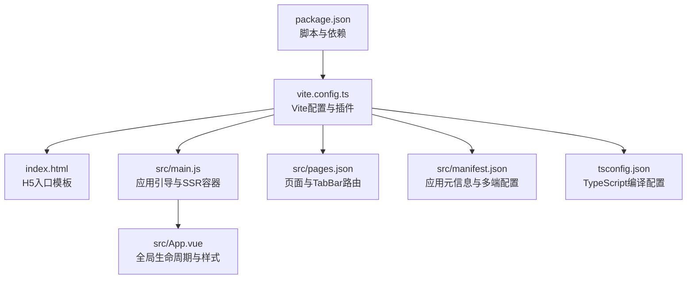
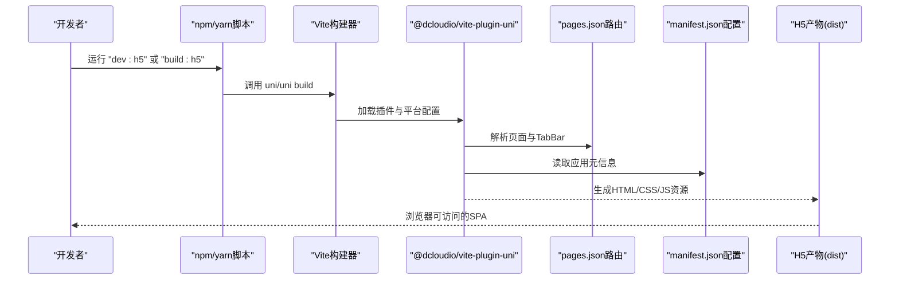
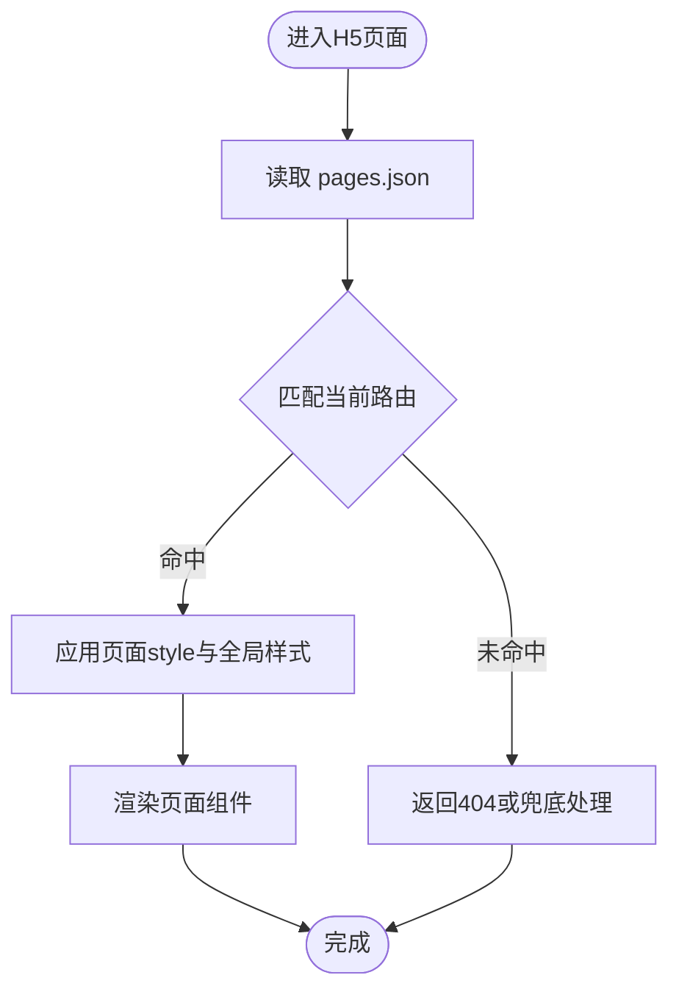
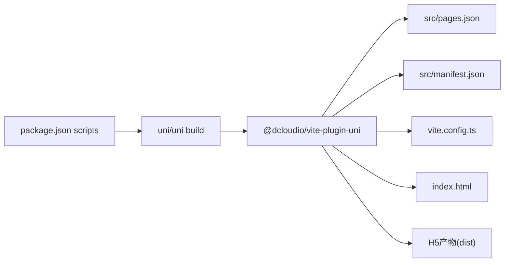

# H5网页构建

<cite>
**本文引用的文件**
- [package.json](file://package.json)
- [vite.config.ts](file://vite.config.ts)
- [src/manifest.json](file://src/manifest.json)
- [src/pages.json](file://src/pages.json)
- [index.html](file://index.html)
- [src/main.js](file://src/main.js)
- [src/App.vue](file://src/App.vue)
- [tsconfig.json](file://tsconfig.json)
</cite>

## 目录
1. [简介](#简介)
2. [项目结构](#项目结构)
3. [核心组件](#核心组件)
4. [架构总览](#架构总览)
5. [详细组件分析](#详细组件分析)
6. [依赖关系分析](#依赖关系分析)
7. [性能考虑](#性能考虑)
8. [故障排查指南](#故障排查指南)
9. [结论](#结论)
10. [附录](#附录)

## 简介
本文件面向Star Grow项目的H5网页构建与上线，系统化说明开发环境与浏览器兼容性、命令行脚本差异（dev:h5、build:h5、build:h5:ssr）、manifest.json配置要点（应用标题、图标、视口等）、路由与SPA实现、调试技巧、性能优化策略、部署与服务器配置、PWA特性以及SEO与分享实现方法。内容基于仓库中实际存在的配置文件进行归纳总结，帮助开发者快速上手并高质量交付H5版本。

## 项目结构
- 基于Vite与uni-app生态，采用Vue 3 + TypeScript + Pinia的状态管理方案。
- H5目标产物由uni-app CLI在H5平台下构建，入口与模板通过index.html与Vite插件注入。
- 页面路由与TabBar配置集中在pages.json；应用元信息与多端配置集中在manifest.json。

图表来源
- [package.json:1-74](file://package.json#L1-L74)
- [vite.config.ts:1-8](file://vite.config.ts#L1-L8)
- [index.html:1-21](file://index.html#L1-L21)
- [src/main.js:1-11](file://src/main.js#L1-L11)
- [src/App.vue:1-64](file://src/App.vue#L1-L64)
- [src/pages.json:1-56](file://src/pages.json#L1-L56)
- [src/manifest.json:1-78](file://src/manifest.json#L1-L78)
- [tsconfig.json:1-14](file://tsconfig.json#L1-L14)

章节来源
- [package.json:1-74](file://package.json#L1-L74)
- [vite.config.ts:1-8](file://vite.config.ts#L1-L8)
- [index.html:1-21](file://index.html#L1-L21)
- [src/main.js:1-11](file://src/main.js#L1-L11)
- [src/App.vue:1-64](file://src/App.vue#L1-L64)
- [src/pages.json:1-56](file://src/pages.json#L1-L56)
- [src/manifest.json:1-78](file://src/manifest.json#L1-L78)
- [tsconfig.json:1-14](file://tsconfig.json#L1-L14)

## 核心组件
- 开发与构建脚本
  - dev:h5：启动H5开发服务器，支持热更新。
  - dev:h5:ssr：启动H5开发服务器并启用SSR模式。
  - build:h5：构建H5产物（客户端渲染）。
  - build:h5:ssr：构建H5产物并启用SSR模式。
- Vite与插件
  - 使用@uni/vite-plugin-uni插件，统一多端构建。
- 应用入口
  - main.js导出createApp工厂函数，用于SSR与CSR场景。
- 页面与导航
  - pages.json定义页面列表、全局样式与TabBar。
- 应用元信息
  - manifest.json集中配置版本、多端参数、云开发空间等。
- 视图模板
  - index.html提供viewport注入、预加载占位与应用挂载点。

章节来源
- [package.json:4-37](file://package.json#L4-L37)
- [vite.config.ts:1-8](file://vite.config.ts#L1-L8)
- [src/main.js:1-11](file://src/main.js#L1-L11)
- [src/pages.json:1-56](file://src/pages.json#L1-L56)
- [src/manifest.json:1-78](file://src/manifest.json#L1-L78)
- [index.html:1-21](file://index.html#L1-L21)

## 架构总览
H5构建从package.json脚本触发，经由Vite与@uni/vite-plugin-uni处理，结合pages.json路由与manifest.json元信息，最终输出可在浏览器运行的单页应用（SPA）。SSR模式下，服务端渲染首屏，提升首屏性能与SEO表现。

图表来源
- [package.json:4-37](file://package.json#L4-L37)
- [vite.config.ts:1-8](file://vite.config.ts#L1-L8)
- [src/pages.json:1-56](file://src/pages.json#L1-L56)
- [src/manifest.json:1-78](file://src/manifest.json#L1-L78)

## 详细组件分析

### 开发与构建命令详解
- dev:h5
  - 启动H5开发服务器，自动监听源码变化并热更新。
  - 适合本地联调与快速迭代。
- dev:h5:ssr
  - 在dev:h5基础上启用SSR，服务端渲染首屏，改善首屏性能与SEO。
  - 需要后端或本地SSR服务配合。
- build:h5
  - 构建客户端渲染的H5产物，输出静态资源到默认目录。
- build:h5:ssr
  - 构建SSR版本的H5产物，包含服务端渲染逻辑与静态资源。

章节来源
- [package.json:6-23](file://package.json#L6-L23)

### manifest.json配置要点
- 应用基础信息
  - name/versionName/versionCode：应用名称、版本号与内部版本号。
  - uniCloud：阿里云空间配置，包含vendor、dcloudAppId、spaceId。
- 多端配置
  - mp-weixin：小程序（微信）相关配置，如appid与安全设置。
  - app-plus：5+App分发配置（Android/iOS权限、打包参数等），H5可按需参考。
- 统计与版本
  - uniStatistics：统计开关。
  - vueVersion：声明Vue版本为3。

章节来源
- [src/manifest.json:1-78](file://src/manifest.json#L1-L78)

### 路由与SPA实现
- 页面注册
  - pages.json中通过path字段注册页面路径，style中可设置导航栏标题与自定义样式。
- TabBar
  - tabBar.list定义底部导航项，包含pagePath、text、iconPath与selectedIconPath。
- 导航行为
  - 项目未显式引入router库，采用pages.json声明式路由，符合uni-app SPA模式。
- 全局样式
  - globalStyle统一设置导航栏文字颜色、背景色与页面背景色。

图表来源
- [src/pages.json:1-56](file://src/pages.json#L1-L56)

章节来源
- [src/pages.json:1-56](file://src/pages.json#L1-L56)

### 视口与模板配置
- 视口注入
  - index.html通过动态脚本检测安全区域并注入viewport meta，支持iPhone X系列等刘海屏适配。
- 预加载与上下文
  - 模板中保留<!--preload-links-->与<!--app-context-->占位，由构建器注入预加载链接与应用上下文。
- 挂载点
  - 
作为应用挂载根节点，入口脚本在<body>末尾加载。

章节来源
- [index.html:1-21](file://index.html#L1-L21)

### 应用入口与SSR容器
- main.js
  - 导出createApp工厂函数，创建SSR应用实例并安装Pinia状态管理。
- App.vue
  - 全局生命周期：onLaunch与onShow，用于初始化与离线数据同步。
  - 提供全局样式与通用组件样式（如按钮、卡片）。

章节来源
- [src/main.js:1-11](file://src/main.js#L1-L11)
- [src/App.vue:1-64](file://src/App.vue#L1-L64)

### TypeScript与浏览器兼容性
- tsconfig.json
  - 启用sourceMap便于调试。
  - lib包含esnext与dom，满足现代浏览器API需求。
  - types包含@uni/types，提供多端类型支持。
- 浏览器兼容
  - 项目未提供browserslist配置文件，建议在根目录新增.browserslistrc或在package.json中配置browserslist字段，明确目标浏览器范围，以便Babel/Polyfill按需注入。

章节来源
- [tsconfig.json:1-14](file://tsconfig.json#L1-L14)

## 依赖关系分析
- 脚本与构建链路
  - package.json scripts驱动uni/cli，配合vite.config.ts与@uni/vite-plugin-uni完成多端构建。
- 插件与模板
  - @dcloudio/vite-plugin-uni负责解析pages.json与manifest.json，生成H5运行时所需的路由与配置。
- 入口与运行时
  - src/main.js提供createApp工厂，index.html提供DOM挂载点，二者共同构成应用运行时。

图表来源
- [package.json:4-37](file://package.json#L4-L37)
- [vite.config.ts:1-8](file://vite.config.ts#L1-L8)
- [src/pages.json:1-56](file://src/pages.json#L1-L56)
- [src/manifest.json:1-78](file://src/manifest.json#L1-L78)
- [index.html:1-21](file://index.html#L1-L21)

章节来源
- [package.json:4-37](file://package.json#L4-L37)
- [vite.config.ts:1-8](file://vite.config.ts#L1-L8)

## 性能考虑
- 代码分割与懒加载
  - 建议将大型页面或第三方库拆分为异步组件，利用动态import实现按需加载。
- 缓存策略
  - 静态资源采用长效缓存，构建时加入哈希后缀；HTML与入口JS不缓存或短缓存。
- Polyfill与兼容性
  - 通过browserslist与@babel/preset-env按需注入polyfill，减少不必要的垫片体积。
- 首屏优化
  - SSR模式可显著提升首屏渲染速度与SEO表现；若无SSR需求，可通过预渲染或骨架屏提升感知性能。
- 资源压缩
  - 生产构建开启压缩与Tree Shaking，移除未使用代码。

[本节为通用性能指导，无需特定文件引用]

## 故障排查指南
- 开发服务器无法启动
  - 检查Node.js与npm版本是否满足依赖要求；确认端口未被占用。
- 页面路由不生效
  - 确认pages.json中path与实际文件路径一致，且文件扩展名正确。
- 图标与TabBar显示异常
  - 确保iconPath指向static目录下的PNG文件，尺寸与命名规范符合要求。
- 视口适配问题
  - 检查index.html中viewport注入逻辑是否正常执行，iOS安全区域是否正确识别。
- SSR相关错误
  - 确认dev:h5:ssr/build:h5:ssr命令可用，且服务端渲染逻辑与客户端保持同构。

章节来源
- [src/pages.json:1-56](file://src/pages.json#L1-L56)
- [index.html:1-21](file://index.html#L1-L21)

## 结论
本项目基于uni-app与Vite构建H5应用，通过pages.json与manifest.json集中管理路由与元信息，借助SSR可进一步提升首屏性能与SEO表现。建议在现有基础上完善browserslist配置、引入按需polyfill与代码分割策略，并结合缓存与压缩手段持续优化用户体验。

[本节为总结性内容，无需特定文件引用]

## 附录

### H5网页构建命令速查
- 开发模式
  - dev:h5：启动H5开发服务器（客户端渲染）。
  - dev:h5:ssr：启动H5开发服务器（服务端渲染）。
- 生产构建
  - build:h5：构建H5产物（客户端渲染）。
  - build:h5:ssr：构建H5产物（服务端渲染）。

章节来源
- [package.json:6-23](file://package.json#L6-L23)

### PWA特性配置与实现
- Workbox集成
  - 建议在Vite配置中引入workbox插件，生成Service Worker，实现离线缓存与后台同步。
- manifest.webmanifest
  - 生成Web App Manifest，配置应用名称、图标、主题色与启动画面。
- 缓存策略
  - 对静态资源采用Stale-While-Revalidate策略，对API请求采用Network-first并降级至Cache。

[本节为概念性指导，无需特定文件引用]

### SEO优化与分享功能
- SEO
  - 动态设置<title>与<meta name="description">，在SSR模式下由服务端注入。
  - 为每个页面生成结构化数据（JSON-LD），提升搜索引擎理解度。
- 分享
  - 微信分享：通过JSSDK或后端签名接口实现朋友圈与好友分享。
  - 通用分享：提供统一的分享卡片模板与缩略图，确保在社交平台展示一致。

[本节为概念性指导，无需特定文件引用]