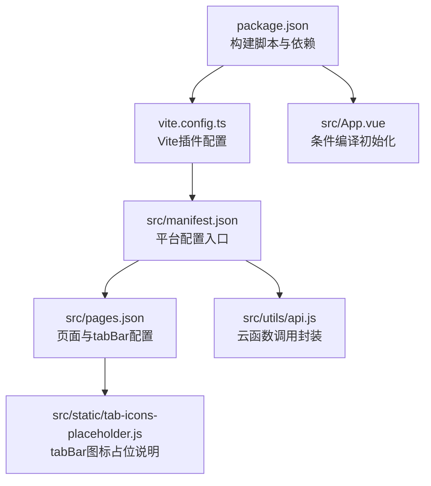
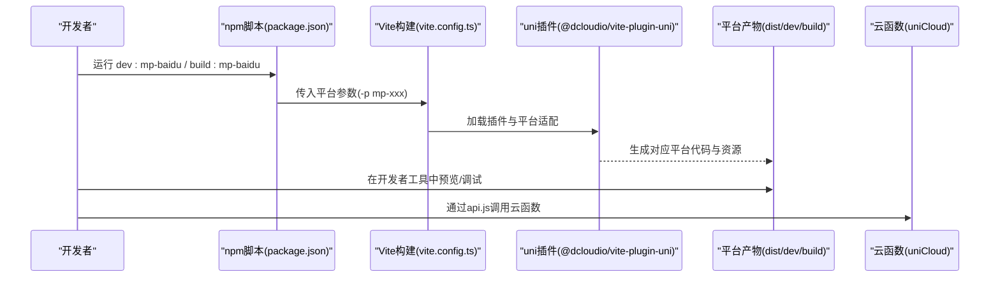
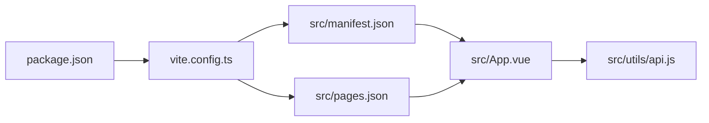

# 其他平台构建

<cite>
**本文引用的文件**
- [package.json](file://package.json)
- [manifest.json](file://src/manifest.json)
- [pages.json](file://src/pages.json)
- [vite.config.ts](file://vite.config.ts)
- [api.js](file://src/utils/api.js)
- [App.vue](file://src/App.vue)
- [main.js](file://src/main.js)
- [tab-icons-placeholder.js](file://src/static/tab-icons-placeholder.js)
</cite>

## 目录
1. [简介](#简介)
2. [项目结构](#项目结构)
3. [核心组件](#核心组件)
4. [架构总览](#架构总览)
5. [详细组件分析](#详细组件分析)
6. [依赖关系分析](#依赖关系分析)
7. [性能考虑](#性能考虑)
8. [故障排查指南](#故障排查指南)
9. [结论](#结论)
10. [附录](#附录)

## 简介
本文件面向Star Grow项目在多平台（含百度小程序、京东小程序、快手小程序、字节小程序、QQ小程序、哈啰小程序、小红书小程序、HarmonyOS应用、快应用等）的构建与发布，系统梳理开发环境、构建脚本、平台差异化配置、调试与发布流程、与微信小程序的差异及兼容策略、平台特有API与限制，并总结跨平台开发最佳实践与注意事项。内容基于仓库现有配置与源码进行归纳，避免臆测。

## 项目结构
项目采用uni-app生态，通过Vite插件统一构建，manifest.json集中声明各平台配置，pages.json定义页面与tabBar，utils目录封装云函数调用，App.vue中包含条件编译片段用于平台特性初始化。

**图表来源**
- [package.json:1-74](file://package.json#L1-L74)
- [vite.config.ts:1-8](file://vite.config.ts#L1-L8)
- [manifest.json:1-78](file://src/manifest.json#L1-L78)
- [pages.json:1-56](file://src/pages.json#L1-L56)
- [api.js:1-18](file://src/utils/api.js#L1-L18)
- [App.vue:1-64](file://src/App.vue#L1-L64)
- [tab-icons-placeholder.js:1-9](file://src/static/tab-icons-placeholder.js#L1-L9)

**章节来源**
- [package.json:1-74](file://package.json#L1-L74)
- [vite.config.ts:1-8](file://vite.config.ts#L1-L8)
- [manifest.json:1-78](file://src/manifest.json#L1-L78)
- [pages.json:1-56](file://src/pages.json#L1-L56)
- [api.js:1-18](file://src/utils/api.js#L1-L18)
- [App.vue:1-64](file://src/App.vue#L1-L64)
- [tab-icons-placeholder.js:1-9](file://src/static/tab-icons-placeholder.js#L1-L9)

## 核心组件
- 构建脚本与平台映射：通过package.json中的scripts字段提供各平台开发与构建命令，覆盖百度、京东、快手、字节、QQ、哈啰、小红书、HarmonyOS、快应用及其变体。
- 平台配置入口：manifest.json集中声明各小程序平台的特有配置（如appID、安全校验开关、组件化开关等），并包含uniCloud空间绑定信息。
- 页面与tabBar：pages.json定义页面路由、导航栏样式与tabBar列表、图标路径等。
- 云函数调用：utils/api.js封装uniCloud.callFunction调用，统一返回格式与错误处理。
- 条件编译：App.vue中使用条件编译片段初始化平台专属能力（如微信云开发）。
- Vite构建：vite.config.ts启用@dcloudio/vite-plugin-uni，作为uni-app构建的核心插件。

**章节来源**
- [package.json:4-38](file://package.json#L4-L38)
- [manifest.json:52-77](file://src/manifest.json#L52-L77)
- [pages.json:23-54](file://src/pages.json#L23-L54)
- [api.js:9-17](file://src/utils/api.js#L9-L17)
- [App.vue:5-27](file://src/App.vue#L5-L27)
- [vite.config.ts:5-7](file://vite.config.ts#L5-L7)

## 架构总览
下图展示从开发到构建的关键流程：开发者通过npm scripts选择目标平台，Vite配合uni插件进行编译，最终输出对应平台产物；manifest.json与pages.json决定页面结构与平台特性；云函数调用通过封装层统一接入。

**图表来源**
- [package.json:8-34](file://package.json#L8-L34)
- [vite.config.ts:5-7](file://vite.config.ts#L5-L7)
- [api.js:9-17](file://src/utils/api.js#L9-L17)

## 详细组件分析

### 百度小程序（mp-baidu）
- 开发与构建
  - 开发：运行 npm 脚本 dev:mp-baidu
  - 构建：运行 npm 脚本 build:mp-baidu
- 平台配置
  - manifest.json中存在mp-baidu节点，开启组件化支持
- 调试与发布
  - 使用百度开发者工具导入dist/dev/mp-baidu或dist/build/mp-baidu
  - 发布前检查组件化与安全校验设置
- 差异与兼容
  - 组件化默认开启，遵循uni-app通用规范
- 特有API与限制
  - 无特殊API示例，按通用uniAPI使用
- 最佳实践
  - 保持pages.json与manifest.json配置一致，避免遗漏

**章节来源**
- [package.json:8-34](file://package.json#L8-L34)
- [manifest.json:62-64](file://src/manifest.json#L62-L64)

### 京东小程序（mp-jd）
- 开发与构建
  - 开发：npm 脚本 dev:mp-jd
  - 构建：npm 脚本 build:mp-jd
- 配置与限制
  - 仓库未提供专用配置节点，建议在manifest.json中补充必要字段
- 调试与发布
  - 使用京东开发者工具导入对应dist目录
- 最佳实践
  - 参考mp-weixin的setting配置，按需开启URL校验与组件化

**章节来源**
- [package.json:10-34](file://package.json#L10-L34)
- [manifest.json:52-77](file://src/manifest.json#L52-L77)

### 快手小程序（mp-kuaishou）
- 开发与构建
  - 开发：npm 脚本 dev:mp-kuaishou
  - 构建：npm 脚本 build:mp-kuaishou
- 配置与限制
  - 仓库未提供专用配置节点，建议在manifest.json中补充
- 调试与发布
  - 使用快手开发者工具导入对应dist目录
- 最佳实践
  - 关注平台对组件化与网络请求的限制，避免使用不被支持的API

**章节来源**
- [package.json:11-34](file://package.json#L11-L34)
- [manifest.json:52-77](file://src/manifest.json#L52-L77)

### 字节小程序（mp-toutiao）
- 开发与构建
  - 开发：npm 脚本 dev:mp-toutiao
  - 构建：npm 脚本 build:mp-toutiao
- 配置与限制
  - manifest.json中存在mp-toutiao节点，开启组件化支持
- 调试与发布
  - 使用字节开发者工具导入对应dist目录
- 最佳实践
  - 保持组件化与页面配置一致性，避免自定义组件命名冲突

**章节来源**
- [package.json:13-34](file://package.json#L13-L34)
- [manifest.json:65-67](file://src/manifest.json#L65-L67)

### QQ小程序（mp-qq）
- 开发与构建
  - 开发：npm 脚本 dev:mp-qq
  - 构建：npm 脚本 build:mp-qq
- 配置与限制
  - 仓库未提供专用配置节点，建议在manifest.json中补充
- 调试与发布
  - 使用QQ开发者工具导入对应dist目录
- 最佳实践
  - 注意平台对tabBar图标尺寸与格式的要求

**章节来源**
- [package.json:12-34](file://package.json#L12-L34)
- [manifest.json:52-77](file://src/manifest.json#L52-L77)
- [pages.json:23-54](file://src/pages.json#L23-L54)

### 哈啰小程序（mp-lark）
- 开发与构建
  - 开发：npm 脚本 dev:mp-lark
  - 构建：npm 脚本 build:mp-lark
- 配置与限制
  - 仓库未提供专用配置节点，建议在manifest.json中补充
- 调试与发布
  - 使用哈啰开发者工具导入对应dist目录
- 最佳实践
  - 关注平台对云函数域名与网络请求的白名单限制

**章节来源**
- [package.json:12-34](file://package.json#L12-L34)
- [manifest.json:52-77](file://src/manifest.json#L52-L77)

### 小红书小程序（mp-xhs）
- 开发与构建
  - 开发：npm 脚本 dev:mp-xhs
  - 构建：npm 脚本 build:mp-xhs
- 配置与限制
  - 仓库未提供专用配置节点，建议在manifest.json中补充
- 调试与发布
  - 使用小红书开发者工具导入对应dist目录
- 最佳实践
  - 注意平台对图片与字体资源的加载策略

**章节来源**
- [package.json:17-34](file://package.json#L17-L34)
- [manifest.json:52-77](file://src/manifest.json#L52-L77)

### HarmonyOS应用（mp-harmony）
- 开发与构建
  - 开发：npm 脚本 dev:mp-harmony
  - 构建：npm 脚本 build:mp-harmony
- 依赖与插件
  - package.json包含@uni-app-harmony相关依赖
- 调试与发布
  - 使用DevEco Studio导入对应dist目录
- 最佳实践
  - 关注HarmonyOS对导航API与生命周期的差异

**章节来源**
- [package.json:15-55](file://package.json#L15-L55)
- [package.json:24-34](file://package.json#L24-L34)

### 快应用（quickapp-webview）
- 开发与构建
  - 开发：npm 脚本 dev:quickapp-webview
  - 构建：npm 脚本 build:quickapp-webview
- 变体平台
  - 提供quickapp-webview-huawei与quickapp-webview-union两个变体脚本
- 配置与限制
  - manifest.json中存在quickapp节点占位，建议按需完善
- 调试与发布
  - 使用快应用开发者工具导入对应dist目录
- 最佳实践
  - 注意不同厂商快应用对WebView内核与API支持的差异

**章节来源**
- [package.json:18-20](file://package.json#L18-L20)
- [package.json:34-36](file://package.json#L34-L36)
- [manifest.json:49](file://src/manifest.json#L49)

### 与微信小程序的差异与兼容
- 平台差异
  - 微信小程序在manifest.json中配置了appID与setting.urlCheck开关，且在App.vue中使用条件编译初始化wx.cloud
- 兼容策略
  - 对于其他平台，移除或屏蔽微信专属初始化逻辑，确保在非微信环境下不报错
  - 通过条件编译片段隔离平台特定代码
- 建议
  - 在新功能开发时优先使用uniAPI，减少平台差异带来的影响

**章节来源**
- [manifest.json:52-58](file://src/manifest.json#L52-L58)
- [App.vue:9-18](file://src/App.vue#L9-L18)

### 调试方法与发布流程（通用）
- 调试
  - 使用对应平台开发者工具打开dist/dev/{platform}目录
  - 在App.vue与pages.json中定位问题，逐步缩小范围
- 发布
  - 使用dist/build/{platform}目录产物提交至平台审核
  - 确认manifest.json中各平台配置正确，特别是appID与安全设置
- 云函数
  - 通过utils/api.js封装的callFunction统一调用，注意错误处理与日志

**章节来源**
- [api.js:9-17](file://src/utils/api.js#L9-L17)
- [manifest.json:52-77](file://src/manifest.json#L52-L77)

### 平台特有API与限制说明
- 通用API
  - 项目通过uniCloud.callFunction统一调用云函数，适用于所有平台
- 平台差异
  - 不同平台对组件化、tabBar图标格式、网络请求域名白名单等存在差异
- 建议
  - 在manifest.json中为各平台补充必要配置，避免默认行为导致的兼容问题

**章节来源**
- [api.js:9-17](file://src/utils/api.js#L9-L17)
- [manifest.json:52-77](file://src/manifest.json#L52-L77)

## 依赖关系分析
下图展示项目关键文件之间的依赖关系：package.json提供脚本入口，vite.config.ts启用uni插件，manifest.json与pages.json决定平台配置与页面结构，App.vue承载条件编译初始化，utils/api.js封装云函数调用。

**图表来源**
- [package.json:1-74](file://package.json#L1-L74)
- [vite.config.ts:1-8](file://vite.config.ts#L1-L8)
- [manifest.json:1-78](file://src/manifest.json#L1-L78)
- [pages.json:1-56](file://src/pages.json#L1-L56)
- [App.vue:1-64](file://src/App.vue#L1-L64)
- [api.js:1-18](file://src/utils/api.js#L1-L18)

**章节来源**
- [package.json:1-74](file://package.json#L1-L74)
- [vite.config.ts:1-8](file://vite.config.ts#L1-L8)
- [manifest.json:1-78](file://src/manifest.json#L1-L78)
- [pages.json:1-56](file://src/pages.json#L1-L56)
- [App.vue:1-64](file://src/App.vue#L1-L64)
- [api.js:1-18](file://src/utils/api.js#L1-L18)

## 性能考虑
- 构建优化
  - 使用Vite与@uni-vite-plugin提升开发体验与构建速度
  - 合理拆分页面与组件，避免一次性引入过多资源
- 运行时优化
  - 控制tabBar图标数量与体积，避免影响首屏渲染
  - 云函数调用尽量批量与去重，减少网络往返

## 故障排查指南
- 常见问题
  - 页面无法显示或tabBar图标缺失：检查pages.json中iconPath与静态资源路径是否正确
  - 云函数调用失败：查看utils/api.js返回的错误信息，确认云函数名称与参数
  - 平台初始化异常：检查App.vue中的条件编译片段，确保仅在目标平台执行
- 定位步骤
  - 在对应平台开发者工具中打开dist/dev/{platform}，复现问题
  - 查看控制台日志与网络面板，定位具体调用链路
- 修复建议
  - 补充manifest.json中缺失的平台配置
  - 统一使用uniAPI，减少平台差异带来的问题

**章节来源**
- [pages.json:23-54](file://src/pages.json#L23-L54)
- [api.js:9-17](file://src/utils/api.js#L9-L17)
- [App.vue:5-27](file://src/App.vue#L5-L27)

## 结论
本项目已具备多平台构建的基础能力，通过npm脚本与manifest.json/pages.json实现平台差异化配置。建议后续为各平台补充完整配置节点，完善快应用与部分小程序平台的manifest.json配置，并持续以uniAPI为核心降低平台差异成本，提升跨平台开发效率与稳定性。

## 附录
- 开发环境要求（通用）
  - Node.js与npm版本满足项目依赖
  - 各平台开发者工具安装完成
  - 本地已配置好uniCloud空间（阿里云）
- 跨平台开发最佳实践
  - 优先使用uniAPI与跨平台组件
  - 通过条件编译隔离平台特定逻辑
  - 在manifest.json中为各平台补充必要配置
  - 统一管理tabBar图标，避免格式与尺寸差异