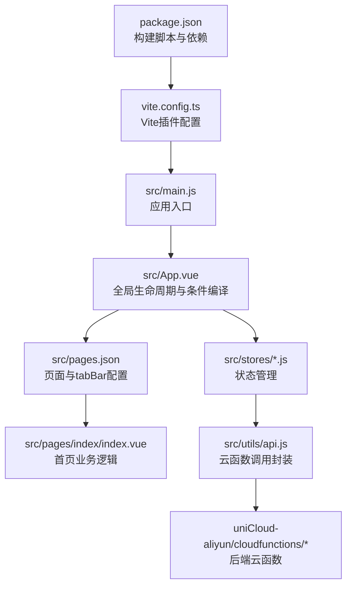
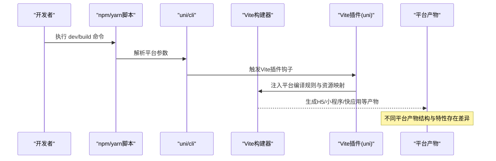
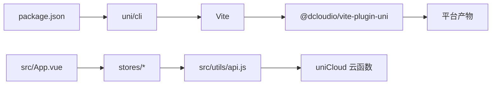

# 多平台构建

<cite>
**本文引用的文件**
- [package.json](file://package.json)
- [vite.config.ts](file://vite.config.ts)
- [index.html](file://index.html)
- [src/manifest.json](file://src/manifest.json)
- [src/pages.json](file://src/pages.json)
- [src/main.js](file://src/main.js)
- [src/App.vue](file://src/App.vue)
- [src/pages/index/index.vue](file://src/pages/index/index.vue)
- [src/stores/user.js](file://src/stores/user.js)
- [src/stores/checkins.js](file://src/stores/checkins.js)
- [src/utils/api.js](file://src/utils/api.js)
- [src/components/CheckInCard.vue](file://src/components/CheckInCard.vue)
- [src/static/tab-icons-placeholder.js](file://src/static/tab-icons-placeholder.js)
</cite>

## 目录
1. [简介](#简介)
2. [项目结构](#项目结构)
3. [核心组件](#核心组件)
4. [架构总览](#架构总览)
5. [详细组件分析](#详细组件分析)
6. [依赖关系分析](#依赖关系分析)
7. [性能与构建优化](#性能与构建优化)
8. [故障排查指南](#故障排查指南)
9. [结论](#结论)
10. [附录](#附录)

## 简介
本文件面向Star Grow项目，系统性阐述基于uni-app的多平台构建流程与适配策略。内容覆盖：
- 支持平台与构建命令
- manifest.json平台特定配置
- pages.json路由与tabBar对平台的影响
- 构建产物差异与适配建议
- 性能优化与构建技巧
- 平台兼容性与条件编译实践

## 项目结构
项目采用uni-app标准目录组织，核心入口与配置如下：
- 构建脚本与依赖：通过根目录脚本定义多平台开发与构建命令
- Vite插件：使用uni官方Vite插件统一多端编译
- 运行时入口：App.vue与main.js提供跨端应用初始化
- 配置文件：manifest.json与pages.json分别负责应用元信息与页面路由
- 页面与组件：按功能模块划分，使用Pinia进行状态管理，调用uniCloud云函数

图表来源
- [package.json:1-74](file://package.json#L1-L74)
- [vite.config.ts:1-8](file://vite.config.ts#L1-L8)
- [src/main.js:1-11](file://src/main.js#L1-L11)
- [src/App.vue:1-64](file://src/App.vue#L1-L64)
- [src/pages.json:1-56](file://src/pages.json#L1-L56)
- [src/pages/index/index.vue:1-204](file://src/pages/index/index.vue#L1-L204)
- [src/utils/api.js:1-18](file://src/utils/api.js#L1-L18)

章节来源
- [package.json:1-74](file://package.json#L1-L74)
- [vite.config.ts:1-8](file://vite.config.ts#L1-L8)
- [src/main.js:1-11](file://src/main.js#L1-L11)
- [src/App.vue:1-64](file://src/App.vue#L1-L64)
- [src/pages.json:1-56](file://src/pages.json#L1-L56)

## 核心组件
- 构建脚本与平台命令
  - 开发命令：dev:mp-weixin、dev:mp-alipay、dev:h5、dev:quickapp-webview等
  - 构建命令：build:mp-weixin、build:mp-alipay、build:h5、build:quickapp-webview等
- Vite插件：通过uni插件实现多端编译
- 运行时入口：App.vue中使用条件编译初始化微信云开发
- 配置文件：manifest.json定义应用元信息与平台特定配置；pages.json定义页面与tabBar

章节来源
- [package.json:4-37](file://package.json#L4-L37)
- [vite.config.ts:5-7](file://vite.config.ts#L5-L7)
- [src/App.vue:9-18](file://src/App.vue#L9-L18)
- [src/manifest.json:1-78](file://src/manifest.json#L1-L78)
- [src/pages.json:17-55](file://src/pages.json#L17-L55)

## 架构总览
下图展示从命令行到最终产物的关键流程，以及平台差异对构建与运行的影响。

图表来源
- [package.json:4-37](file://package.json#L4-L37)
- [vite.config.ts:5-7](file://vite.config.ts#L5-L7)

## 详细组件分析

### 构建命令与平台支持
- 支持平台（示例）
  - 微信小程序：dev:mp-weixin、build:mp-weixin
  - 支付宝小程序：dev:mp-alipay、build:mp-alipay
  - H5网页：dev:h5、build:h5
  - 快应用：dev:quickapp-webview、build:quickapp-webview
  - 其他平台：百度、QQ、头条、快手、Harmony、小红书等均有对应命令
- 命令解析
  - 开发命令通常带平台参数，构建命令默认输出到对应平台目录
  - H5支持SSR模式的开发与构建选项

章节来源
- [package.json:4-37](file://package.json#L4-L37)

### manifest.json平台特定配置
- 应用元信息
  - 基础信息：name、versionName、versionCode、vueVersion
  - 统计开关：uniStatistics.enable
- 5+App（App端）配置
  - splashscreen：启动屏行为控制
  - distribute.android.permissions：Android权限声明
- 平台特定段落
  - mp-weixin：小程序应用ID、调试设置、组件化
  - mp-alipay/mp-baidu/mp-toutiao：组件化开关
- uniCloud集成
  - vendor、dcloudAppId、spaceId：阿里云空间绑定

章节来源
- [src/manifest.json:1-78](file://src/manifest.json#L1-L78)

### pages.json路由与tabBar
- 页面列表与全局导航样式
  - pages：定义页面路径与页面级导航样式
  - globalStyle：全局导航文字颜色、标题、背景色
- tabBar
  - color、selectedColor、borderStyle、backgroundColor
  - list：每项包含pagePath、text、iconPath、selectedIconPath
  - 注意：iconPath需为PNG格式，不支持SVG；项目提供了占位说明文件

章节来源
- [src/pages.json:1-56](file://src/pages.json#L1-L56)
- [src/static/tab-icons-placeholder.js:1-9](file://src/static/tab-icons-placeholder.js#L1-L9)

### 条件编译与平台兼容性
- App.vue中使用条件编译初始化微信云开发
- 组件中常见条件编译用于平台差异化广告组件
- 建议在业务代码中使用条件编译屏蔽或启用平台特定API

章节来源
- [src/App.vue:9-18](file://src/App.vue#L9-L18)

### 运行时入口与应用生命周期
- main.js：创建SSR应用与Pinia实例
- App.vue：应用生命周期钩子，平台初始化逻辑，全局样式

章节来源
- [src/main.js:1-11](file://src/main.js#L1-L11)
- [src/App.vue:1-64](file://src/App.vue#L1-L64)

### 页面与状态管理
- 首页index.vue：展示问候语、日期、积分、打卡列表与离线同步提示
- stores/user.js：用户/家庭状态管理，角色切换与持久化
- stores/checkins.js：打卡状态管理，云函数调用、离线缓存与同步
- utils/api.js：统一封装uniCloud.callFunction调用

章节来源
- [src/pages/index/index.vue:1-204](file://src/pages/index/index.vue#L1-L204)
- [src/stores/user.js:1-119](file://src/stores/user.js#L1-L119)
- [src/stores/checkins.js:1-163](file://src/stores/checkins.js#L1-L163)
- [src/utils/api.js:1-18](file://src/utils/api.js#L1-L18)

### 组件与UI
- CheckInCard.vue：打卡卡片组件，响应式交互与样式

章节来源
- [src/components/CheckInCard.vue:1-67](file://src/components/CheckInCard.vue#L1-L67)

## 依赖关系分析
- 构建链路
  - package.json脚本 -> uni/cli -> Vite -> @dcloudio/vite-plugin-uni -> 平台产物
- 运行时链路
  - App.vue -> Pinia stores -> utils/api.js -> uniCloud云函数
- 页面与路由
  - pages.json -> 页面组件 -> stores -> API

图表来源
- [package.json:4-37](file://package.json#L4-L37)
- [vite.config.ts:5-7](file://vite.config.ts#L5-L7)
- [src/App.vue:1-64](file://src/App.vue#L1-L64)
- [src/utils/api.js:1-18](file://src/utils/api.js#L1-L18)

章节来源
- [package.json:4-37](file://package.json#L4-L37)
- [vite.config.ts:5-7](file://vite.config.ts#L5-L7)
- [src/App.vue:1-64](file://src/App.vue#L1-L64)
- [src/utils/api.js:1-18](file://src/utils/api.js#L1-L18)

## 性能与构建优化
- 构建命令选择
  - H5开发：优先使用dev:h5；如需服务端渲染可使用dev:h5:ssr
  - 小程序开发：使用对应平台开发命令，便于IDE联调
- 依赖与插件
  - 保持依赖版本与uni官方插件一致，避免编译异常
- 资源与图标
  - tabBar图标使用PNG格式，确保各平台显示一致
- 离线与缓存
  - 打卡与积分等关键数据采用本地缓存与离线队列，减少网络依赖
- SSR注意事项
  - H5 SSR模式需关注客户端水合与条件渲染差异

章节来源
- [package.json:4-37](file://package.json#L4-L37)
- [src/static/tab-icons-placeholder.js:1-9](file://src/static/tab-icons-placeholder.js#L1-L9)
- [src/stores/checkins.js:78-88](file://src/stores/checkins.js#L78-L88)

## 故障排查指南
- 构建失败
  - 检查平台命令是否正确，确认对应平台依赖已安装
  - 确认Vite插件配置未被覆盖
- 小程序调试
  - mp-weixin调试设置可关闭域名检查，便于本地联调
- H5显示问题
  - 检查index.html中的viewport注入逻辑与动态覆盖
- tabBar图标
  - 确保iconPath指向PNG文件，且路径在各平台可访问
- 云函数调用
  - 统一通过api.js封装，捕获错误并提示

章节来源
- [src/manifest.json:52-58](file://src/manifest.json#L52-L58)
- [index.html:5-11](file://index.html#L5-L11)
- [src/static/tab-icons-placeholder.js:1-9](file://src/static/tab-icons-placeholder.js#L1-L9)
- [src/utils/api.js:9-17](file://src/utils/api.js#L9-L17)

## 结论
本项目基于uni-app实现了多平台统一开发与构建。通过标准化的脚本命令、manifest.json与pages.json配置、条件编译与Pinia状态管理，能够高效适配微信小程序、支付宝小程序、H5网页与快应用等平台。建议在实际落地中：
- 明确各平台差异，针对性优化资源与图标
- 使用条件编译隔离平台特性
- 强化离线与缓存策略，提升弱网体验
- 严格遵循各平台审核规范与权限声明

## 附录

### 各平台构建命令速览
- 开发命令
  - 微信小程序：dev:mp-weixin
  - 支付宝小程序：dev:mp-alipay
  - H5：dev:h5；SSR：dev:h5:ssr
  - 快应用：dev:quickapp-webview；华为快应用：dev:quickapp-webview-huawei；合一快应用：dev:quickapp-webview-union
- 构建命令
  - 对应平台使用build:前缀命令进行生产构建

章节来源
- [package.json:4-37](file://package.json#L4-L37)

### manifest.json关键配置说明
- 基础信息：name、versionName、versionCode、vueVersion
- 5+App
  - splashscreen：启动屏行为
  - distribute.android.permissions：Android权限清单
- 平台段落
  - mp-weixin：appid、setting.urlCheck、usingComponents
  - mp-alipay/mp-baidu/mp-toutiao：usingComponents
- uniCloud：vendor、dcloudAppId、spaceId

章节来源
- [src/manifest.json:1-78](file://src/manifest.json#L1-L78)

### pages.json路由与tabBar要点
- pages：页面路径与导航样式
- globalStyle：全局导航与背景
- tabBar：颜色、边框、背景与列表项（pagePath、text、iconPath、selectedIconPath）

章节来源
- [src/pages.json:1-56](file://src/pages.json#L1-L56)

### 平台兼容性与条件编译
- App.vue中使用条件编译初始化微信云开发
- 组件中常见条件编译用于平台差异化广告组件
- 建议在业务层使用条件编译屏蔽平台差异API

章节来源
- [src/App.vue:9-18](file://src/App.vue#L9-L18)