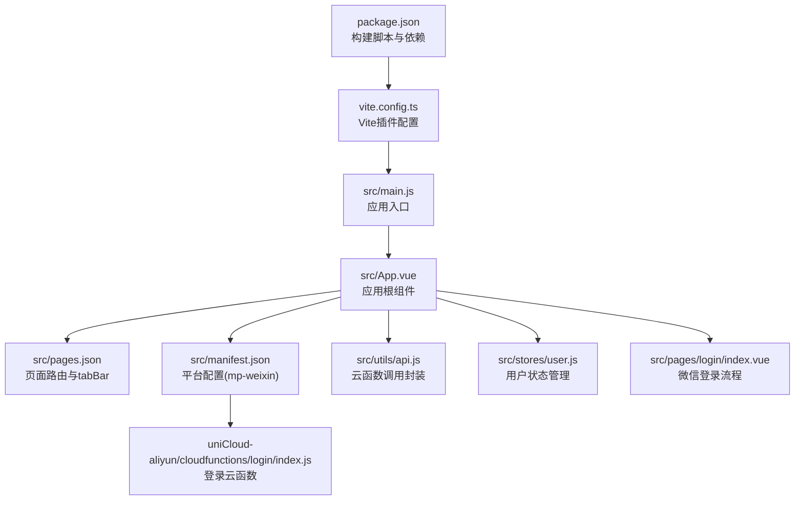
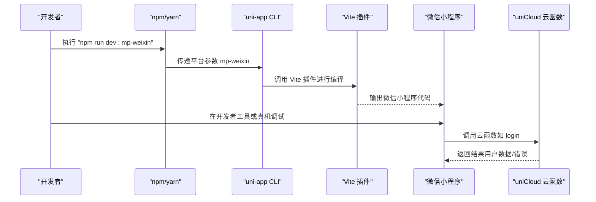
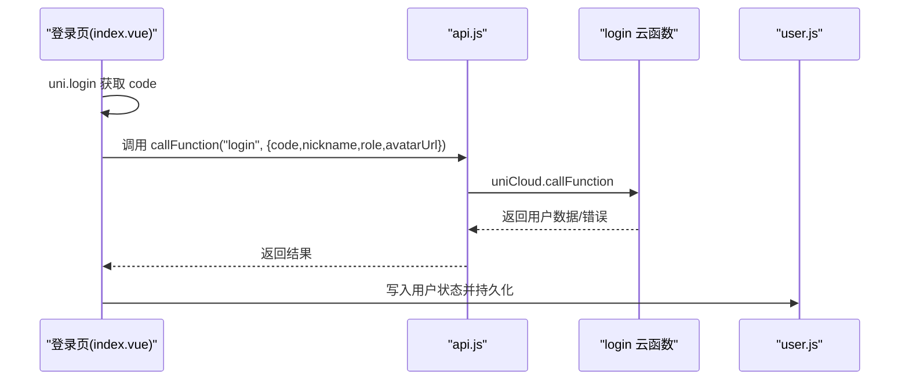
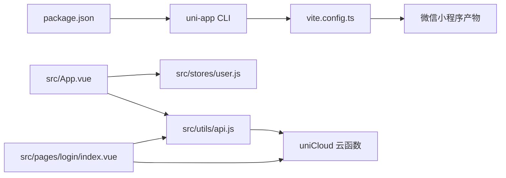

# 微信小程序构建

<cite>
**本文引用的文件**
- [package.json](file://package.json)
- [vite.config.ts](file://vite.config.ts)
- [src/manifest.json](file://src/manifest.json)
- [src/pages.json](file://src/pages.json)
- [src/main.js](file://src/main.js)
- [src/App.vue](file://src/App.vue)
- [src/utils/api.js](file://src/utils/api.js)
- [src/stores/user.js](file://src/stores/user.js)
- [src/pages/login/index.vue](file://src/pages/login/index.vue)
- [uniCloud-aliyun/cloudfunctions/login/index.js](file://uniCloud-aliyun/cloudfunctions/login/index.js)
- [src/static/tab-icons-placeholder.js](file://src/static/tab-icons-placeholder.js)
- [shims-uni.d.ts](file://shims-uni.d.ts)
</cite>

## 目录
1. [简介](#简介)
2. [项目结构](#项目结构)
3. [核心组件](#核心组件)
4. [架构总览](#架构总览)
5. [详细组件分析](#详细组件分析)
6. [依赖关系分析](#依赖关系分析)
7. [性能考虑](#性能考虑)
8. [故障排查指南](#故障排查指南)
9. [结论](#结论)
10. [附录](#附录)

## 简介
本文件面向Star Grow项目的微信小程序构建与发布，系统性说明开发环境配置、命令行构建流程、微信小程序专属配置项、页面路由与tabBar设置、导航栏样式、调试技巧、发布与审核注意事项，以及微信小程序特有的API使用与限制。文档基于仓库现有代码进行分析，确保内容可追溯至具体源文件。

## 项目结构
项目采用UniApp多端统一开发框架，通过Vite插件实现多端编译，其中微信小程序目标平台通过脚本命令触发。核心目录与文件如下：
- 根级构建脚本与依赖：package.json
- Vite配置：vite.config.ts
- 应用入口：src/main.js
- 应用根组件：src/App.vue
- 应用清单与平台配置：src/manifest.json
- 页面路由与tabBar配置：src/pages.json
- 工具与状态管理：src/utils/api.js、src/stores/user.js
- 平台条件编译示例：src/pages/login/index.vue
- 云函数登录逻辑：uniCloud-aliyun/cloudfunctions/login/index.js
- 类型声明：shims-uni.d.ts

图表来源
- [package.json:1-74](file://package.json#L1-L74)
- [vite.config.ts:1-8](file://vite.config.ts#L1-L8)
- [src/main.js:1-11](file://src/main.js#L1-L11)
- [src/App.vue:1-64](file://src/App.vue#L1-L64)
- [src/pages.json:1-56](file://src/pages.json#L1-L56)
- [src/manifest.json:1-78](file://src/manifest.json#L1-L78)
- [src/utils/api.js:1-18](file://src/utils/api.js#L1-L18)
- [src/stores/user.js:1-119](file://src/stores/user.js#L1-L119)
- [src/pages/login/index.vue:1-179](file://src/pages/login/index.vue#L1-L179)
- [uniCloud-aliyun/cloudfunctions/login/index.js:1-48](file://uniCloud-aliyun/cloudfunctions/login/index.js#L1-L48)

章节来源
- [package.json:1-74](file://package.json#L1-L74)
- [vite.config.ts:1-8](file://vite.config.ts#L1-L8)
- [src/main.js:1-11](file://src/main.js#L1-L11)
- [src/App.vue:1-64](file://src/App.vue#L1-L64)
- [src/pages.json:1-56](file://src/pages.json#L1-L56)
- [src/manifest.json:1-78](file://src/manifest.json#L1-L78)
- [src/utils/api.js:1-18](file://src/utils/api.js#L1-L18)
- [src/stores/user.js:1-119](file://src/stores/user.js#L1-L119)
- [src/pages/login/index.vue:1-179](file://src/pages/login/index.vue#L1-L179)
- [uniCloud-aliyun/cloudfunctions/login/index.js:1-48](file://uniCloud-aliyun/cloudfunctions/login/index.js#L1-L48)

## 核心组件
- 构建命令与脚本
  - 开发命令：dev:mp-weixin
  - 生产构建：build:mp-weixin
  - 基于uni-app CLI，通过平台参数选择目标端
- 应用入口与运行时
  - main.js创建SSR应用实例并挂载Pinia
  - App.vue在启动时初始化微信云开发（条件编译）
- 配置中心
  - manifest.json定义各平台配置，含mp-weixin的appid、setting、usingComponents
  - pages.json定义页面列表、全局样式、tabBar与导航栏样式
- 云函数与API封装
  - utils/api.js封装uniCloud.callFunction调用
  - stores/user.js管理用户状态与本地存储
  - 登录流程在pages/login/index.vue中实现，并调用云函数

章节来源
- [package.json:4-38](file://package.json#L4-L38)
- [src/main.js:1-11](file://src/main.js#L1-L11)
- [src/App.vue:1-28](file://src/App.vue#L1-L28)
- [src/manifest.json:52-58](file://src/manifest.json#L52-L58)
- [src/pages.json:1-56](file://src/pages.json#L1-L56)
- [src/utils/api.js:1-18](file://src/utils/api.js#L1-L18)
- [src/stores/user.js:1-119](file://src/stores/user.js#L1-L119)
- [src/pages/login/index.vue:102-179](file://src/pages/login/index.vue#L102-L179)

## 架构总览
下图展示从命令行到微信小程序产物的关键路径，以及微信云开发与云函数的交互。

图表来源
- [package.json:16](file://package.json#L16)
- [vite.config.ts:5-7](file://vite.config.ts#L5-L7)
- [src/pages/login/index.vue:172-179](file://src/pages/login/index.vue#L172-L179)
- [uniCloud-aliyun/cloudfunctions/login/index.js:6-48](file://uniCloud-aliyun/cloudfunctions/login/index.js#L6-L48)

## 详细组件分析

### 构建命令与参数
- 开发命令
  - npm run dev:mp-weixin
  - 功能：启动开发服务器，监听文件变化并热更新微信小程序代码
- 生产构建
  - npm run build:mp-weixin
  - 功能：打包输出微信小程序目标代码，用于上传与发布
- 关键点
  - 命令通过uni-app CLI的平台参数选择目标端
  - Vite插件负责实际的编译与资源处理

章节来源
- [package.json:16](file://package.json#L16)
- [package.json:32](file://package.json#L32)
- [vite.config.ts:5-7](file://vite.config.ts#L5-L7)

### 微信小程序专属配置（manifest.json）
- mp-weixin节点
  - appid：微信小程序唯一标识，需在微信公众平台申请
  - setting.urlCheck：是否检查TLS版本与域名校验，默认关闭便于开发
  - usingComponents：启用自定义组件
- 其他平台配置
  - app-plus、quickapp等节点存在，但与微信小程序构建无关
- uniCloud配置
  - vendor、dcloudAppId、spaceId指向阿里云uniCloud空间

章节来源
- [src/manifest.json:52-58](file://src/manifest.json#L52-L58)
- [src/manifest.json:72-76](file://src/manifest.json#L72-L76)

### 页面路由与tabBar配置（pages.json）
- pages数组
  - 定义每个页面的路径与页面级样式（如导航栏标题、自定义导航样式）
- globalStyle
  - 全局导航栏文字颜色、标题、背景色与页面背景色
- tabBar
  - 颜色、选中色、边框、背景色
  - list中每项包含pagePath、text、iconPath、selectedIconPath
  - 图标路径位于static目录，注意不支持SVG，需PNG格式

章节来源
- [src/pages.json:2-16](file://src/pages.json#L2-L16)
- [src/pages.json:17-22](file://src/pages.json#L17-L22)
- [src/pages.json:23-54](file://src/pages.json#L23-L54)
- [src/static/tab-icons-placeholder.js:1-9](file://src/static/tab-icons-placeholder.js#L1-L9)

### 导航栏样式与页面级样式
- 页面级样式
  - navigationBarTitleText：页面导航栏标题
  - navigationStyle：可设为custom以自定义导航栏
- 全局样式
  - navigationBarTextStyle、navigationBarBackgroundColor、backgroundColor
- 实践建议
  - 统一导航栏风格，避免页面间差异过大
  - 自定义导航栏时注意与tabBar高度叠加的兼容性

章节来源
- [src/pages.json:3-15](file://src/pages.json#L3-L15)
- [src/pages.json:17-22](file://src/pages.json#L17-L22)

### 登录与云函数调用流程
- 登录流程（微信端）
  - 通过uni.login获取code
  - 调用云函数login，传入code、昵称、角色、头像URL
  - 云函数校验并返回用户完整数据
- 云函数封装
  - utils/api.js对uniCloud.callFunction进行统一封装，返回结果或错误对象
- 用户状态管理
  - stores/user.js持久化用户信息，支持角色切换与登出

图表来源
- [src/pages/login/index.vue:136-179](file://src/pages/login/index.vue#L136-L179)
- [src/utils/api.js:9-17](file://src/utils/api.js#L9-L17)
- [uniCloud-aliyun/cloudfunctions/login/index.js:6-48](file://uniCloud-aliyun/cloudfunctions/login/index.js#L6-L48)
- [src/stores/user.js:23-53](file://src/stores/user.js#L23-L53)

章节来源
- [src/pages/login/index.vue:102-179](file://src/pages/login/index.vue#L102-L179)
- [src/utils/api.js:1-18](file://src/utils/api.js#L1-L18)
- [uniCloud-aliyun/cloudfunctions/login/index.js:1-48](file://uniCloud-aliyun/cloudfunctions/login/index.js#L1-L48)
- [src/stores/user.js:1-119](file://src/stores/user.js#L1-L119)

### 条件编译与平台适配
- 条件编译示例
  - #ifdef MP-WEIXIN：仅在微信小程序生效的登录与UI元素
  - #ifndef MP-WEIXIN：其他平台（如H5）的替代逻辑
- 实际应用
  - 登录页针对微信端使用chooseAvatar、nickname等特性
  - App.vue在微信端初始化wx.cloud

章节来源
- [src/pages/login/index.vue:10-98](file://src/pages/login/index.vue#L10-L98)
- [src/pages/login/index.vue:75-98](file://src/pages/login/index.vue#L75-L98)
- [src/App.vue:9-18](file://src/App.vue#L9-L18)

### 应用入口与运行时
- main.js
  - 创建SSR应用实例，挂载Pinia
- App.vue
  - onLaunch中初始化微信云开发（条件编译）
  - onShow中尝试同步离线数据

章节来源
- [src/main.js:1-11](file://src/main.js#L1-L11)
- [src/App.vue:1-28](file://src/App.vue#L1-L28)

## 依赖关系分析
- 构建链路
  - package.json脚本 -> uni-app CLI -> Vite插件 -> 编译输出
- 运行时链路
  - App.vue -> utils/api.js -> uniCloud -> 云函数
  - App.vue -> stores/user.js -> 本地存储
  - 登录页 -> 云函数login -> 用户状态写入

图表来源
- [package.json:4-38](file://package.json#L4-L38)
- [vite.config.ts:5-7](file://vite.config.ts#L5-L7)
- [src/App.vue:1-28](file://src/App.vue#L1-L28)
- [src/stores/user.js:1-119](file://src/stores/user.js#L1-L119)
- [src/utils/api.js:1-18](file://src/utils/api.js#L1-L18)
- [src/pages/login/index.vue:102-179](file://src/pages/login/index.vue#L102-L179)

章节来源
- [package.json:1-74](file://package.json#L1-L74)
- [vite.config.ts:1-8](file://vite.config.ts#L1-L8)
- [src/App.vue:1-64](file://src/App.vue#L1-L64)
- [src/stores/user.js:1-119](file://src/stores/user.js#L1-L119)
- [src/utils/api.js:1-18](file://src/utils/api.js#L1-L18)
- [src/pages/login/index.vue:1-179](file://src/pages/login/index.vue#L1-L179)

## 性能考虑
- 构建优化
  - 使用Vite插件提升编译速度
  - 合理拆分页面与组件，减少首屏加载体积
- 运行时优化
  - 登录与数据拉取尽量异步化，避免阻塞主线程
  - 使用本地缓存与智能同步策略（参考离线同步相关工具）
- 图标与资源
  - tabBar图标使用PNG，尺寸建议按官方规范准备，避免运行时缩放损耗

[本节为通用指导，无需特定文件引用]

## 故障排查指南
- 开发命令无法识别
  - 确认已安装依赖并使用正确命令
  - 检查package.json脚本是否存在
- 微信小程序appid无效
  - 在微信公众平台申请并填写正确的appid
  - 确保manifest.json中mp-weixin.appid已配置
- 域名校验问题
  - 开发阶段可将manifest.json中setting.urlCheck设为false
  - 生产前务必开启并配置合法域名
- 登录失败
  - 检查云函数login是否正确配置secret与环境
  - 查看控制台日志定位错误
- 真机调试无响应
  - 确认开发者工具已连接设备
  - 检查网络与证书配置

章节来源
- [package.json:4-38](file://package.json#L4-L38)
- [src/manifest.json:52-58](file://src/manifest.json#L52-L58)
- [uniCloud-aliyun/cloudfunctions/login/index.js:25-47](file://uniCloud-aliyun/cloudfunctions/login/index.js#L25-L47)

## 结论
本项目基于UniApp与Vite构建微信小程序，通过manifest.json与pages.json完成平台与页面配置，配合云函数实现用户登录与业务数据处理。遵循本文档的命令、配置与调试方法，可高效完成开发、调试与发布全流程。

[本节为总结性内容，无需特定文件引用]

## 附录

### 常用命令速查
- 开发：npm run dev:mp-weixin
- 生产构建：npm run build:mp-weixin

章节来源
- [package.json:16](file://package.json#L16)
- [package.json:32](file://package.json#L32)

### 微信小程序API使用与限制提示
- 登录与授权
  - 使用uni.login获取code，再调用云函数换取用户态
- 云开发
  - 在App.vue中初始化wx.cloud，注意条件编译
- 条件编译
  - 使用#ifdef/#endif包裹平台特定代码
- 数据存储
  - 使用uni.get/setStorageSync进行本地持久化
- 离线与网络
  - 参考离线同步工具，结合网络状态进行智能同步

章节来源
- [src/pages/login/index.vue:136-179](file://src/pages/login/index.vue#L136-L179)
- [src/App.vue:9-18](file://src/App.vue#L9-L18)
- [src/stores/user.js:1-119](file://src/stores/user.js#L1-L119)
- [src/utils/api.js:1-18](file://src/utils/api.js#L1-L18)