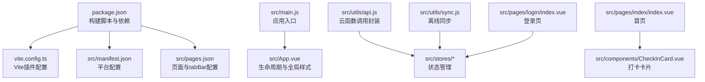
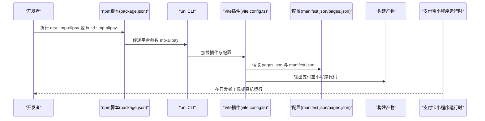
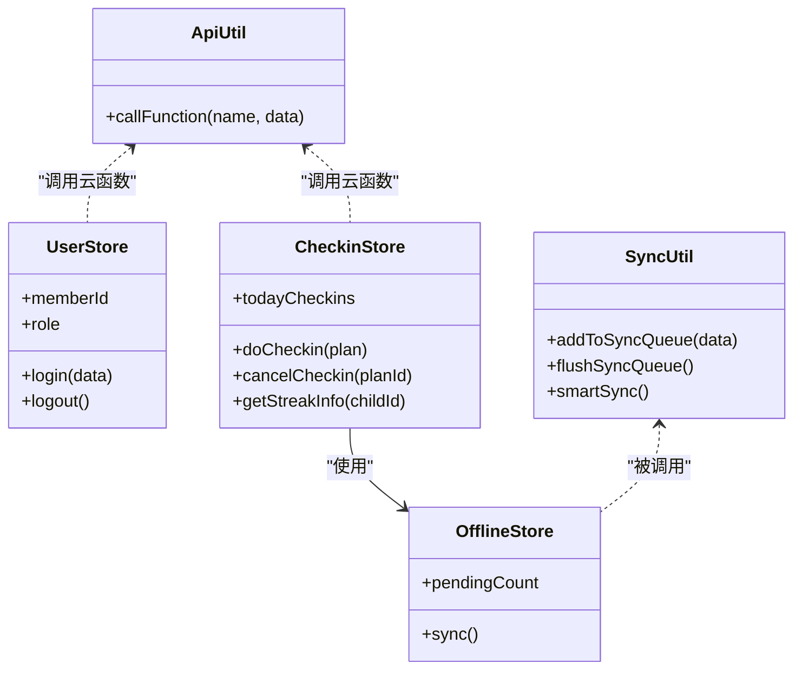
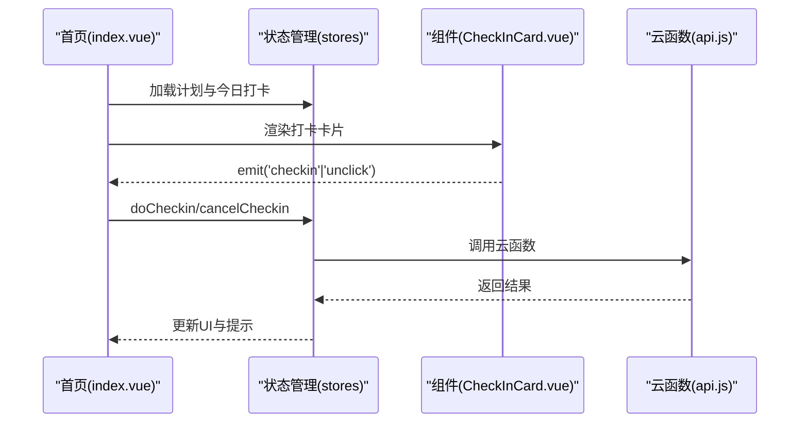
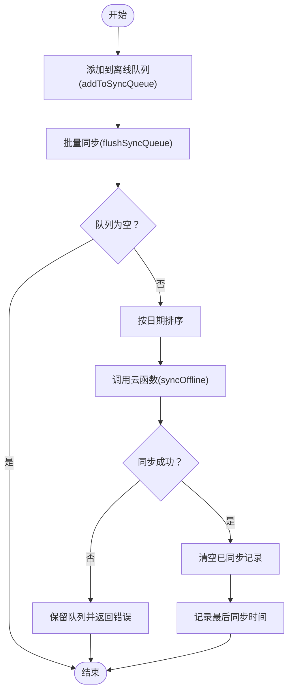
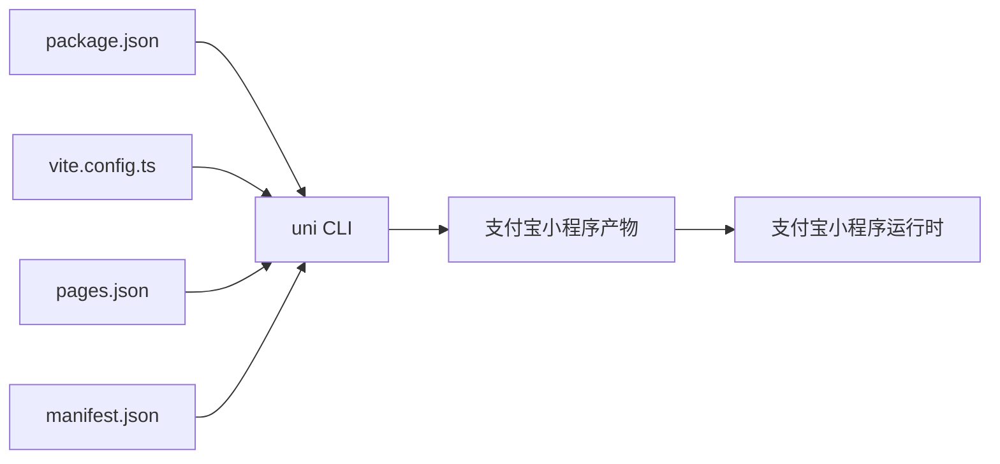

# 支付宝小程序构建

<cite>
**本文档引用的文件**
- [package.json](file://package.json)
- [vite.config.ts](file://vite.config.ts)
- [src/manifest.json](file://src/manifest.json)
- [src/pages.json](file://src/pages.json)
- [src/main.js](file://src/main.js)
- [src/App.vue](file://src/App.vue)
- [src/utils/api.js](file://src/utils/api.js)
- [src/stores/user.js](file://src/stores/user.js)
- [src/stores/checkins.js](file://src/stores/checkins.js)
- [src/stores/offline.js](file://src/stores/offline.js)
- [src/utils/sync.js](file://src/utils/sync.js)
- [src/pages/index/index.vue](file://src/pages/index/index.vue)
- [src/pages/login/index.vue](file://src/pages/login/index.vue)
- [src/components/CheckInCard.vue](file://src/components/CheckInCard.vue)
</cite>

## 目录
1. [简介](#简介)
2. [项目结构](#项目结构)
3. [核心组件](#核心组件)
4. [架构总览](#架构总览)
5. [详细组件分析](#详细组件分析)
6. [依赖关系分析](#依赖关系分析)
7. [性能考虑](#性能考虑)
8. [故障排查指南](#故障排查指南)
9. [结论](#结论)
10. [附录](#附录)

## 简介
本文件面向Star Grow项目中支付宝小程序（mp-alipay）的构建与发布，系统性说明开发环境搭建、构建命令使用、manifest.json与pages.json配置要点、页面与导航栏设置、调试与发布流程、与微信小程序的差异与兼容策略，以及支付宝小程序特有的API与组件使用建议。内容基于仓库现有源码进行归纳总结，确保可操作与可落地。

## 项目结构
本项目采用UniApp多端统一框架，通过Vite插件与脚本命令实现多平台构建。支付宝小程序相关的关键位置如下：
- 构建脚本与依赖：位于根目录的package.json，定义了dev:mp-alipay与build:mp-alipay命令及依赖包
- 配置文件：src/manifest.json用于各平台差异化配置；src/pages.json用于页面路由、全局样式与tabBar配置
- 应用入口：src/main.js导出createApp工厂；src/App.vue作为应用生命周期与全局样式的入口
- 功能模块：src/utils/api.js统一封装uniCloud调用；src/stores/*管理状态；src/utils/sync.js处理离线同步
- 页面与组件：src/pages/*与src/components/*承载具体业务页面与通用组件

图表来源
- [package.json:1-74](file://package.json#L1-L74)
- [vite.config.ts:1-8](file://vite.config.ts#L1-L8)
- [src/manifest.json:1-78](file://src/manifest.json#L1-L78)
- [src/pages.json:1-56](file://src/pages.json#L1-L56)
- [src/main.js:1-11](file://src/main.js#L1-L11)
- [src/App.vue:1-64](file://src/App.vue#L1-L64)
- [src/utils/api.js:1-18](file://src/utils/api.js#L1-L18)
- [src/utils/sync.js:1-96](file://src/utils/sync.js#L1-L96)
- [src/pages/index/index.vue:1-204](file://src/pages/index/index.vue#L1-L204)
- [src/pages/login/index.vue:1-289](file://src/pages/login/index.vue#L1-L289)
- [src/components/CheckInCard.vue:1-67](file://src/components/CheckInCard.vue#L1-L67)

章节来源
- [package.json:1-74](file://package.json#L1-L74)
- [vite.config.ts:1-8](file://vite.config.ts#L1-L8)
- [src/manifest.json:1-78](file://src/manifest.json#L1-L78)
- [src/pages.json:1-56](file://src/pages.json#L1-L56)
- [src/main.js:1-11](file://src/main.js#L1-L11)
- [src/App.vue:1-64](file://src/App.vue#L1-L64)

## 核心组件
- 构建与运行
  - 开发命令：dev:mp-alipay
  - 生产构建：build:mp-alipay
  - 基于uni-app CLI与Vite插件实现多端编译
- 平台配置
  - manifest.json中的mp-alipay节点启用自定义组件（usingComponents）
  - uniCloud统一后端，供应商aliyun
- 页面与导航
  - pages.json集中声明页面路径与样式，全局样式与tabBar统一配置
- 状态与云服务
  - api.js统一封装uniCloud.callFunction
  - stores/*管理用户、打卡、离线等状态
  - sync.js处理离线队列与智能同步

章节来源
- [package.json:8-24](file://package.json#L8-L24)
- [src/manifest.json:59-61](file://src/manifest.json#L59-L61)
- [src/pages.json:1-56](file://src/pages.json#L1-L56)
- [src/utils/api.js:1-18](file://src/utils/api.js#L1-L18)
- [src/stores/user.js:1-119](file://src/stores/user.js#L1-L119)
- [src/stores/checkins.js:1-163](file://src/stores/checkins.js#L1-L163)
- [src/stores/offline.js:1-30](file://src/stores/offline.js#L1-L30)
- [src/utils/sync.js:1-96](file://src/utils/sync.js#L1-L96)

## 架构总览
下图展示支付宝小程序构建与运行的关键流程：开发者通过npm脚本触发uni CLI，经由Vite插件解析pages.json与manifest.json，输出目标平台代码；运行时通过uniCloud访问后端云资源。

图表来源
- [package.json:8-24](file://package.json#L8-L24)
- [vite.config.ts:1-8](file://vite.config.ts#L1-L8)
- [src/manifest.json:1-78](file://src/manifest.json#L1-L78)
- [src/pages.json:1-56](file://src/pages.json#L1-L56)

## 详细组件分析

### 构建命令与环境
- 开发命令：dev:mp-alipay
  - 作用：启动开发服务器，监听代码变更并热更新支付宝小程序
  - 实现：通过uni CLI传入平台参数mp-alipay
- 生产构建：build:mp-alipay
  - 作用：打包生成支付宝小程序生产版本
  - 实现：uni CLI按平台产出对应目录与资源

章节来源
- [package.json:8-24](file://package.json#L8-L24)

### 配置文件与平台差异
- manifest.json（支付宝小程序）
  - mp-alipay节点：启用自定义组件（usingComponents: true）
  - uniCloud：指定供应商aliyun与空间标识
  - 注意：支付宝小程序无需在此处填写appid（以开发者工具与平台审核为准）
- pages.json（支付宝小程序）
  - pages：声明所有页面路径与导航样式（如自定义导航栏）
  - globalStyle：全局导航文字颜色、标题、背景色
  - tabBar：颜色、选中色、边框、背景、图标与文本配置

章节来源
- [src/manifest.json:59-61](file://src/manifest.json#L59-L61)
- [src/manifest.json:72-76](file://src/manifest.json#L72-L76)
- [src/pages.json:1-56](file://src/pages.json#L1-L56)

### 页面与导航栏设置
- 导航栏
  - 全局样式：navigationBarTextStyle、navigationBarTitleText、navigationBarBackgroundColor、backgroundColor
  - 页面级样式：每页可覆盖全局样式（如自定义导航栏）
- tabBar
  - 颜色体系：color、selectedColor、borderStyle、backgroundColor
  - 列表：pagePath、text、iconPath、selectedIconPath
  - 图标资源：需确保静态资源路径有效

章节来源
- [src/pages.json:17-22](file://src/pages.json#L17-L22)
- [src/pages.json:23-54](file://src/pages.json#L23-L54)

### 状态管理与云服务
- 统一云函数调用
  - api.js封装callFunction，统一错误处理与返回格式
- 用户状态
  - user.js管理成员ID、角色、昵称、头像、积分等，持久化至Storage
- 打卡状态
  - checkins.js负责今日/周打卡查询、执行打卡、撤销、连续天数统计
  - 支持离线记录与本地缓存，失败时入队等待同步
- 离线同步
  - offline.js暴露pendingCount与sync接口
  - sync.js提供队列入队、批量同步、网络检测与智能同步

图表来源
- [src/utils/api.js:1-18](file://src/utils/api.js#L1-L18)
- [src/stores/user.js:1-119](file://src/stores/user.js#L1-L119)
- [src/stores/checkins.js:1-163](file://src/stores/checkins.js#L1-L163)
- [src/stores/offline.js:1-30](file://src/stores/offline.js#L1-L30)
- [src/utils/sync.js:1-96](file://src/utils/sync.js#L1-L96)

章节来源
- [src/utils/api.js:1-18](file://src/utils/api.js#L1-L18)
- [src/stores/user.js:1-119](file://src/stores/user.js#L1-L119)
- [src/stores/checkins.js:1-163](file://src/stores/checkins.js#L1-L163)
- [src/stores/offline.js:1-30](file://src/stores/offline.js#L1-L30)
- [src/utils/sync.js:1-96](file://src/utils/sync.js#L1-L96)

### 页面与组件示例
- 首页（今日打卡）
  - 展示问候语、日期、积分、打卡进度与卡片列表
  - 支持离线同步提示与一键同步
- 登录页
  - 条件编译：仅微信平台显示微信授权入口
  - 支持家长/孩子角色选择与进入应用
- 打卡卡片组件
  - 左侧分类图标与计划信息，右侧打卡按钮
  - 已完成态样式区分

图表来源
- [src/pages/index/index.vue:1-204](file://src/pages/index/index.vue#L1-L204)
- [src/components/CheckInCard.vue:1-67](file://src/components/CheckInCard.vue#L1-L67)
- [src/utils/api.js:1-18](file://src/utils/api.js#L1-L18)
- [src/stores/checkins.js:1-163](file://src/stores/checkins.js#L1-L163)

章节来源
- [src/pages/index/index.vue:1-204](file://src/pages/index/index.vue#L1-L204)
- [src/pages/login/index.vue:1-289](file://src/pages/login/index.vue#L1-L289)
- [src/components/CheckInCard.vue:1-67](file://src/components/CheckInCard.vue#L1-L67)

### 离线同步流程

图表来源
- [src/utils/sync.js:13-53](file://src/utils/sync.js#L13-L53)

章节来源
- [src/utils/sync.js:1-96](file://src/utils/sync.js#L1-L96)

## 依赖关系分析
- 构建链路
  - npm脚本 -> uni CLI -> Vite插件 -> pages.json/manifest.json -> 产物
- 运行链路
  - App.vue生命周期 -> 状态初始化 -> 页面渲染 -> 云函数调用 -> 数据持久化

图表来源
- [package.json:1-74](file://package.json#L1-L74)
- [vite.config.ts:1-8](file://vite.config.ts#L1-L8)
- [src/manifest.json:1-78](file://src/manifest.json#L1-L78)
- [src/pages.json:1-56](file://src/pages.json#L1-L56)

章节来源
- [package.json:1-74](file://package.json#L1-L74)
- [vite.config.ts:1-8](file://vite.config.ts#L1-L8)
- [src/manifest.json:1-78](file://src/manifest.json#L1-L78)
- [src/pages.json:1-56](file://src/pages.json#L1-L56)

## 性能考虑
- 构建优化
  - 使用Vite插件提升开发体验与构建速度
  - 合理拆分页面与组件，避免一次性加载过多资源
- 运行优化
  - 离线优先：离线记录与本地缓存降低首屏等待
  - 智能同步：仅在网络可用时执行批量同步，减少无效请求
  - 图标与静态资源：统一放置static目录，确保路径正确

## 故障排查指南
- 构建失败
  - 检查package.json中的脚本与依赖版本是否匹配
  - 确认vite.config.ts已正确加载uni插件
- 配置问题
  - 确认pages.json中页面路径与实际文件一致
  - 确认manifest.json中mp-alipay节点的usingComponents为true
- 云函数调用异常
  - 查看api.js的错误处理与返回格式
  - 核对uniCloud空间ID与供应商配置
- 登录与角色切换
  - 登录页存在条件编译逻辑，确保在支付宝小程序端走通用登录流程
- 离线同步
  - 检查sync.js队列键值与Storage权限
  - 确保网络类型检测与智能同步逻辑正常

章节来源
- [package.json:1-74](file://package.json#L1-L74)
- [vite.config.ts:1-8](file://vite.config.ts#L1-L8)
- [src/manifest.json:59-61](file://src/manifest.json#L59-L61)
- [src/pages.json:1-56](file://src/pages.json#L1-L56)
- [src/utils/api.js:1-18](file://src/utils/api.js#L1-L18)
- [src/utils/sync.js:1-96](file://src/utils/sync.js#L1-L96)
- [src/pages/login/index.vue:1-289](file://src/pages/login/index.vue#L1-L289)

## 结论
本项目通过标准的UniApp多端方案，结合Vite与脚本命令，实现了支付宝小程序的高效开发与构建。通过manifest.json与pages.json的平台化配置、统一的云函数封装与状态管理、以及完善的离线同步机制，能够满足日常业务需求。后续可在发布前完善平台特定配置与测试覆盖，确保跨平台一致性与稳定性。

## 附录

### 开发环境与配置清单
- 安装依赖
  - 使用npm/yarn安装根目录依赖
- 开发与构建
  - 开发：npm run dev:mp-alipay
  - 构建：npm run build:mp-alipay
- 关键配置
  - pages.json：页面路由、全局样式、tabBar
  - manifest.json：mp-alipay节点、uniCloud配置
  - vite.config.ts：Vite插件加载

章节来源
- [package.json:1-74](file://package.json#L1-L74)
- [vite.config.ts:1-8](file://vite.config.ts#L1-L8)
- [src/manifest.json:1-78](file://src/manifest.json#L1-L78)
- [src/pages.json:1-56](file://src/pages.json#L1-L56)

### 支付宝小程序与微信小程序差异与兼容
- 登录与授权
  - 登录页存在条件编译：仅微信平台提供微信授权入口，支付宝小程序端走通用登录流程
- 平台特性
  - 支付宝小程序在manifest.json中无需配置appid，以开发者工具与平台审核为准
  - 使用Components：支付宝小程序启用自定义组件（usingComponents: true）
- 云服务
  - 统一使用uniCloud，供应商配置为aliyun，确保两端一致

章节来源
- [src/pages/login/index.vue:102-162](file://src/pages/login/index.vue#L102-L162)
- [src/manifest.json:59-61](file://src/manifest.json#L59-L61)
- [src/manifest.json:72-76](file://src/manifest.json#L72-L76)

### 支付宝小程序特有API与组件使用建议
- 自定义组件
  - 在mp-alipay中启用usingComponents，便于复用与扩展
- 云开发
  - 使用uniCloud统一调用，注意错误处理与返回格式
- 离线能力
  - 借助Storage与队列机制实现离线记录与批量同步

章节来源
- [src/manifest.json:59-61](file://src/manifest.json#L59-L61)
- [src/utils/api.js:1-18](file://src/utils/api.js#L1-L18)
- [src/utils/sync.js:1-96](file://src/utils/sync.js#L1-L96)