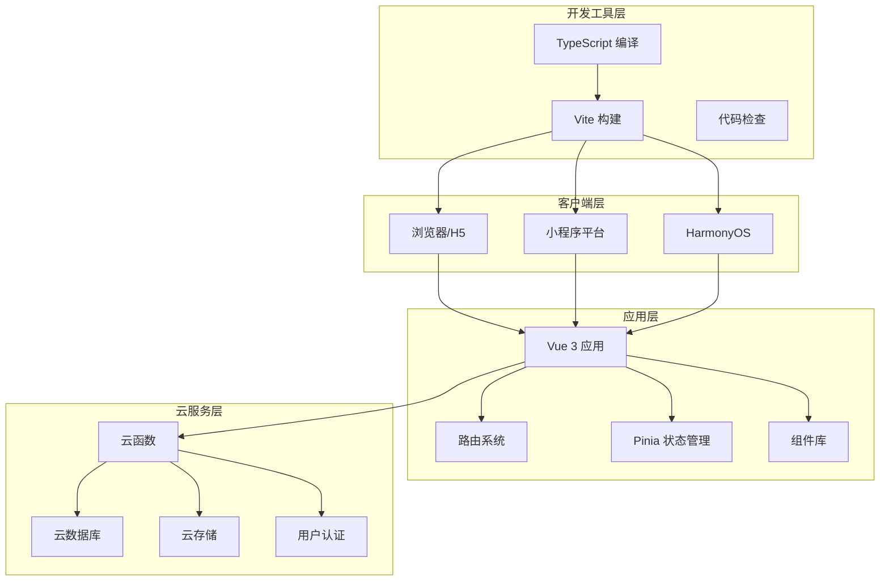
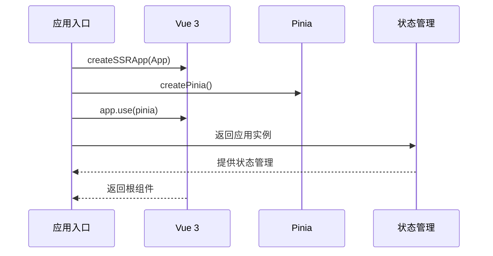
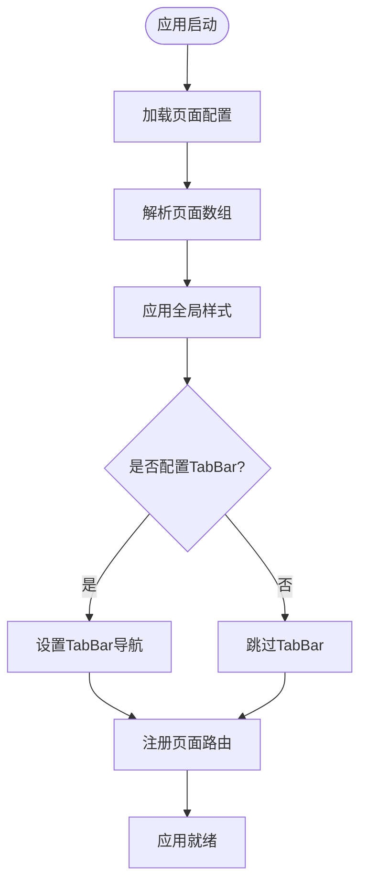
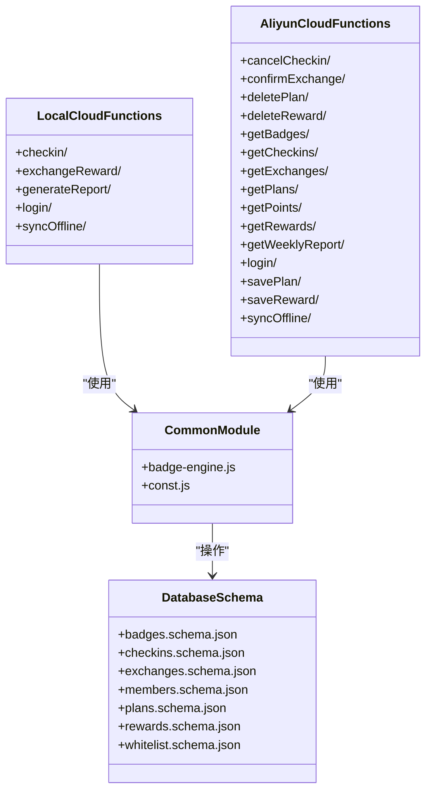
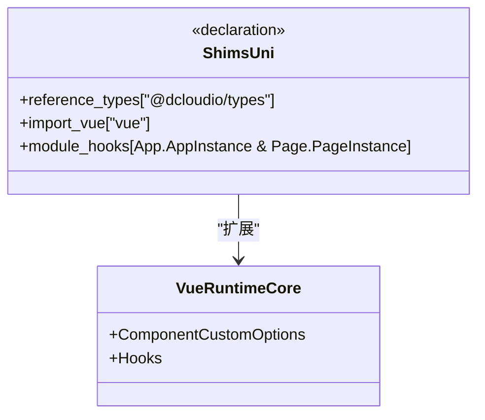
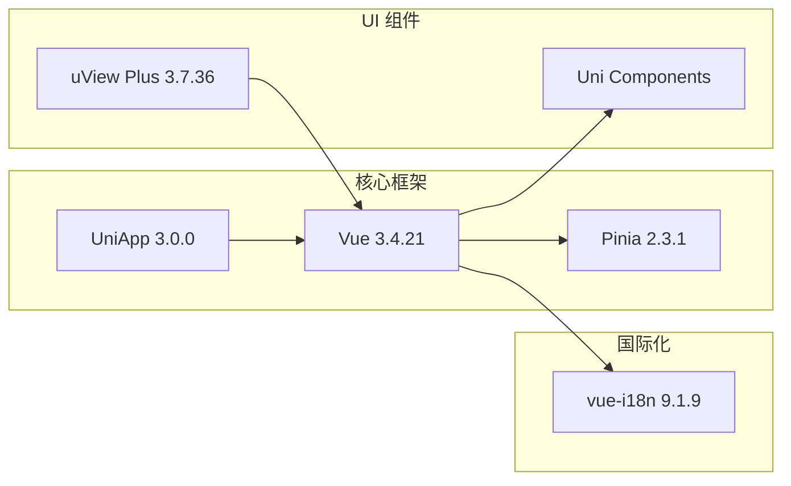

# 开发环境配置

<cite>
**本文档引用的文件**
- [package.json](file://package.json)
- [tsconfig.json](file://tsconfig.json)
- [vite.config.ts](file://vite.config.ts)
- [.gitignore](file://.gitignore)
- [shims-uni.d.ts](file://shims-uni.d.ts)
- [src/main.js](file://src/main.js)
- [src/App.vue](file://src/App.vue)
- [src/pages.json](file://src/pages.json)
- [src/cloudfunctions/checkin/package.json](file://src/cloudfunctions/checkin/package.json)
- [uniCloud-aliyun/cloudfunctions/common/package.json](file://uniCloud-aliyun/cloudfunctions/common/package.json)
</cite>

## 目录
1. [简介](#简介)
2. [项目结构](#项目结构)
3. [核心组件](#核心组件)
4. [架构概览](#架构概览)
5. [详细组件分析](#详细组件分析)
6. [依赖分析](#依赖分析)
7. [性能考虑](#性能考虑)
8. [故障排除指南](#故障排除指南)
9. [结论](#结论)

## 简介

Star Grow 是一个基于 Vue 3 和 UniApp 的多端应用项目，支持 H5 和多个小程序平台。该项目采用 TypeScript 进行类型安全开发，使用 Vite 作为构建工具，配合 Pinia 进行状态管理。

## 项目结构

项目采用典型的 UniApp 多端应用结构，主要分为以下几个部分：

```mermaid
graph TB
subgraph "项目根目录"
Root[项目根目录]
Src[src/] 源代码目录
Cloud[uniCloud-aliyun/] 云开发目录
Config[配置文件]
end
subgraph "源代码结构"
Pages[pages/] 页面组件
Components[components/] 业务组件
Stores[stores/] 状态管理
Utils[utils/] 工具函数
Static[static/] 静态资源
CloudFunc[src/cloudfunctions/] 服务端云函数
end
subgraph "云开发结构"
UCpages[pages/] 云页面
UCstores[stores/] 云存储
UCfunc[cloudfunctions/] 云函数
UCommon[common/] 公共模块
UDB[database/] 数据库模式
end
Root --> Src
Root --> Cloud
Root --> Config
Src --> Pages
Src --> Components
Src --> Stores
Src --> Utils
Src --> Static
Src --> CloudFunc
Cloud --> UCpages
Cloud --> UCstores
Cloud --> UCfunc
Cloud --> UCommon
Cloud --> UDB
```

**图表来源**
- [package.json:1-74](file://package.json#L1-L74)
- [src/pages.json:1-56](file://src/pages.json#L1-L56)

**章节来源**
- [package.json:1-74](file://package.json#L1-L74)
- [src/pages.json:1-56](file://src/pages.json#L1-L56)

## 核心组件

### 包管理器配置

项目支持多种包管理器，包括 npm 和 yarn。根据 package.json 中的脚本配置，可以使用以下命令进行开发和构建：

- **开发模式**: `npm run dev:h5` 或 `yarn dev:h5`
- **构建模式**: `npm run build:h5` 或 `yarn build:h5`
- **多平台开发**: 支持微信小程序、支付宝小程序等多个平台的开发命令

**章节来源**
- [package.json:4-37](file://package.json#L4-L37)

### TypeScript 配置

项目使用 TypeScript 进行类型安全开发，配置文件位于根目录：

- **扩展配置**: 继承自 `@vue/tsconfig/tsconfig.json`
- **路径映射**: 使用 `@/*` 映射到 `./src/*`
- **类型定义**: 包含 `@dcloudio/types` 以支持 UniApp 类型
- **目标库**: 支持 ESNext 和 DOM API

**章节来源**
- [tsconfig.json:1-14](file://tsconfig.json#L1-L14)

### 构建配置

Vite 作为构建工具，配置相对简洁：

- **插件系统**: 使用 `@dcloudio/vite-plugin-uni` 插件
- **多端支持**: 通过插件实现对不同平台的支持
- **开发服务器**: 自动热重载功能

**章节来源**
- [vite.config.ts:1-8](file://vite.config.ts#L1-L8)

## 架构概览

项目采用分层架构设计，结合了前端应用、云服务和数据库三层结构：



**图表来源**
- [src/main.js:1-11](file://src/main.js#L1-L11)
- [src/App.vue:1-64](file://src/App.vue#L1-L64)
- [package.json:39-72](file://package.json#L39-L72)

## 详细组件分析

### 应用入口配置

应用入口文件负责初始化 Vue 应用和 Pinia 状态管理：



**图表来源**
- [src/main.js:1-11](file://src/main.js#L1-L11)

应用初始化流程包括：
- 创建 SSR 应用实例
- 初始化 Pinia 状态管理
- 注册应用实例
- 导出应用工厂函数

**章节来源**
- [src/main.js:1-11](file://src/main.js#L1-L11)

### 页面路由配置

项目使用 pages.json 进行页面路由配置，支持 TabBar 导航：



**图表来源**
- [src/pages.json:1-56](file://src/pages.json#L1-L56)

页面配置特点：
- 支持 13 个主要页面
- 配置全局导航样式
- 设置 TabBar 导航栏
- 自定义页面标题和样式

**章节来源**
- [src/pages.json:1-56](file://src/pages.json#L1-L56)

### 云函数架构

项目包含两套云函数：本地云函数和阿里云函数：



**图表来源**
- [src/cloudfunctions/checkin/package.json:1-2](file://src/cloudfunctions/checkin/package.json#L1-L2)
- [uniCloud-aliyun/cloudfunctions/common/package.json:1-7](file://uniCloud-aliyun/cloudfunctions/common/package.json#L1-L7)

**章节来源**
- [src/cloudfunctions/checkin/package.json:1-2](file://src/cloudfunctions/checkin/package.json#L1-L2)
- [uniCloud-aliyun/cloudfunctions/common/package.json:1-7](file://uniCloud-aliyun/cloudfunctions/common/package.json#L1-L7)

### 类型声明配置

项目使用 TypeScript 声明文件支持 UniApp 开发：



**图表来源**
- [shims-uni.d.ts:1-11](file://shims-uni.d.ts#L1-L11)

**章节来源**
- [shims-uni.d.ts:1-11](file://shims-uni.d.ts#L1-L11)

## 依赖分析

### 生产依赖分析

项目的核心生产依赖包括：



**图表来源**
- [package.json:39-59](file://package.json#L39-L59)

### 开发依赖分析

开发工具链配置：

```mermaid
graph TB
subgraph "构建工具"
Vite[Vite 5.2.8]
TypeScript[TypeScript 4.9.4]
VueTSC[vue-tsc 1.0.24]
end
subgraph "UniApp 生态"
UniAutomator[uni-automator]
UniCLI[uni-cli-shared]
UniStacktracey[uni-stacktracey]
VitePluginUni[vite-plugin-uni]
end
subgraph "类型定义"
DCloudTypes[@dcloudio/types 3.4.8]
VueRuntimeCore[@vue/runtime-core]
VueTsconfig[@vue/tsconfig]
end
Vite --> VitePluginUni
TypeScript --> VueTSC
DCloudTypes --> UniApp
VueTsconfig --> TypeScript
```

**图表来源**
- [package.json:61-72](file://package.json#L61-L72)

**章节来源**
- [package.json:39-72](file://package.json#L39-L72)

## 性能考虑

### 构建优化

项目采用 Vite 作为构建工具，具有以下性能优势：
- **快速冷启动**: 基于 ES 模块的原生支持
- **热重载**: 实时代码更新，无需刷新页面
- **按需编译**: 只编译当前页面所需的模块

### 代码分割

项目结构支持自动代码分割：
- 按页面拆分代码包
- 懒加载非关键页面
- 优化首屏加载时间

### 缓存策略

开发环境中的缓存优化：
- 浏览器缓存静态资源
- Vite 缓存编译结果
- 模块依赖缓存

## 故障排除指南

### 常见开发问题

#### 1. 依赖安装问题

**问题**: 安装依赖时出现版本冲突
**解决方案**: 
- 清理 node_modules 和 package-lock.json
- 使用 `npm audit fix` 修复安全问题
- 检查 TypeScript 版本兼容性

#### 2. 热重载失效

**问题**: 修改代码后页面不自动刷新
**解决方案**:
- 检查 Vite 配置文件
- 确认端口未被占用
- 重启开发服务器

#### 3. 路由配置错误

**问题**: 页面无法正常显示或路由跳转失败
**解决方案**:
- 检查 pages.json 中的路径配置
- 确认页面文件存在且命名正确
- 验证全局样式配置

#### 4. 云函数部署问题

**问题**: 云函数无法正常运行
**解决方案**:
- 检查云函数的 package.json 配置
- 确认依赖项正确安装
- 验证云数据库连接配置

**章节来源**
- [package.json:4-37](file://package.json#L4-L37)
- [src/pages.json:1-56](file://src/pages.json#L1-L56)

## 结论

Star Grow 项目采用现代化的开发技术栈，具备良好的可维护性和扩展性。项目配置清晰，支持多端开发，适合团队协作开发。通过合理的依赖管理和构建配置，能够提供高效的开发体验和稳定的运行性能。

建议开发者在开始项目前：
1. 确保 Node.js 版本满足项目要求
2. 熟悉 UniApp 和 Vue 3 的开发模式
3. 掌握 TypeScript 类型系统
4. 了解云开发的基本概念和配置方法
5. 学习 Vite 构建工具的使用技巧