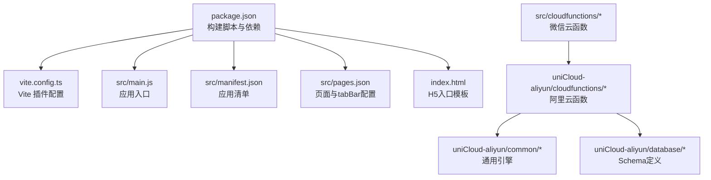
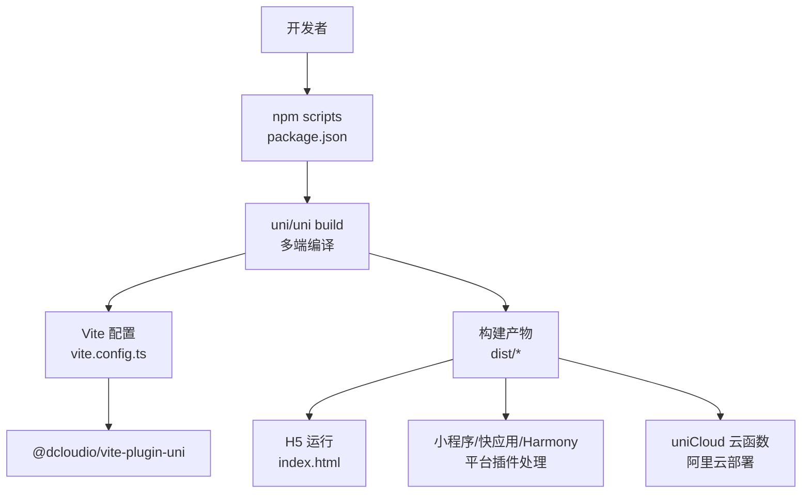
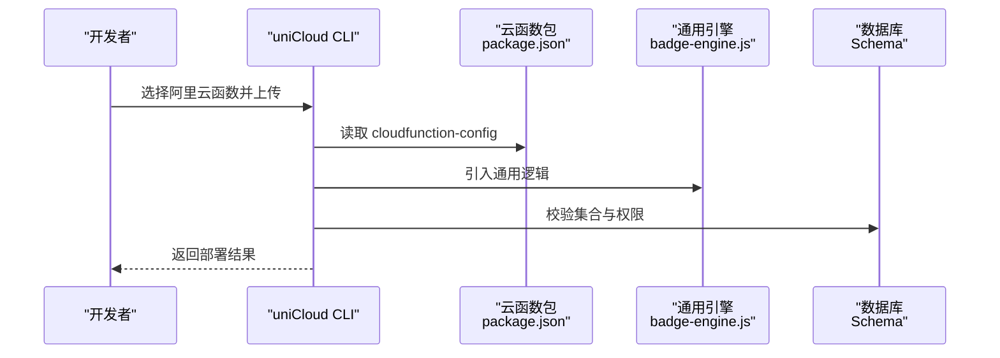
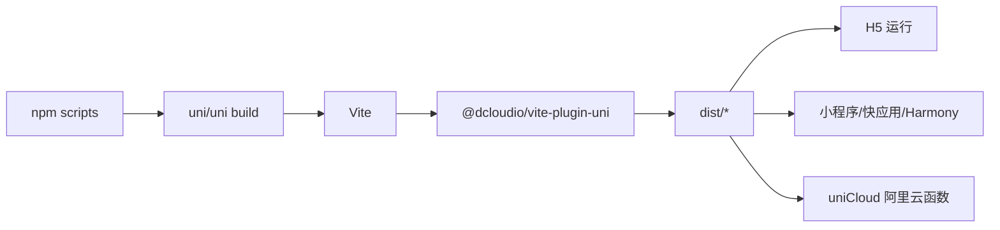

# 构建部署

<cite>
**本文引用的文件**
- [package.json](file://package.json)
- [vite.config.ts](file://vite.config.ts)
- [index.html](file://index.html)
- [src/main.js](file://src/main.js)
- [src/manifest.json](file://src/manifest.json)
- [src/pages.json](file://src/pages.json)
- [src/cloudfunctions/checkin/index.js](file://src/cloudfunctions/checkin/index.js)
- [src/cloudfunctions/checkin/package.json](file://src/cloudfunctions/checkin/package.json)
- [uniCloud-aliyun/cloudfunctions/checkin/index.js](file://uniCloud-aliyun/cloudfunctions/checkin/index.js)
- [uniCloud-aliyun/cloudfunctions/checkin/package.json](file://uniCloud-aliyun/cloudfunctions/checkin/package.json)
- [uniCloud-aliyun/common/badge-engine.js](file://uniCloud-aliyun/common/badge-engine.js)
- [uniCloud-aliyun/database/checkins.schema.json](file://uniCloud-aliyun/database/checkins.schema.json)
- [uniCloud-aliyun/database/plans.schema.json](file://uniCloud-aliyun/database/plans.schema.json)
</cite>

## 目录
1. [简介](#简介)
2. [项目结构](#项目结构)
3. [核心组件](#核心组件)
4. [架构总览](#架构总览)
5. [详细组件分析](#详细组件分析)
6. [依赖关系分析](#依赖关系分析)
7. [性能与构建优化](#性能与构建优化)
8. [故障排查指南](#故障排查指南)
9. [结论](#结论)
10. [附录](#附录)

## 简介
本文件面向 Star Grow 项目的构建与部署，覆盖 uni-app 多端构建命令与参数、manifest.json 配置项说明、pages.json 路由与 tabBar 设置、生产环境优化策略、uniCloud 云函数构建与部署流程、构建产物验证与测试方法，以及不同环境的部署策略与注意事项。内容基于仓库中现有配置与源码进行整理，确保可操作性与可追溯性。

## 项目结构
项目采用 uni-app 3.x + Vite 的标准工程化结构，前端源码位于 src 目录，云开发位于 uniCloud-aliyun 目录，根目录提供构建脚本与基础配置文件。

图示来源
- [package.json:1-74](file://package.json#L1-L74)
- [vite.config.ts:1-8](file://vite.config.ts#L1-L8)
- [src/main.js:1-11](file://src/main.js#L1-L11)
- [src/manifest.json:1-77](file://src/manifest.json#L1-L77)
- [src/pages.json:1-56](file://src/pages.json#L1-L56)
- [index.html:1-21](file://index.html#L1-L21)

章节来源
- [package.json:1-74](file://package.json#L1-L74)
- [vite.config.ts:1-8](file://vite.config.ts#L1-L8)
- [src/main.js:1-11](file://src/main.js#L1-L11)
- [src/manifest.json:1-77](file://src/manifest.json#L1-L77)
- [src/pages.json:1-56](file://src/pages.json#L1-L56)
- [index.html:1-21](file://index.html#L1-L21)

## 核心组件
- 构建脚本与多端命令：通过 package.json 中的 scripts 定义统一的开发与构建命令，支持 H5、微信小程序、支付宝小程序、快应用、Harmony 等平台。
- Vite 配置：使用 @dcloudio/vite-plugin-uni 插件，启用 uni-app 生态的编译与多端能力。
- 应用清单 manifest.json：集中配置应用元信息、平台特定选项、权限与 uniCloud 厂商信息。
- 页面与导航 pages.json：定义页面路径、全局样式、导航栏与 tabBar。
- H5 入口模板 index.html：提供 viewport、预加载占位与应用上下文注入。
- 云函数与数据库：src/cloudfunctions 提供微信云函数样例；uniCloud-aliyun 提供阿里云函数与通用引擎、Schema 定义。

章节来源
- [package.json:4-38](file://package.json#L4-L38)
- [vite.config.ts:5-7](file://vite.config.ts#L5-L7)
- [src/manifest.json:1-77](file://src/manifest.json#L1-L77)
- [src/pages.json:1-56](file://src/pages.json#L1-L56)
- [index.html:3-20](file://index.html#L3-L20)
- [src/cloudfunctions/checkin/index.js:1-142](file://src/cloudfunctions/checkin/index.js#L1-L142)
- [uniCloud-aliyun/cloudfunctions/checkin/index.js:1-83](file://uniCloud-aliyun/cloudfunctions/checkin/index.js#L1-L83)

## 架构总览
下图展示从构建到运行的关键路径：开发者通过 npm scripts 触发 uni/uni build，Vite 结合 @dcloudio/vite-plugin-uni 编译多端代码；H5 以 index.html 为入口；小程序与快应用等平台由对应平台插件处理；uniCloud 云函数在阿里云侧独立部署。

图示来源
- [package.json:4-38](file://package.json#L4-L38)
- [vite.config.ts:5-7](file://vite.config.ts#L5-L7)
- [index.html:16-20](file://index.html#L16-L20)

## 详细组件分析

### uni-app 多端构建命令与参数
- 开发命令
  - H5 开发：dev:h5
  - H5 SSR 开发：dev:h5:ssr
  - 微信小程序开发：dev:mp-weixin
  - 支付宝小程序开发：dev:mp-alipay
  - 其他平台：dev:mp-baidu、dev:mp-toutiao、dev:mp-qq、dev:mp-jd、dev:mp-kuaishou、dev:mp-lark、dev:mp-harmony、dev:mp-xhs、dev:quickapp-webview、dev:quickapp-webview-huawei、dev:quickapp-webview-union
- 构建命令
  - H5 构建：build:h5
  - H5 SSR 构建：build:h5:ssr
  - 各小程序与快应用平台：build:mp-weixin、build:mp-alipay、...、build:quickapp-webview-union
- 参数说明
  - -p：指定平台（如 -p mp-weixin），用于 uni 与 uni build 命令
  - --ssr：启用服务端渲染（仅 H5）

章节来源
- [package.json:4-38](file://package.json#L4-L38)

### manifest.json 配置详解
- 基本信息
  - name、description、versionName、versionCode、appid 等
- 平台特性
  - app-plus：5+App 特有配置，如 splashscreen、modules、distribute.android.permissions 等
  - mp-weixin：小程序（微信）appid、setting.urlCheck、usingComponents
  - mp-alipay、mp-baidu、mp-toutiao：平台特定开关
- 统计与版本
  - uniStatistics.enable 控制统计上报
  - vueVersion 指定 Vue 版本
- uniCloud
  - vendor 指定云厂商（阿里云）
  - dcloudAppId 指定应用标识

章节来源
- [src/manifest.json:1-77](file://src/manifest.json#L1-L77)

### pages.json 路由与 tabBar
- pages：声明页面路径与页面级样式（如导航栏标题、自定义导航）
- globalStyle：全局导航栏文字颜色、背景色、默认标题等
- tabBar：
  - color、selectedColor、borderStyle、backgroundColor
  - list：每项包含 pagePath、text、iconPath、selectedIconPath

章节来源
- [src/pages.json:1-56](file://src/pages.json#L1-L56)

### H5 构建与入口模板
- index.html 提供 viewport、预加载占位与应用上下文注入，H5 运行时由 dist 目录提供静态资源
- Vite 配置通过 @dcloudio/vite-plugin-uni 插件支持多端编译

章节来源
- [index.html:3-20](file://index.html#L3-L20)
- [vite.config.ts:5-7](file://vite.config.ts#L5-L7)

### uniCloud 云函数构建与部署
- 双套云函数
  - src/cloudfunctions/*：微信云函数示例（使用 wx-server-sdk）
  - uniCloud-aliyun/cloudfunctions/*：阿里云函数（使用 uniCloud.database）
- 通用引擎与 Schema
  - uniCloud-aliyun/common/badge-engine.js：连续打卡、加成与勋章颁发逻辑复用
  - uniCloud-aliyun/database/*.schema.json：集合字段约束与权限
- 部署要点
  - 使用 uniCloud-aliyun 下的云函数作为生产部署目标
  - package.json 中的 cloudfunction-config 可控制内存与超时
  - 数据库 Schema 用于约束与权限控制

图示来源
- [uniCloud-aliyun/cloudfunctions/checkin/package.json:1-11](file://uniCloud-aliyun/cloudfunctions/checkin/package.json#L1-L11)
- [uniCloud-aliyun/cloudfunctions/checkin/index.js:1-83](file://uniCloud-aliyun/cloudfunctions/checkin/index.js#L1-L83)
- [uniCloud-aliyun/common/badge-engine.js:1-125](file://uniCloud-aliyun/common/badge-engine.js#L1-L125)
- [uniCloud-aliyun/database/checkins.schema.json:1-52](file://uniCloud-aliyun/database/checkins.schema.json#L1-L52)
- [uniCloud-aliyun/database/plans.schema.json:1-50](file://uniCloud-aliyun/database/plans.schema.json#L1-L50)

章节来源
- [src/cloudfunctions/checkin/index.js:1-142](file://src/cloudfunctions/checkin/index.js#L1-L142)
- [uniCloud-aliyun/cloudfunctions/checkin/index.js:1-83](file://uniCloud-aliyun/cloudfunctions/checkin/index.js#L1-L83)
- [uniCloud-aliyun/cloudfunctions/checkin/package.json:1-11](file://uniCloud-aliyun/cloudfunctions/checkin/package.json#L1-L11)
- [uniCloud-aliyun/common/badge-engine.js:1-125](file://uniCloud-aliyun/common/badge-engine.js#L1-L125)
- [uniCloud-aliyun/database/checkins.schema.json:1-52](file://uniCloud-aliyun/database/checkins.schema.json#L1-L52)
- [uniCloud-aliyun/database/plans.schema.json:1-50](file://uniCloud-aliyun/database/plans.schema.json#L1-L50)

## 依赖关系分析
- 构建链路
  - npm scripts -> uni/uni build -> Vite -> @dcloudio/vite-plugin-uni -> 多端产物
- 应用入口
  - src/main.js 导出 createApp 工厂函数，供各端初始化
- 平台差异
  - manifest.json 与 pages.json 驱动不同平台的 UI 与权限
  - 云函数按厂商拆分，阿里云函数为生产部署目标

图示来源
- [package.json:4-38](file://package.json#L4-L38)
- [vite.config.ts:5-7](file://vite.config.ts#L5-L7)

章节来源
- [package.json:4-38](file://package.json#L4-L38)
- [vite.config.ts:5-7](file://vite.config.ts#L5-L7)
- [src/main.js:5-10](file://src/main.js#L5-L10)

## 性能与构建优化
- 代码压缩与 Tree Shaking
  - 使用 Vite 默认 Rollup 打包器，结合 @dcloudio/vite-plugin-uni，自动进行模块合并与无用代码剔除
- 资源打包
  - 图标与静态资源建议放置于 static 目录，避免运行时动态拼接路径
- CDN 与缓存
  - H5 构建后可将 dist 目录部署至 CDN，结合强缓存与版本号策略
- 生产环境优化建议
  - 关闭开发期日志与调试信息
  - 在 manifest.json 中按需开启平台特性（如 splashscreen、权限）
  - 对云函数设置合理的 memorySize 与 timeout，避免超时与冷启动
- 云函数优化
  - 复用 uniCloud-aliyun/common/badge-engine.js 等通用逻辑，减少重复代码
  - 利用数据库 Schema 约束与权限，降低无效请求带来的开销

章节来源
- [vite.config.ts:5-7](file://vite.config.ts#L5-L7)
- [uniCloud-aliyun/cloudfunctions/checkin/package.json:6-9](file://uniCloud-aliyun/cloudfunctions/checkin/package.json#L6-L9)
- [uniCloud-aliyun/common/badge-engine.js:1-125](file://uniCloud-aliyun/common/badge-engine.js#L1-L125)
- [uniCloud-aliyun/database/checkins.schema.json:1-52](file://uniCloud-aliyun/database/checkins.schema.json#L1-L52)
- [uniCloud-aliyun/database/plans.schema.json:1-50](file://uniCloud-aliyun/database/plans.schema.json#L1-L50)

## 故障排查指南
- 构建失败
  - 检查 npm scripts 是否正确传入平台参数（如 -p mp-weixin）
  - 确认 Vite 插件已安装且版本兼容
- H5 运行异常
  - 核对 index.html 的 viewport 与预加载占位是否保留
  - 确保 dist 目录存在且静态资源路径正确
- 小程序/快应用问题
  - 核对 manifest.json 中对应平台的 setting、permissions 与 appid
- 云函数错误
  - 查看阿里云函数日志与超时设置
  - 确认数据库 Schema 与权限配置是否满足业务需求
- 常见定位步骤
  - 清理 node_modules 与重新安装依赖
  - 使用最小化 pages.json 与 manifest.json 排除配置干扰
  - 分别验证微信与阿里云两套云函数逻辑差异

章节来源
- [package.json:4-38](file://package.json#L4-L38)
- [vite.config.ts:5-7](file://vite.config.ts#L5-L7)
- [index.html:3-20](file://index.html#L3-L20)
- [src/manifest.json:52-61](file://src/manifest.json#L52-L61)
- [uniCloud-aliyun/cloudfunctions/checkin/package.json:6-9](file://uniCloud-aliyun/cloudfunctions/checkin/package.json#L6-L9)
- [uniCloud-aliyun/database/checkins.schema.json:4-9](file://uniCloud-aliyun/database/checkins.schema.json#L4-L9)

## 结论
本项目以 uni-app + Vite 为基础，通过标准化的 npm scripts 与 manifest.json/pages.json 配置，实现了 H5 与多端小程序的快速构建与运行；uniCloud 阿里云函数作为生产后端，配合通用引擎与数据库 Schema，提供了可扩展的数据与业务能力。建议在生产环境中严格控制云函数资源配置、完善日志与监控，并持续优化静态资源与缓存策略以提升用户体验。

## 附录

### 构建产物验证与测试方法
- H5
  - 本地预览：使用 H5 开发命令启动，访问浏览器地址
  - 截图对比：与设计稿对比导航栏、tabBar 与关键交互
- 小程序
  - 使用开发者工具导入对应平台项目，逐页验证页面与事件
  - 测试权限弹窗与授权流程（如相机、网络）
- 云函数
  - 单元测试：构造 event 与 context，调用云函数入口函数
  - 集成测试：连接真实数据库，验证 CRUD 与业务逻辑
  - 日志审计：观察执行耗时、错误堆栈与数据库变更

章节来源
- [package.json:4-38](file://package.json#L4-L38)
- [src/pages.json:23-54](file://src/pages.json#L23-L54)
- [src/manifest.json:22-47](file://src/manifest.json#L22-L47)
- [uniCloud-aliyun/cloudfunctions/checkin/index.js:5-82](file://uniCloud-aliyun/cloudfunctions/checkin/index.js#L5-L82)

### 不同环境的部署策略与注意事项
- 开发环境
  - 使用 dev:* 命令启动，保持热更新与调试信息
- 测试环境
  - 使用 build:* 命令生成 dist，部署至测试 CDN 或内网服务器
  - 配置不同的 uniCloud 环境变量与数据库隔离
- 生产环境
  - 固定版本号与构建时间戳，启用强缓存策略
  - 严格控制 manifest.json 权限与平台配置
  - 云函数设置合理 memorySize 与 timeout，开启日志与告警

章节来源
- [package.json:4-38](file://package.json#L4-L38)
- [src/manifest.json:68-75](file://src/manifest.json#L68-L75)
- [uniCloud-aliyun/cloudfunctions/checkin/package.json:6-9](file://uniCloud-aliyun/cloudfunctions/checkin/package.json#L6-L9)