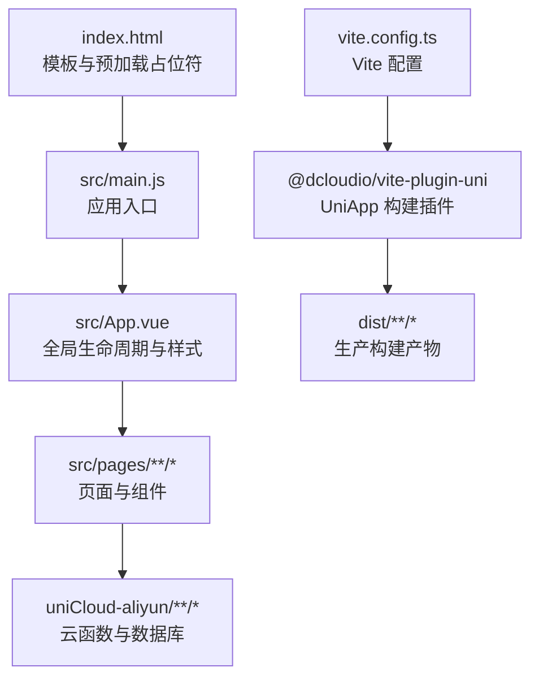
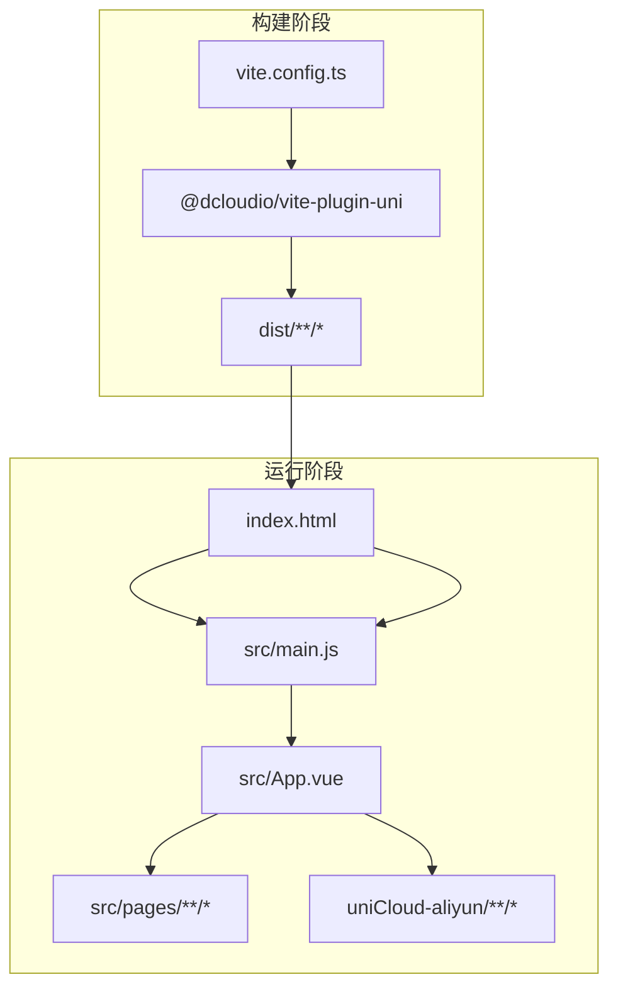

# 生产环境优化

<cite>
**本文引用的文件**
- [vite.config.ts](file://vite.config.ts)
- [package.json](file://package.json)
- [tsconfig.json](file://tsconfig.json)
- [index.html](file://index.html)
- [src/main.js](file://src/main.js)
- [src/App.vue](file://src/App.vue)
- [src/manifest.json](file://src/manifest.json)
- [uniCloud-aliyun/cloudfunctions/checkin/index.js](file://src/cloudfunctions/checkin/index.js)
- [uniCloud-aliyun/cloudfunctions/getWeeklyReport/index.js](file://uniCloud-aliyun/cloudfunctions/getWeeklyReport/index.js)
</cite>

## 目录
1. [引言](#引言)
2. [项目结构](#项目结构)
3. [核心组件](#核心组件)
4. [架构总览](#架构总览)
5. [详细组件分析](#详细组件分析)
6. [依赖关系分析](#依赖关系分析)
7. [性能考量](#性能考量)
8. [故障排查指南](#故障排查指南)
9. [结论](#结论)
10. [附录](#附录)

## 引言
本文件面向 Star Grow 项目在生产环境中的优化实践，聚焦于 Vite 构建配置与打包优化（代码分割、Tree Shaking、压缩策略）、资源优化（图片、字体、CSS 提取）、CDN 与静态资源托管、PWA 与离线缓存、性能监控与分析、缓存与浏览器兼容、安全加固（CSP、HTTPS）以及构建产物体积分析与平台差异化优化策略。文档基于仓库现有配置与实现进行归纳总结，并提供可操作的优化建议。

## 项目结构
项目采用 UniApp + Vue 3 + Vite 的多端统一开发框架，构建入口通过 @dcloudio/vite-plugin-uni 插件集成，支持 H5、小程序与快应用等多端输出；同时结合 uniCloud 阿里云后端服务实现数据与业务逻辑。

图示来源
- [index.html:1-21](file://index.html#L1-L21)
- [src/main.js:1-11](file://src/main.js#L1-L11)
- [src/App.vue:1-64](file://src/App.vue#L1-L64)
- [vite.config.ts:1-8](file://vite.config.ts#L1-L8)

章节来源
- [vite.config.ts:1-8](file://vite.config.ts#L1-L8)
- [package.json:1-74](file://package.json#L1-L74)
- [index.html:1-21](file://index.html#L1-L21)
- [src/main.js:1-11](file://src/main.js#L1-L11)
- [src/App.vue:1-64](file://src/App.vue#L1-L64)

## 核心组件
- 构建与打包
  - 使用 Vite 与 @dcloudio/vite-plugin-uni 统一多端构建流程，生产脚本通过 uni build 命令触发。
  - 项目未显式配置 rollup 插件链，Tree Shaking 由 Vite/ESBuild 默认开启；压缩器默认使用 Terser。
- 应用入口与生命周期
  - 应用在启动时初始化云开发能力（小程序端），并在前台显示时尝试同步离线数据，保障用户体验与数据一致性。
- 配置与清单
  - manifest.json 中包含各端（如微信小程序）的配置项，以及 uniCloud 空间信息；index.html 提供 viewport 与预加载占位符，便于性能优化。

章节来源
- [package.json:21-36](file://package.json#L21-L36)
- [src/App.vue:5-27](file://src/App.vue#L5-L27)
- [src/manifest.json:1-78](file://src/manifest.json#L1-L78)
- [index.html:1-21](file://index.html#L1-L21)

## 架构总览
下图展示从构建到运行的关键路径与优化点：

图示来源
- [vite.config.ts:1-8](file://vite.config.ts#L1-L8)
- [index.html:1-21](file://index.html#L1-L21)
- [src/main.js:1-11](file://src/main.js#L1-L11)
- [src/App.vue:1-64](file://src/App.vue#L1-L64)

## 详细组件分析

### Vite 构建配置与优化
- 当前配置
  - 仅启用 @dcloudio/vite-plugin-uni 插件，未自定义 rollupOptions、build.rollupOptions 或其他优化参数。
- 可选优化方向
  - 代码分割：通过路由级拆分与动态导入实现按需加载；对第三方库进行外部化或独立分包，降低首屏体积。
  - Tree Shaking：确保 ESModule 导入导出规范，避免副作用模块；在依赖中选择纯 ESM 包。
  - 压缩策略：在生产模式下启用最小化（Terser），合理设置压缩选项与并行度；对 CSS 使用 Lightning CSS 或 PostCSS 插件链。
  - 资源处理：对图片与字体进行压缩与格式优化（WebP/SVG），启用资源内联阈值控制与哈希命名。
  - 预加载与预取：利用 index.html 中的预加载占位符与路由级预加载策略，提升关键路径性能。
- 关键配置参考路径
  - [vite.config.ts:1-8](file://vite.config.ts#L1-L8)
  - [package.json:21-36](file://package.json#L21-L36)

章节来源
- [vite.config.ts:1-8](file://vite.config.ts#L1-L8)
- [package.json:21-36](file://package.json#L21-L36)

### 资源优化（图片、字体、CSS）
- 图片优化
  - 在构建阶段对图片进行压缩与格式转换（优先 WebP），对图标使用 SVG；对背景图与懒加载图分别采用合适尺寸与懒加载策略。
- 字体优化
  - 使用子集化字体与可变字体；对本地字体进行压缩与缓存控制；CDN 托管常用字体以提升复用率。
- CSS 提取与压缩
  - 将全局样式与组件样式分离，提取公共 CSS 并进行压缩；对媒体查询与关键样式进行优先加载。
- 预加载与预取
  - 利用 index.html 的预加载占位符与路由级预加载策略，减少关键渲染阻塞。

章节来源
- [index.html:13-14](file://index.html#L13-L14)
- [src/App.vue:30-63](file://src/App.vue#L30-L63)

### CDN 配置与静态资源托管
- 静态资源托管
  - 将 dist 目录部署至 CDN，开启缓存头与压缩；对版本化文件名（含哈希）启用长期缓存，对 index.html 与清单文件设置较短缓存。
- 外部资源
  - 对第三方库与字体采用 CDN 加速；对 uniCloud 云函数域名配置 CNAME 与 HTTPS。
- 缓存策略
  - 对 JS/CSS 设置强缓存（immutable），对 HTML 设置协商缓存；对图片与媒体资源设置合理过期时间。

章节来源
- [src/manifest.json:72-76](file://src/manifest.json#L72-L76)

### PWA 与离线缓存策略
- PWA 配置
  - 在 manifest.json 中完善应用元信息与图标；在 index.html 中预留 service worker 注册位置。
- 离线缓存
  - 通过 service worker 缓存关键静态资源与接口数据；对离线数据采用本地存储与增量同步策略。
- 生命周期与回退
  - 在网络异常时提供降级页面与重试机制；对关键功能（如打卡）在离线状态下记录并延迟提交。

章节来源
- [src/App.vue:21-27](file://src/App.vue#L21-L27)
- [src/manifest.json:1-78](file://src/manifest.json#L1-L78)
- [index.html:1-21](file://index.html#L1-L21)

### 性能监控与分析
- 工具与指标
  - 使用 Web Vitals（LCP、FID、CLS）与自定义埋点；在关键页面与交互节点打点统计。
- 分析与报告
  - 结合 CDN 日志与前端错误上报，定期生成性能报告；对慢加载资源与长任务进行专项优化。
- 实施建议
  - 在应用入口与关键路由处注入监控脚本；对第三方 SDK 进行异步加载与错误隔离。

章节来源
- [src/main.js:1-11](file://src/main.js#L1-L11)

### 缓存策略与浏览器兼容
- 缓存策略
  - 对静态资源采用强缓存与版本化；对 HTML 与动态内容采用协商缓存；对 API 数据采用合理的缓存头。
- 浏览器兼容
  - 通过构建目标与 polyfill 适配低版本浏览器；对 CSS 自动前缀与语法降级；对 ESNext 特性进行按需转换。
- 视口与覆盖
  - 根据设备支持自动注入 viewport-fit=cover，提升刘海屏适配体验。

章节来源
- [index.html:6-11](file://index.html#L6-L11)
- [tsconfig.json:3-12](file://tsconfig.json#L3-L12)

### 安全加固（CSP、HTTPS）
- CSP
  - 在服务端响应头中配置严格的 CSP，限制内联脚本与远程资源来源；对 eval 与不安全的内联行为进行禁用。
- HTTPS
  - 强制全站 HTTPS，启用 HSTS；对 CDN 与云函数域名统一走 HTTPS。
- 内容安全
  - 对上传与富文本输入进行白名单过滤；对敏感数据进行加密传输与存储。

章节来源
- [src/manifest.json:52-58](file://src/manifest.json#L52-L58)

### 构建产物体积分析与优化建议
- 分析手段
  - 使用构建分析工具（如可视化打包报告）识别最大依赖与重复模块；对比不同优化策略的效果。
- 优化建议
  - 移除未使用依赖与死代码；对第三方库进行按需引入与外部化；拆分 vendor 与业务代码；启用更激进的压缩与 Tree Shaking。
- 平台差异
  - H5 与小程序端对资源体积与加载策略要求不同，需分别制定优化方案。

章节来源
- [package.json:61-72](file://package.json#L61-L72)

### 不同平台的特殊优化策略
- H5
  - 启用 PWA 与 Service Worker；对路由进行代码分割；对图片与字体进行 CDN 加速。
- 微信小程序
  - 控制包体大小，避免一次性加载过多资源；对云函数进行冷启动优化与超时控制。
- 支付宝/百度/头条等小程序
  - 遵循各平台的包体限制与审核规范；对图标与字体进行本地化或 CDN 化。

章节来源
- [src/manifest.json:52-67](file://src/manifest.json#L52-L67)

## 依赖关系分析
- 构建依赖
  - Vite 与 @dcloudio/vite-plugin-uni 是生产构建的核心；Rollup 与 Terser 用于打包与压缩。
- 运行时依赖
  - Vue 3、Pinia、uView Plus 等为运行时框架与 UI 基础；uni-app 与各端 SDK 提供多端能力。
- 云函数依赖
  - 云函数通过 uniCloud SDK 访问数据库与云存储，需关注超时与内存配置。

图示来源
- [package.json:40-59](file://package.json#L40-L59)
- [package.json:61-72](file://package.json#L61-L72)

章节来源
- [package.json:40-59](file://package.json#L40-L59)
- [package.json:61-72](file://package.json#L61-L72)

## 性能考量
- 关键路径优化
  - 减少首屏 JavaScript 体积；优先加载关键 CSS 与字体；对非关键资源进行延迟加载。
- 资源加载
  - 合理使用 HTTP/2 多路复用与连接复用；对静态资源启用 Gzip/Brotli 压缩。
- 交互性能
  - 避免长任务阻塞主线程；对动画与滚动事件进行节流与去抖；使用 Web Workers 处理计算密集型任务。
- 数据层优化
  - 对接口进行缓存与合并请求；对云函数进行并发控制与超时设置。

章节来源
- [uniCloud-aliyun/cloudfunctions/checkin/index.js:1-94](file://src/cloudfunctions/checkin/index.js#L1-L94)
- [uniCloud-aliyun/cloudfunctions/getWeeklyReport/index.js:1-45](file://uniCloud-aliyun/cloudfunctions/getWeeklyReport/index.js#L1-L45)

## 故障排查指南
- 构建问题
  - 若出现打包失败或模块解析错误，检查 Vite 插件链与依赖版本；确认 tsconfig 与路径别名配置正确。
- 运行时问题
  - 小程序端云开发初始化失败时，检查环境 ID 与权限配置；对离线数据同步失败时，查看离线队列与重试逻辑。
- 性能问题
  - 使用性能分析工具定位慢加载资源与长任务；结合 CDN 日志与前端埋点进行根因分析。
- 安全问题
  - 检查 CSP 响应头与 HTTPS 强制策略；对敏感接口进行鉴权与限流。

章节来源
- [src/App.vue:9-18](file://src/App.vue#L9-L18)
- [src/manifest.json:72-76](file://src/manifest.json#L72-L76)

## 结论
Star Grow 项目当前以 Vite + UniApp 为基础，具备良好的多端扩展性。生产环境优化应围绕构建优化、资源优化、CDN 与缓存、PWA 与离线策略、性能监控与安全加固展开。建议逐步引入代码分割、Tree Shaking、压缩与资源优化策略，并针对不同平台制定差异化优化方案，持续进行体积分析与性能回归测试，确保在多端场景下获得稳定、快速与安全的用户体验。

## 附录
- 关键配置与入口参考
  - [vite.config.ts:1-8](file://vite.config.ts#L1-L8)
  - [package.json:21-36](file://package.json#L21-L36)
  - [index.html:1-21](file://index.html#L1-L21)
  - [src/main.js:1-11](file://src/main.js#L1-L11)
  - [src/App.vue:1-64](file://src/App.vue#L1-L64)
  - [src/manifest.json:1-78](file://src/manifest.json#L1-L78)
  - [uniCloud-aliyun/cloudfunctions/checkin/index.js:1-94](file://src/cloudfunctions/checkin/index.js#L1-L94)
  - [uniCloud-aliyun/cloudfunctions/getWeeklyReport/index.js:1-45](file://uniCloud-aliyun/cloudfunctions/getWeeklyReport/index.js#L1-L45)