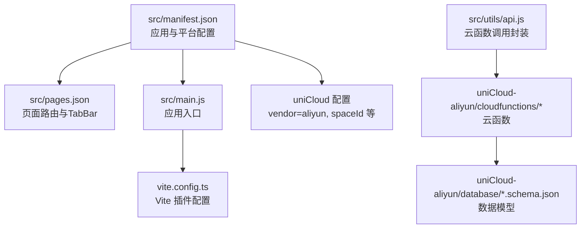
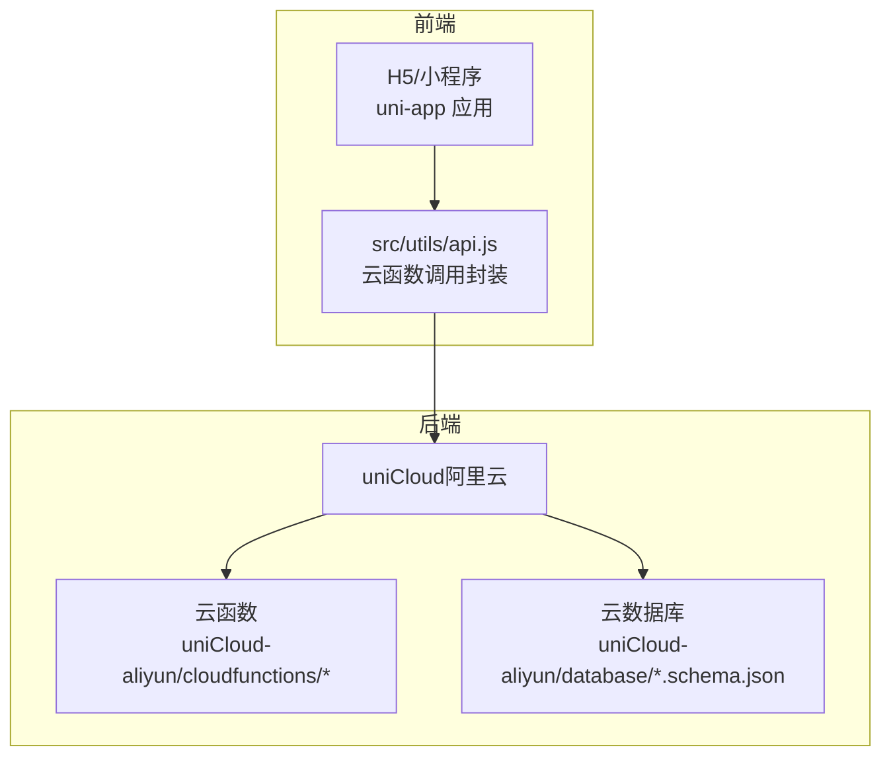
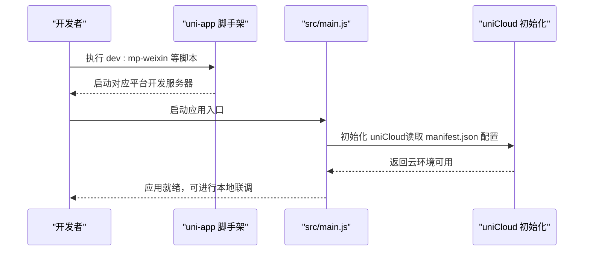
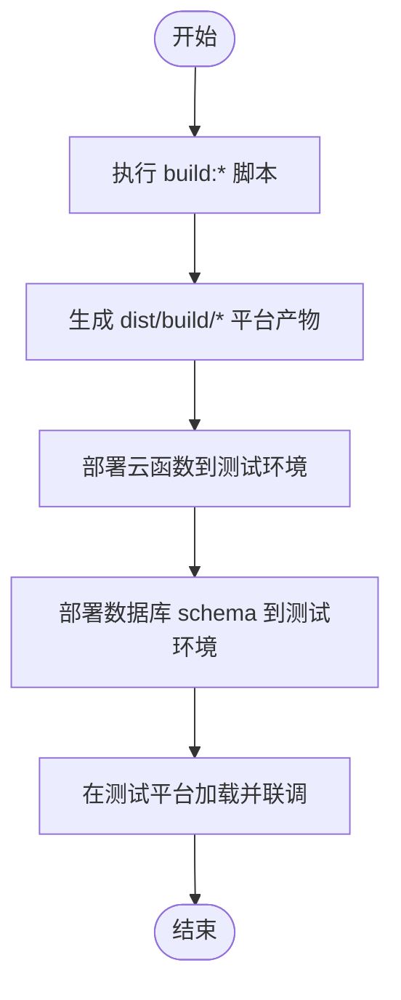
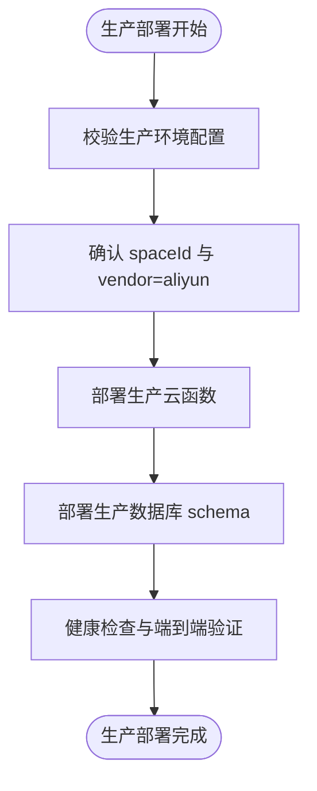
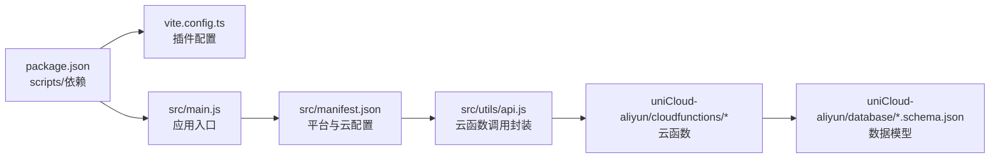

# 部署策略

<cite>
**本文引用的文件**
- [package.json](file://package.json)
- [vite.config.ts](file://vite.config.ts)
- [src/main.js](file://src/main.js)
- [src/manifest.json](file://src/manifest.json)
- [src/pages.json](file://src/pages.json)
- [.gitignore](file://.gitignore)
- [.claude/settings.local.json](file://.claude/settings.local.json)
- [src/utils/api.js](file://src/utils/api.js)
- [uniCloud-aliyun/cloudfunctions/checkin/package.json](file://uniCloud-aliyun/cloudfunctions/checkin/package.json)
- [uniCloud-aliyun/cloudfunctions/getWeeklyReport/package.json](file://uniCloud-aliyun/cloudfunctions/getWeeklyReport/package.json)
- [uniCloud-aliyun/cloudfunctions/savePlan/package.json](file://uniCloud-aliyun/cloudfunctions/savePlan/package.json)
- [uniCloud-aliyun/cloudfunctions/deletePlan/package.json](file://uniCloud-aliyun/cloudfunctions/deletePlan/package.json)
- [uniCloud-aliyun/cloudfunctions/getPoints/package.json](file://uniCloud-aliyun/cloudfunctions/getPoints/package.json)
- [uniCloud-aliyun/cloudfunctions/syncOffline/package.json](file://uniCloud-aliyun/cloudfunctions/syncOffline/package.json)
- [uniCloud-aliyun/database/badges.schema.json](file://uniCloud-aliyun/database/badges.schema.json)
- [uniCloud-aliyun/database/checkins.schema.json](file://uniCloud-aliyun/database/checkins.schema.json)
</cite>

## 目录
1. [简介](#简介)
2. [项目结构](#项目结构)
3. [核心组件](#核心组件)
4. [架构总览](#架构总览)
5. [详细组件分析](#详细组件分析)
6. [依赖关系分析](#依赖关系分析)
7. [性能考量](#性能考量)
8. [故障排查指南](#故障排查指南)
9. [结论](#结论)
10. [附录](#附录)

## 简介
本部署策略文档面向 Star Grow 项目，覆盖从开发到生产的全生命周期部署与运维实践。项目基于 uni-app 构建，前端通过 Vite 打包，后端采用 uniCloud（阿里云），云数据库与云函数统一管理。本文将给出：
- 不同环境（开发/测试/生产）的部署流程与配置差异
- CI/CD 流水线与自动化部署策略
- 多平台（H5、微信小程序、支付宝小程序等）同时发布的协调方法
- 域名与 SSL 证书的申请流程
- 版本管理与回滚策略
- 灰度发布与 A/B 测试的实施方法
- 监控告警与日志收集配置
- 部署后的验证与测试流程
- 运维监控与故障排查方法

## 项目结构
项目采用 uni-app 多端一体化架构，前端源码位于 src 目录，uniCloud 阿里云侧的云函数与数据库结构位于 uniCloud-aliyun 目录。构建脚本由 uni-app 提供，支持多平台一键构建。

图表来源
- [src/manifest.json:1-78](file://src/manifest.json#L1-L78)
- [src/pages.json:1-56](file://src/pages.json#L1-L56)
- [src/main.js:1-11](file://src/main.js#L1-L11)
- [vite.config.ts:1-8](file://vite.config.ts#L1-L8)
- [src/utils/api.js:1-18](file://src/utils/api.js#L1-L18)

章节来源
- [package.json:1-74](file://package.json#L1-L74)
- [vite.config.ts:1-8](file://vite.config.ts#L1-L8)
- [src/manifest.json:1-78](file://src/manifest.json#L1-L78)
- [src/pages.json:1-56](file://src/pages.json#L1-L56)
- [src/main.js:1-11](file://src/main.js#L1-L11)
- [.gitignore:1-21](file://.gitignore#L1-L21)

## 核心组件
- 构建与脚手架：通过 package.json 中的 scripts 定义多平台构建命令，支持 H5、微信小程序、支付宝小程序等平台。
- 应用入口与状态管理：src/main.js 创建 SSR 应用并挂载 Pinia；应用清单与平台配置在 src/manifest.json；页面路由与 TabBar 在 src/pages.json。
- 云服务集成：src/manifest.json 指定 uniCloud 供应商为阿里云，并配置空间 ID；src/utils/api.js 封装 uniCloud.callFunction 调用。
- 数据模型：uniCloud-aliyun/database 下的 JSON 文件定义集合字段与权限约束，如 badges、checkins 等。

章节来源
- [package.json:4-38](file://package.json#L4-L38)
- [src/main.js:1-11](file://src/main.js#L1-L11)
- [src/manifest.json:72-76](file://src/manifest.json#L72-L76)
- [src/utils/api.js:1-18](file://src/utils/api.js#L1-L18)
- [uniCloud-aliyun/database/badges.schema.json:1-40](file://uniCloud-aliyun/database/badges.schema.json#L1-L40)
- [uniCloud-aliyun/database/checkins.schema.json:1-52](file://uniCloud-aliyun/database/checkins.schema.json#L1-L52)

## 架构总览
前端通过 uni-app 统一编译，多端运行；后端使用 uniCloud（阿里云）提供云函数与云数据库。应用通过云函数进行业务逻辑处理，数据库通过 schema 控制字段与权限。

图表来源
- [src/utils/api.js:1-18](file://src/utils/api.js#L1-L18)
- [src/manifest.json:72-76](file://src/manifest.json#L72-L76)
- [uniCloud-aliyun/cloudfunctions/checkin/package.json:1-10](file://uniCloud-aliyun/cloudfunctions/checkin/package.json#L1-L10)
- [uniCloud-aliyun/database/badges.schema.json:1-40](file://uniCloud-aliyun/database/badges.schema.json#L1-L40)

## 详细组件分析

### 开发环境部署
- 本地开发：使用 uni-app 提供的 dev:* 脚本启动对应平台的开发服务器，例如 H5、微信小程序、支付宝小程序等。
- 平台配置：src/manifest.json 中的各平台节点（如 mp-weixin、mp-alipay 等）用于配置平台参数与权限。
- 云环境初始化：应用入口会在启动时初始化 uniCloud，确保云能力可用。
- 本地调试：.claude/settings.local.json 允许在本地执行 uni 相关命令，便于快速调试。

图表来源
- [package.json:8-18](file://package.json#L8-L18)
- [src/main.js:1-11](file://src/main.js#L1-L11)
- [src/manifest.json:52-58](file://src/manifest.json#L52-L58)

章节来源
- [package.json:4-38](file://package.json#L4-L38)
- [src/manifest.json:52-58](file://src/manifest.json#L52-L58)
- [src/main.js:1-11](file://src/main.js#L1-L11)
- [.claude/settings.local.json:1-8](file://.claude/settings.local.json#L1-L8)

### 测试环境部署
- 构建产物：使用 uni build:* 脚本生成各平台构建产物，dist 目录存放构建结果。
- 云函数与数据库：在测试环境中部署对应的云函数与数据库 schema，确保数据结构一致。
- 平台联调：在测试平台（如微信开发者工具）中加载 dist/build 对应平台目录，进行端到端测试。

图表来源
- [package.json:21-36](file://package.json#L21-L36)
- [uniCloud-aliyun/cloudfunctions/getWeeklyReport/package.json:1-10](file://uniCloud-aliyun/cloudfunctions/getWeeklyReport/package.json#L1-L10)
- [uniCloud-aliyun/database/checkins.schema.json:1-52](file://uniCloud-aliyun/database/checkins.schema.json#L1-L52)

章节来源
- [package.json:21-36](file://package.json#L21-L36)
- [uniCloud-aliyun/cloudfunctions/savePlan/package.json:1-10](file://uniCloud-aliyun/cloudfunctions/savePlan/package.json#L1-L10)
- [uniCloud-aliyun/cloudfunctions/syncOffline/package.json:1-10](file://uniCloud-aliyun/cloudfunctions/syncOffline/package.json#L1-L10)

### 生产环境部署
- 环境隔离：生产环境需独立的空间 ID 与云函数配置，避免与测试环境混用。
- 配置安全：敏感配置（如空间 ID、环境变量）通过受控渠道注入，不在代码仓库中明文存储。
- 稳定性保障：启用超时与内存限制（参考云函数 package.json 中的 memorySize 与 timeout），并进行容量评估与压测。

图表来源
- [src/manifest.json:72-76](file://src/manifest.json#L72-L76)
- [uniCloud-aliyun/cloudfunctions/checkin/package.json:1-10](file://uniCloud-aliyun/cloudfunctions/checkin/package.json#L1-L10)

章节来源
- [src/manifest.json:72-76](file://src/manifest.json#L72-L76)
- [uniCloud-aliyun/cloudfunctions/deletePlan/package.json:1-10](file://uniCloud-aliyun/cloudfunctions/deletePlan/package.json#L1-L10)

### CI/CD 流水线与自动化部署
- 触发条件：分支保护策略（如 main/master）合并或打标签触发流水线。
- 步骤拆分：
  - 代码检出与缓存恢复
  - 依赖安装（npm ci/yarn install/pnpm install）
  - 类型检查与静态分析
  - 单元测试与端到端测试
  - 多平台构建（build:h5、build:mp-weixin 等）
  - 产物上传与归档
  - 云函数与数据库部署（按环境区分）
  - 发布通知与工单关闭
- 环境变量：通过 CI 系统的密钥管理注入空间 ID、访问令牌等敏感信息。
- 回滚策略：保留最近 N 个版本的构建产物，支持一键回滚至上一个稳定版本。

章节来源
- [package.json:4-38](file://package.json#L4-L38)
- [.gitignore:1-21](file://.gitignore#L1-L21)

### 多平台同时发布协调
- 平台差异：不同平台（H5、微信小程序、支付宝小程序等）在 manifest.json 中有独立配置节点，需分别维护。
- 发布节奏：建议以 H5 为基准，优先保证 Web 端稳定性；随后同步推进小程序平台，确保云函数与数据库 schema 一致。
- 冲突规避：同一功能模块在不同平台的 UI/交互差异通过条件编译或平台特定样式处理，避免跨平台冲突。

章节来源
- [src/manifest.json:52-67](file://src/manifest.json#L52-L67)
- [src/pages.json:1-56](file://src/pages.json#L1-L56)

### 域名与 SSL 证书
- 域名申请：根据部署目标选择合适的域名（如 H5 使用自有域名，小程序使用平台域名白名单）。
- SSL 证书：通过可信 CA 申请并配置到 CDN 或反向代理层；小程序端要求合法 HTTPS。
- 自动化：结合 CI/CD，在证书续期前自动触发更新流程，减少人工干预。

章节来源
- [src/manifest.json:52-58](file://src/manifest.json#L52-L58)

### 版本管理与回滚策略
- 版本号：前端与后端版本号由 manifest.json 与云函数 package.json 统一管理。
- 回滚：当发现线上问题，立即回滚至上一个稳定版本；同时通过监控与日志定位问题根因。
- 变更记录：每次回滚需记录变更原因、影响范围与修复方案。

章节来源
- [src/manifest.json:5-7](file://src/manifest.json#L5-L7)
- [uniCloud-aliyun/cloudfunctions/getPoints/package.json:1-10](file://uniCloud-aliyun/cloudfunctions/getPoints/package.json#L1-L10)

### 灰度发布与 A/B 测试
- 灰度发布：按用户维度（如用户 ID 哈希）或设备维度进行流量切分，先在小范围用户群体验证稳定性。
- A/B 测试：对关键功能（如 UI 改动、交互优化）进行双流或多流对比，采集转化率、留存率等指标。
- 监控联动：灰度期间加强关键指标监控，异常即刻熔断并回滚。

章节来源
- [src/utils/api.js:1-18](file://src/utils/api.js#L1-L18)

### 监控告警与日志收集
- 前端监控：接入性能监控（首屏时间、白屏时间、JS 错误）与用户行为追踪。
- 后端监控：关注云函数耗时、错误率、超时次数与数据库查询慢查询。
- 日志收集：统一输出结构化日志，按环境与模块分类，定期归档与检索。
- 告警策略：设定阈值（如错误率 > 1%、P95 响应时间 > 2s）触发告警，分级处理。

章节来源
- [uniCloud-aliyun/cloudfunctions/syncOffline/package.json:1-10](file://uniCloud-aliyun/cloudfunctions/syncOffline/package.json#L1-L10)

### 部署后验证与测试
- 自动化测试：流水线中集成单元测试、接口测试与端到端测试。
- 人工验收：在测试平台中进行关键路径的人工验证（登录、打卡、积分、周报等）。
- 回归验证：每次发布后进行回归测试，确保无回归问题。

章节来源
- [package.json:37-38](file://package.json#L37-L38)

### 运维监控与故障排查
- 故障排查：优先查看云函数日志与数据库异常；结合前端埋点与后端链路追踪定位问题。
- 性能优化：针对慢查询与高延迟接口进行优化，必要时引入缓存与异步处理。
- 应急预案：制定常见故障的应急预案（如数据库连接异常、云函数超时），明确责任人与处置流程。

章节来源
- [uniCloud-aliyun/database/badges.schema.json:1-40](file://uniCloud-aliyun/database/badges.schema.json#L1-L40)
- [uniCloud-aliyun/database/checkins.schema.json:1-52](file://uniCloud-aliyun/database/checkins.schema.json#L1-L52)

## 依赖关系分析
- 前端依赖：uni-app 生态（uni-app、uni-h5、各小程序平台适配）、状态管理（pinia）、UI 组件库（uview-plus）等。
- 构建依赖：Vite、@dcloudio/vite-plugin-uni、typescript、vue-tsc 等。
- 云函数依赖：各云函数 package.json 中声明的依赖项，按需配置 memorySize 与 timeout。

图表来源
- [package.json:1-74](file://package.json#L1-L74)
- [vite.config.ts:1-8](file://vite.config.ts#L1-L8)
- [src/main.js:1-11](file://src/main.js#L1-L11)
- [src/manifest.json:72-76](file://src/manifest.json#L72-L76)
- [src/utils/api.js:1-18](file://src/utils/api.js#L1-L18)

章节来源
- [package.json:1-74](file://package.json#L1-L74)
- [vite.config.ts:1-8](file://vite.config.ts#L1-L8)
- [src/main.js:1-11](file://src/main.js#L1-L11)
- [src/manifest.json:72-76](file://src/manifest.json#L72-L76)
- [src/utils/api.js:1-18](file://src/utils/api.js#L1-L18)

## 性能考量
- 云函数性能：合理设置 memorySize 与 timeout，避免超时与资源浪费；对高频接口进行缓存与降级。
- 数据库性能：为常用查询字段建立索引，控制单次查询返回量，避免 N+1 查询。
- 前端性能：按需加载、分包策略、图片与静态资源压缩，减少首屏时间。

章节来源
- [uniCloud-aliyun/cloudfunctions/getWeeklyReport/package.json:1-10](file://uniCloud-aliyun/cloudfunctions/getWeeklyReport/package.json#L1-L10)
- [uniCloud-aliyun/cloudfunctions/syncOffline/package.json:1-10](file://uniCloud-aliyun/cloudfunctions/syncOffline/package.json#L1-L10)

## 故障排查指南
- 云函数错误：查看云函数日志与错误码，确认入参与返回值格式是否符合预期。
- 数据库异常：核对 schema 与权限配置，检查索引与查询条件。
- 平台兼容：针对不同小程序平台的差异进行专项测试，确保功能一致性。
- 回滚与恢复：若问题严重，立即回滚至上一个稳定版本，并发布热修复补丁。

章节来源
- [uniCloud-aliyun/database/checkins.schema.json:1-52](file://uniCloud-aliyun/database/checkins.schema.json#L1-L52)
- [uniCloud-aliyun/database/badges.schema.json:1-40](file://uniCloud-aliyun/database/badges.schema.json#L1-L40)

## 结论
本部署策略文档基于项目现有配置，给出了从开发到生产的完整落地路径。通过规范化的 CI/CD、严格的版本与回滚策略、完善的监控与日志体系，以及灰度与 A/B 测试机制，可有效提升交付质量与系统稳定性。建议在实际落地过程中持续优化流程与工具链，逐步实现更高程度的自动化与智能化运维。

## 附录
- 关键文件速览
  - 构建与脚本：[package.json:4-38](file://package.json#L4-L38)
  - Vite 配置：[vite.config.ts:1-8](file://vite.config.ts#L1-L8)
  - 应用入口：[src/main.js:1-11](file://src/main.js#L1-L11)
  - 应用清单与平台配置：[src/manifest.json:1-78](file://src/manifest.json#L1-L78)
  - 页面路由与 TabBar：[src/pages.json:1-56](file://src/pages.json#L1-L56)
  - 云函数示例（内存与超时）：[uniCloud-aliyun/cloudfunctions/getPoints/package.json:1-10](file://uniCloud-aliyun/cloudfunctions/getPoints/package.json#L1-L10)
  - 数据模型示例：[uniCloud-aliyun/database/checkins.schema.json:1-52](file://uniCloud-aliyun/database/checkins.schema.json#L1-L52)