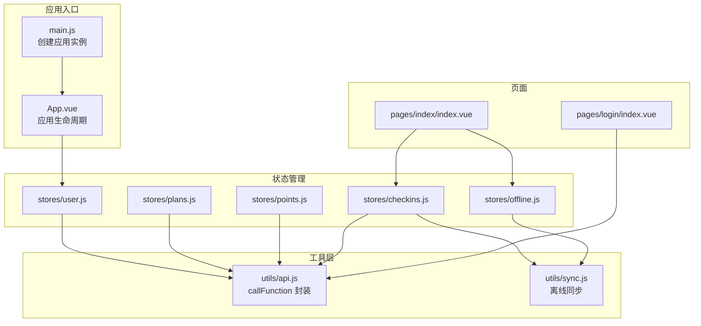
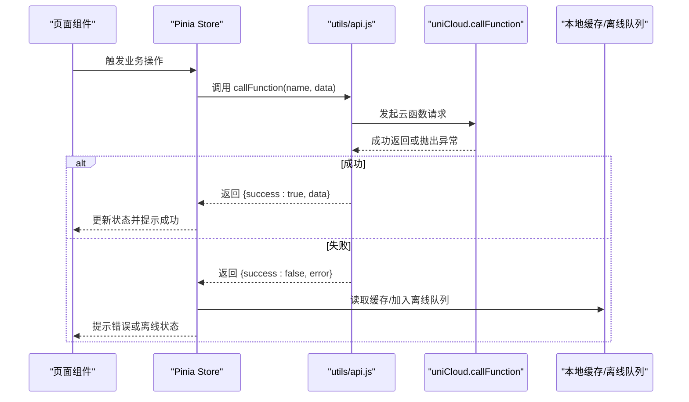
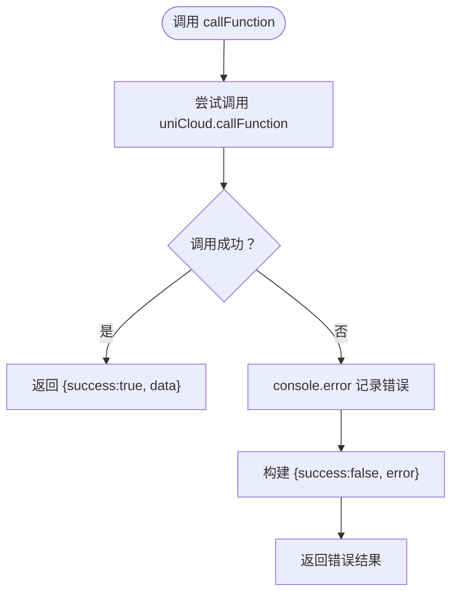
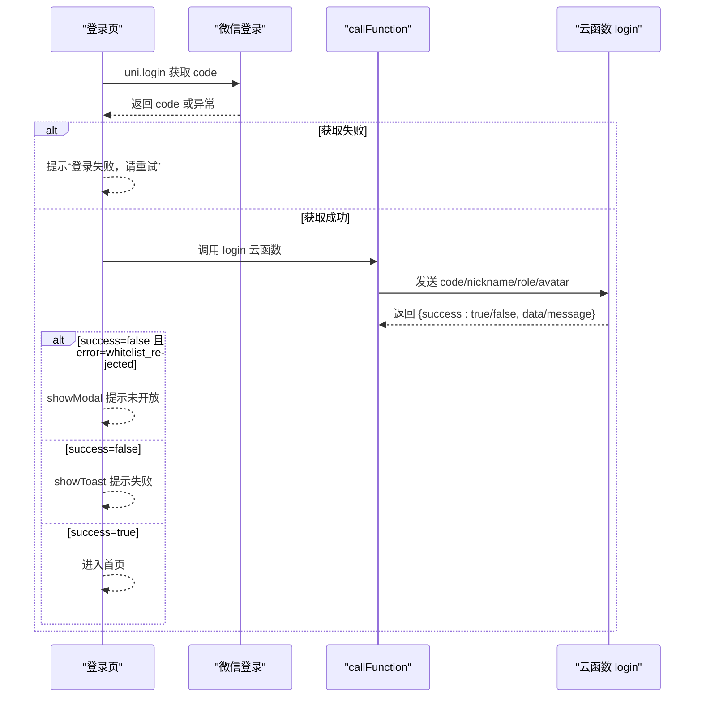
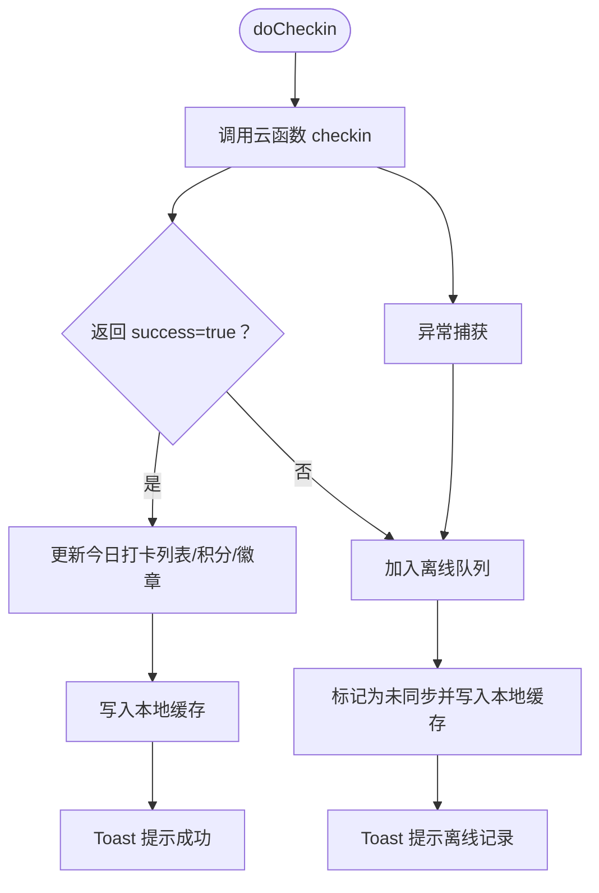
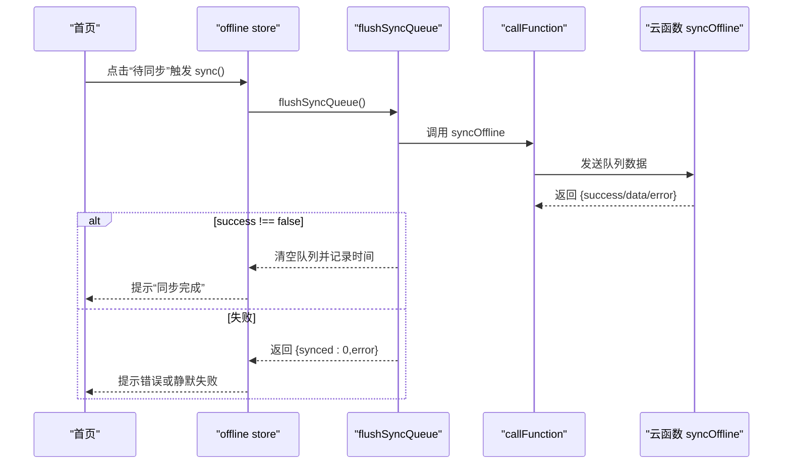
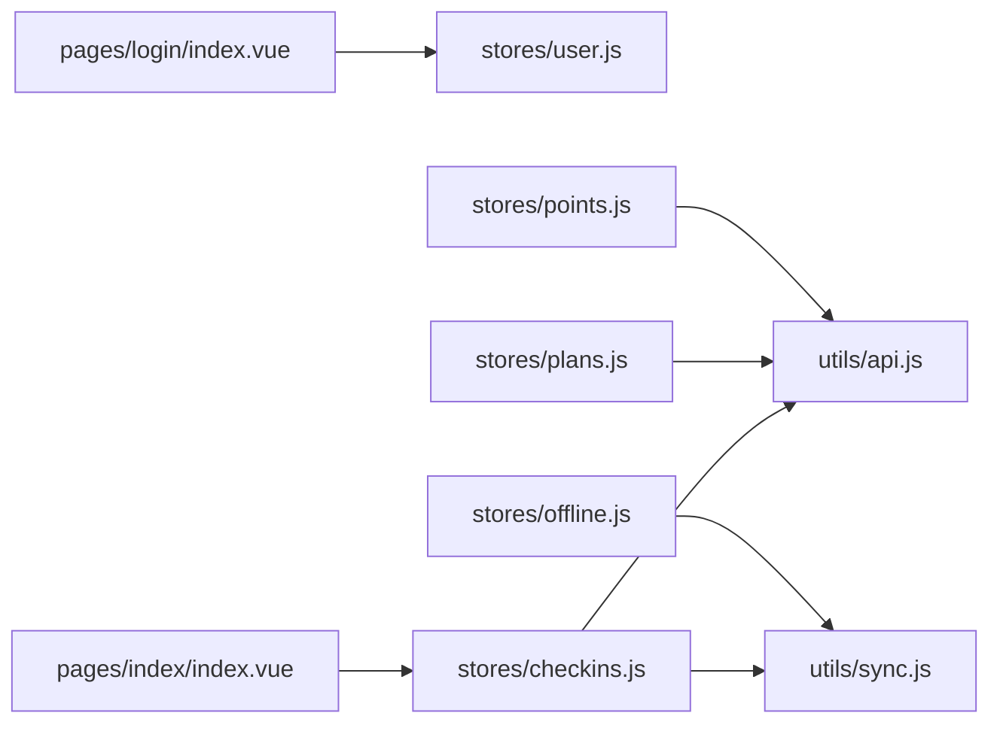

# 前端错误监控

<cite>
**本文引用的文件**
- [src/utils/api.js](file://src/utils/api.js)
- [src/main.js](file://src/main.js)
- [src/App.vue](file://src/App.vue)
- [src/stores/offline.js](file://src/stores/offline.js)
- [src/stores/checkins.js](file://src/stores/checkins.js)
- [src/utils/sync.js](file://src/utils/sync.js)
- [src/pages/index/index.vue](file://src/pages/index/index.vue)
- [src/pages/login/index.vue](file://src/pages/login/index.vue)
- [src/stores/user.js](file://src/stores/user.js)
- [src/stores/plans.js](file://src/stores/plans.js)
- [src/stores/points.js](file://src/stores/points.js)
</cite>

## 目录
1. [简介](#简介)
2. [项目结构](#项目结构)
3. [核心组件](#核心组件)
4. [架构总览](#架构总览)
5. [详细组件分析](#详细组件分析)
6. [依赖关系分析](#依赖关系分析)
7. [性能监控与指标](#性能监控与指标)
8. [故障排查指南](#故障排查指南)
9. [结论](#结论)
10. [附录](#附录)

## 简介
本文件面向 Star Grow 项目的前端错误监控，聚焦以下目标：
- API 调用错误捕获机制：重点解析 callFunction 函数中的 try-catch 处理与错误日志记录。
- uniCloud.callFunction 调用失败的错误处理策略：错误信息格式化与用户友好提示。
- 全局错误边界与异常处理：在 Vue 组件生命周期中的错误捕获实践。
- 前端性能监控指标：页面加载时间、API 响应时间、用户交互延迟等。
- 错误上报与分析方法：结合现有日志输出与本地存储策略进行问题定位。
- 调试工具使用指南：基于现有代码路径给出可操作的调试步骤。

## 项目结构
前端采用 uni-app + Vue 3 + Pinia 架构，核心目录与职责如下：
- src/utils：通用工具层，包含 API 封装与离线同步工具。
- src/stores：状态管理层，使用 Pinia 管理用户、计划、积分、离线队列等状态。
- src/pages：页面级组件，负责业务交互与错误提示展示。
- src/components：可复用 UI 组件。
- src/App.vue 与 src/main.js：应用入口与初始化配置。

图表来源
- [src/main.js:1-11](file://src/main.js#L1-L11)
- [src/App.vue:1-64](file://src/App.vue#L1-L64)
- [src/utils/api.js:1-18](file://src/utils/api.js#L1-L18)
- [src/utils/sync.js:1-96](file://src/utils/sync.js#L1-L96)
- [src/stores/user.js:1-119](file://src/stores/user.js#L1-L119)
- [src/stores/plans.js:1-73](file://src/stores/plans.js#L1-L73)
- [src/stores/points.js:1-44](file://src/stores/points.js#L1-L44)
- [src/stores/checkins.js:1-163](file://src/stores/checkins.js#L1-L163)
- [src/stores/offline.js:1-30](file://src/stores/offline.js#L1-L30)
- [src/pages/index/index.vue:1-204](file://src/pages/index/index.vue#L1-L204)
- [src/pages/login/index.vue:1-289](file://src/pages/login/index.vue#L1-L289)

章节来源
- [src/main.js:1-11](file://src/main.js#L1-L11)
- [src/App.vue:1-64](file://src/App.vue#L1-L64)

## 核心组件
- API 封装与错误捕获：统一通过 callFunction 包装 uniCloud.callFunction，集中处理异常并返回标准化结果。
- 状态管理与错误处理：各 Store 在调用云函数前后进行 try-catch，并结合本地缓存与离线队列保证可用性。
- 页面交互与用户提示：在关键操作（登录、打卡、撤销、同步）中使用 Toast/Modal 展示错误或成功信息。
- 离线同步与幂等设计：离线队列避免重复提交，云端数据为准进行冲突处理。

章节来源
- [src/utils/api.js:9-17](file://src/utils/api.js#L9-L17)
- [src/stores/checkins.js:14-24](file://src/stores/checkins.js#L14-L24)
- [src/stores/plans.js:14-28](file://src/stores/plans.js#L14-L28)
- [src/stores/points.js:14-24](file://src/stores/points.js#L14-L24)
- [src/stores/offline.js:14-26](file://src/stores/offline.js#L14-L26)
- [src/utils/sync.js:25-53](file://src/utils/sync.js#L25-L53)

## 架构总览
下图展示了从前端页面到云函数调用、错误处理与用户反馈的整体流程。

图表来源
- [src/utils/api.js:9-17](file://src/utils/api.js#L9-L17)
- [src/stores/checkins.js:39-89](file://src/stores/checkins.js#L39-L89)
- [src/stores/plans.js:30-47](file://src/stores/plans.js#L30-L47)
- [src/stores/points.js:14-24](file://src/stores/points.js#L14-L24)
- [src/utils/sync.js:13-20](file://src/utils/sync.js#L13-L20)

## 详细组件分析

### API 调用与错误捕获（callFunction）
- 设计要点
  - 统一封装 uniCloud.callFunction，集中处理异常。
  - 成功时返回 { success: true, data }；失败时返回 { success: false, error } 并记录控制台错误。
- 错误信息格式化
  - 优先使用 e.message；若为空则回退为“云函数调用失败”。
- 用户提示策略
  - 页面与 Store 在收到 { success: false } 时，通过 Toast/Modal 展示错误信息。
  - 对于离线场景，提示“已记录，联网后同步”。

图表来源
- [src/utils/api.js:9-17](file://src/utils/api.js#L9-L17)

章节来源
- [src/utils/api.js:9-17](file://src/utils/api.js#L9-L17)

### 登录流程错误处理（pages/login/index.vue）
- 关键点
  - 微信登录阶段：捕获 uni.login 异常并提示“登录失败，请重试”。
  - 云函数登录阶段：对返回的 { success: false } 进行分支处理，白名单拒绝时弹窗提示具体原因。
  - 其他平台：H5 等非微信端走原有登录流程，同样在异常时提示失败。
- 用户提示
  - 使用 uni.showToast/uni.showModal 展示错误或白名单拒绝信息。

图表来源
- [src/pages/login/index.vue:137-161](file://src/pages/login/index.vue#L137-L161)
- [src/pages/login/index.vue:164-230](file://src/pages/login/index.vue#L164-L230)
- [src/utils/api.js:9-17](file://src/utils/api.js#L9-L17)

章节来源
- [src/pages/login/index.vue:137-161](file://src/pages/login/index.vue#L137-L161)
- [src/pages/login/index.vue:164-230](file://src/pages/login/index.vue#L164-L230)

### 打卡流程与离线容错（stores/checkins.js）
- 关键点
  - fetchTodayCheckins：调用云函数失败时回退到本地缓存。
  - doCheckin：云函数成功则更新状态与本地缓存；失败时加入离线队列并提示“已记录，联网后同步”。
  - cancelCheckin：调用云函数取消打卡，失败时返回错误信息。
  - getStreakInfo：调用云函数获取周统计，异常时返回 0。
- 用户提示
  - 成功/失败均通过 Toast 展示消息；新徽章解锁使用 Modal 提示。

图表来源
- [src/stores/checkins.js:26-89](file://src/stores/checkins.js#L26-L89)
- [src/utils/sync.js:13-20](file://src/utils/sync.js#L13-L20)

章节来源
- [src/stores/checkins.js:14-24](file://src/stores/checkins.js#L14-L24)
- [src/stores/checkins.js:26-89](file://src/stores/checkins.js#L26-L89)
- [src/stores/checkins.js:125-159](file://src/stores/checkins.js#L125-L159)

### 离线同步与网络检测（utils/sync.js 与 stores/offline.js）
- 关键点
  - addToSyncQueue：避免重复提交，按时间戳排序。
  - flushSyncQueue：批量调用云函数 syncOffline，成功则清空队列并记录最后同步时间。
  - smartSync：仅在网络可用且有待同步数据时执行。
  - offline store：暴露 pendingCount/sync 方法，统一管理同步状态。
- 错误处理
  - 同步失败时返回 { synced: 0, error }，并在控制台记录错误。

图表来源
- [src/utils/sync.js:25-53](file://src/utils/sync.js#L25-L53)
- [src/stores/offline.js:14-26](file://src/stores/offline.js#L14-L26)

章节来源
- [src/utils/sync.js:13-20](file://src/utils/sync.js#L13-L20)
- [src/utils/sync.js:25-53](file://src/utils/sync.js#L25-L53)
- [src/stores/offline.js:14-26](file://src/stores/offline.js#L14-L26)

### 页面级错误边界与生命周期捕获
- 应用生命周期
  - App.vue 的 onLaunch/onShow：初始化云开发、前台切换时尝试同步离线数据。
- 组件生命周期
  - 页面 onShow 中进行登录态校验与数据加载；异常时通过路由跳转或提示处理。
- 全局错误边界
  - 当前代码未显式定义 Vue 全局错误边界（如 errorCaptured 或 app.config.errorHandler），建议在 main.js 中补充以捕获未处理异常。

章节来源
- [src/App.vue:5-27](file://src/App.vue#L5-L27)
- [src/pages/index/index.vue:101-125](file://src/pages/index/index.vue#L101-L125)

## 依赖关系分析
- 调用链路
  - 页面组件 -> Pinia Store -> utils/api.js -> uniCloud.callFunction -> 云函数服务。
- 依赖耦合
  - Store 与 API 工具强耦合，便于统一错误处理与用户提示。
  - 离线模块与 Store 解耦，通过本地存储实现幂等与容错。
- 潜在风险
  - 控制台日志为主，缺少结构化错误上报；建议引入错误监控 SDK 并在 main.js 中注册全局错误边界。

图表来源
- [src/pages/login/index.vue:102-230](file://src/pages/login/index.vue#L102-L230)
- [src/pages/index/index.vue:65-167](file://src/pages/index/index.vue#L65-L167)
- [src/stores/checkins.js:1-163](file://src/stores/checkins.js#L1-L163)
- [src/stores/plans.js:1-73](file://src/stores/plans.js#L1-L73)
- [src/stores/points.js:1-44](file://src/stores/points.js#L1-L44)
- [src/stores/offline.js:1-30](file://src/stores/offline.js#L1-L30)
- [src/utils/api.js:1-18](file://src/utils/api.js#L1-L18)
- [src/utils/sync.js:1-96](file://src/utils/sync.js#L1-L96)

## 性能监控与指标
基于现有代码与 uni-app 能力，建议采集以下指标：
- 页面加载时间
  - 使用 onShow/onHide 记录页面显示/隐藏时间，结合页面首次渲染时机估算首屏时间。
  - 参考路径：[src/pages/index/index.vue:101-107](file://src/pages/index/index.vue#L101-L107)
- API 响应时间
  - 在调用云函数前后打点，记录请求耗时；可在 utils/api.js 中扩展埋点。
  - 参考路径：[src/utils/api.js:9-17](file://src/utils/api.js#L9-L17)
- 用户交互延迟
  - 记录按钮点击到 Toast/Modal 展示的时间，评估 UI 响应。
  - 参考路径：[src/pages/index/index.vue:127-136](file://src/pages/index/index.vue#L127-L136)
- 离线同步效率
  - 记录队列长度、同步耗时与成功率，优化批量同步策略。
  - 参考路径：[src/utils/sync.js:25-53](file://src/utils/sync.js#L25-L53)

章节来源
- [src/pages/index/index.vue:101-107](file://src/pages/index/index.vue#L101-L107)
- [src/pages/index/index.vue:127-136](file://src/pages/index/index.vue#L127-L136)
- [src/utils/api.js:9-17](file://src/utils/api.js#L9-L17)
- [src/utils/sync.js:25-53](file://src/utils/sync.js#L25-L53)

## 故障排查指南
- 常见问题定位
  - 云函数调用失败：查看控制台错误日志与返回的 error 字段，确认网络与权限。
    - 参考路径：[src/utils/api.js:13-16](file://src/utils/api.js#L13-L16)
  - 登录失败：检查微信登录流程与白名单拒绝逻辑。
    - 参考路径：[src/pages/login/index.vue:137-161](file://src/pages/login/index.vue#L137-L161)，[src/pages/login/index.vue:181-193](file://src/pages/login/index.vue#L181-L193)
  - 打卡未同步：检查离线队列与网络类型判断。
    - 参考路径：[src/utils/sync.js:84-95](file://src/utils/sync.js#L84-L95)，[src/stores/checkins.js:77-88](file://src/stores/checkins.js#L77-L88)
- 调试步骤
  - 打开开发者工具，观察控制台日志与网络面板。
  - 在 main.js 中注册全局错误边界，捕获未处理异常并上报。
  - 在关键函数前后添加性能打点，定位慢点。

章节来源
- [src/utils/api.js:13-16](file://src/utils/api.js#L13-L16)
- [src/pages/login/index.vue:137-161](file://src/pages/login/index.vue#L137-L161)
- [src/pages/login/index.vue:181-193](file://src/pages/login/index.vue#L181-L193)
- [src/utils/sync.js:84-95](file://src/utils/sync.js#L84-L95)
- [src/stores/checkins.js:77-88](file://src/stores/checkins.js#L77-L88)

## 结论
- 现有实现通过统一的 API 封装与 Store 层错误处理，实现了基本的错误捕获与用户提示。
- 离线队列与本地缓存提升了用户体验，但缺少结构化错误上报与全局错误边界。
- 建议在 main.js 中增加全局错误边界与错误监控 SDK，完善性能指标采集与错误分析流程。

## 附录
- 最佳实践清单
  - 在 main.js 注册全局错误边界，捕获未处理异常并上报。
  - 在 utils/api.js 中扩展结构化错误对象，包含时间戳、参数摘要、traceId 等。
  - 在页面生命周期中记录首屏时间与交互延迟，形成性能基线。
  - 对离线同步过程增加重试与退避策略，提升稳定性。