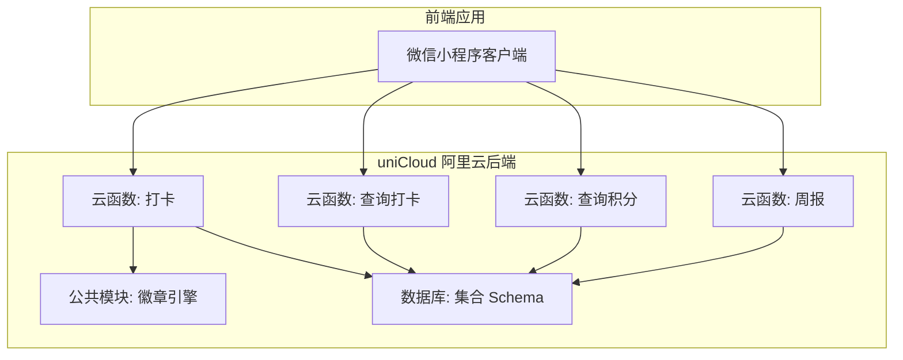
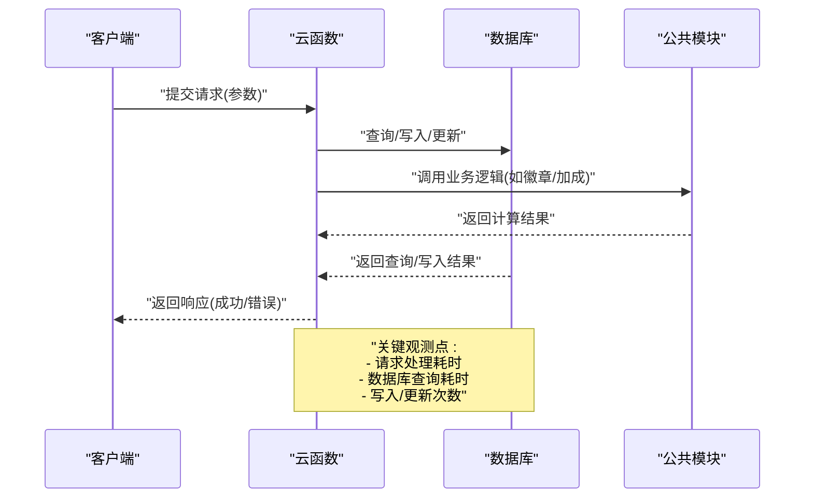
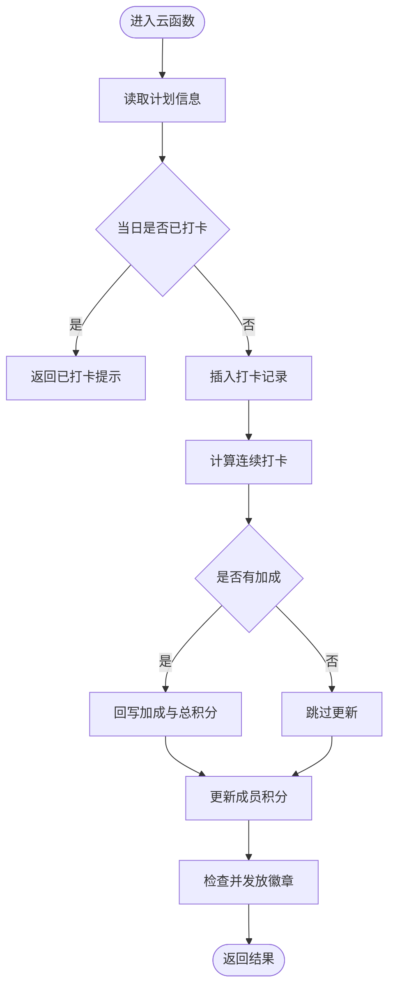
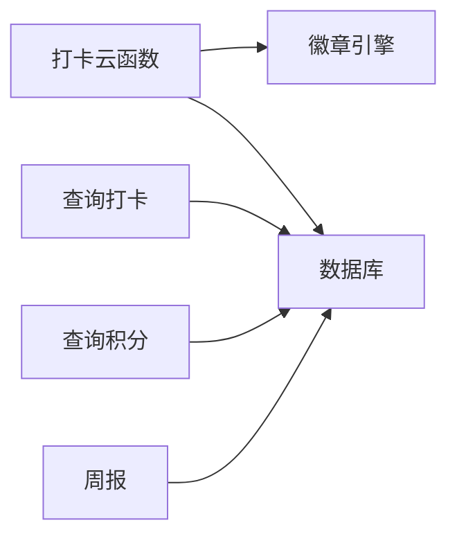

# 后端性能监控

<cite>
**本文引用的文件**
- [checkin/index.js](file://src/cloudfunctions/checkin/index.js)
- [exchangeReward/index.js](file://src/cloudfunctions/exchangeReward/index.js)
- [generateReport/index.js](file://src/cloudfunctions/generateReport/index.js)
- [login/index.js](file://src/cloudfunctions/login/index.js)
- [syncOffline/index.js](file://src/cloudfunctions/syncOffline/index.js)
- [checkin/index.js](file://uniCloud-aliyun/cloudfunctions/checkin/index.js)
- [getCheckins/index.js](file://uniCloud-aliyun/cloudfunctions/getCheckins/index.js)
- [getPoints/index.js](file://uniCloud-aliyun/cloudfunctions/getPoints/index.js)
- [getWeeklyReport/index.js](file://uniCloud-aliyun/cloudfunctions/getWeeklyReport/index.js)
- [badge-engine.js](file://uniCloud-aliyun/common/badge-engine.js)
- [checkins.schema.json](file://uniCloud-aliyun/database/checkins.schema.json)
- [members.schema.json](file://uniCloud-aliyun/database/members.schema.json)
- [badges.schema.json](file://uniCloud-aliyun/database/badges.schema.json)
</cite>

## 目录
1. [简介](#简介)
2. [项目结构](#项目结构)
3. [核心组件](#核心组件)
4. [架构总览](#架构总览)
5. [详细组件分析](#详细组件分析)
6. [依赖分析](#依赖分析)
7. [性能考虑](#性能考虑)
8. [故障排查指南](#故障排查指南)
9. [结论](#结论)
10. [附录](#附录)

## 简介
本文件面向 Star Grow 项目的后端性能监控，聚焦 uniCloud 云函数与数据库的性能观测与优化。内容涵盖：
- 云函数执行时间、内存使用、并发限制的监控与建议
- 调用链路性能分析：请求处理时间、数据库查询优化、缓存策略
- 数据库性能监控：查询执行计划、索引使用、连接池管理
- 错误监控与告警：异常捕获、错误日志聚合、性能阈值告警
- uniCloud 控制台监控面板使用与自定义指标设置

## 项目结构
项目采用“前端 + 两套后端云函数”的组织方式：
- src/cloudfunctions：微信云开发版本的云函数
- uniCloud-aliyun/cloudfunctions：uniCloud 阿里云版本的云函数
- uniCloud-aliyun/database：数据库集合的 Schema 定义
- uniCloud-aliyun/common：公共模块（如徽章引擎）

图表来源
- [checkin/index.js:1-83](file://uniCloud-aliyun/cloudfunctions/checkin/index.js#L1-L83)
- [getCheckins/index.js:1-19](file://uniCloud-aliyun/cloudfunctions/getCheckins/index.js#L1-L19)
- [getPoints/index.js:1-18](file://uniCloud-aliyun/cloudfunctions/getPoints/index.js#L1-L18)
- [getWeeklyReport/index.js:1-46](file://uniCloud-aliyun/cloudfunctions/getWeeklyReport/index.js#L1-L46)
- [badge-engine.js](file://uniCloud-aliyun/common/badge-engine.js)

章节来源
- [checkin/index.js:1-142](file://src/cloudfunctions/checkin/index.js#L1-L142)
- [checkin/index.js:1-83](file://uniCloud-aliyun/cloudfunctions/checkin/index.js#L1-L83)
- [getCheckins/index.js:1-19](file://uniCloud-aliyun/cloudfunctions/getCheckins/index.js#L1-L19)
- [getPoints/index.js:1-18](file://uniCloud-aliyun/cloudfunctions/getPoints/index.js#L1-L18)
- [getWeeklyReport/index.js:1-46](file://uniCloud-aliyun/cloudfunctions/getWeeklyReport/index.js#L1-L46)

## 核心组件
- 打卡云函数：负责校验、写入打卡记录、计算积分与加成、更新成员积分、检查并发放徽章
- 查询打卡云函数：按条件查询打卡记录，支持按日期或周起始时间过滤
- 查询积分云函数：读取成员当前与累计积分
- 周报云函数：统计最近一周的打卡数量、完成率、自检率等指标
- 公共模块：包含连续打卡计算、加成规则、徽章判定等复用逻辑

章节来源
- [checkin/index.js:1-83](file://uniCloud-aliyun/cloudfunctions/checkin/index.js#L1-L83)
- [getCheckins/index.js:1-19](file://uniCloud-aliyun/cloudfunctions/getCheckins/index.js#L1-L19)
- [getPoints/index.js:1-18](file://uniCloud-aliyun/cloudfunctions/getPoints/index.js#L1-L18)
- [getWeeklyReport/index.js:1-46](file://uniCloud-aliyun/cloudfunctions/getWeeklyReport/index.js#L1-L46)
- [badge-engine.js](file://uniCloud-aliyun/common/badge-engine.js)

## 架构总览
下图展示从客户端到云函数再到数据库的典型调用链路，并标注可进行性能观测的关键节点。

图表来源
- [checkin/index.js:1-83](file://uniCloud-aliyun/cloudfunctions/checkin/index.js#L1-L83)
- [getCheckins/index.js:1-19](file://uniCloud-aliyun/cloudfunctions/getCheckins/index.js#L1-L19)
- [getPoints/index.js:1-18](file://uniCloud-aliyun/cloudfunctions/getPoints/index.js#L1-L18)
- [getWeeklyReport/index.js:1-46](file://uniCloud-aliyun/cloudfunctions/getWeeklyReport/index.js#L1-L46)
- [badge-engine.js](file://uniCloud-aliyun/common/badge-engine.js)

## 详细组件分析

### 打卡云函数（uniCloud 版）
- 关键流程
  - 读取计划信息
  - 检查当日是否已打卡
  - 插入打卡记录（含基础积分）
  - 计算连续打卡与加成
  - 回写加成与总积分
  - 更新成员积分
  - 检查并发放徽章
- 性能关注点
  - 查询与写入次数较多，建议合并查询、减少往返
  - 连续打卡计算需遍历近期记录，注意分页与索引
  - 徽章判定逻辑可能触发多次写入，建议批量或去重
- 可观测指标
  - 请求处理时间
  - 数据库读写次数与耗时
  - 加成计算与徽章发放耗时

图表来源
- [checkin/index.js:1-83](file://uniCloud-aliyun/cloudfunctions/checkin/index.js#L1-L83)

章节来源
- [checkin/index.js:1-83](file://uniCloud-aliyun/cloudfunctions/checkin/index.js#L1-L83)

### 查询打卡云函数
- 功能：按 child_id、date 或 week_start 查询打卡记录，按创建时间倒序
- 性能建议
  - 对 child_id、date 建立复合索引
  - 使用分页避免一次性返回大量数据
  - 仅返回必要字段，减少网络与解析开销

章节来源
- [getCheckins/index.js:1-19](file://uniCloud-aliyun/cloudfunctions/getCheckins/index.js#L1-L19)

### 查询积分云函数
- 功能：读取成员当前与累计积分
- 性能建议
  - 通过主键查询，避免全表扫描
  - 若频繁读取，可在应用层引入缓存（如 Redis）以降低数据库压力

章节来源
- [getPoints/index.js:1-18](file://uniCloud-aliyun/cloudfunctions/getPoints/index.js#L1-L18)

### 周报云函数
- 功能：统计最近一周的打卡数量、完成率、自检率等
- 性能建议
  - 使用聚合查询替代多次读取
  - 对 family_id、status、date 建立索引
  - 将计算逻辑下沉到数据库聚合阶段

章节来源
- [getWeeklyReport/index.js:1-46](file://uniCloud-aliyun/cloudfunctions/getWeeklyReport/index.js#L1-L46)

### 公共模块（徽章引擎）
- 功能：提供连续打卡计算、加成规则、徽章判定等
- 性能建议
  - 将热点数据放入缓存，减少重复计算
  - 对频繁调用的计算逻辑进行批量化处理

章节来源
- [badge-engine.js](file://uniCloud-aliyun/common/badge-engine.js)

## 依赖分析
- 组件耦合
  - 打卡云函数依赖公共模块（徽章引擎），并通过数据库进行读写
  - 查询类云函数主要依赖数据库读取
- 外部依赖
  - uniCloud 数据库 SDK
  - 微信开放平台接口（登录场景）
- 潜在风险
  - 查询未建索引导致慢查询
  - 写入操作过于频繁造成数据库压力
  - 缺少缓存导致重复计算与高延迟

图表来源
- [checkin/index.js:1-83](file://uniCloud-aliyun/cloudfunctions/checkin/index.js#L1-L83)
- [getCheckins/index.js:1-19](file://uniCloud-aliyun/cloudfunctions/getCheckins/index.js#L1-L19)
- [getPoints/index.js:1-18](file://uniCloud-aliyun/cloudfunctions/getPoints/index.js#L1-L18)
- [getWeeklyReport/index.js:1-46](file://uniCloud-aliyun/cloudfunctions/getWeeklyReport/index.js#L1-L46)
- [badge-engine.js](file://uniCloud-aliyun/common/badge-engine.js)

## 性能考虑
- 云函数执行时间
  - 在函数入口与关键步骤埋点，记录开始与结束时间，计算处理耗时
  - 对复杂计算（如连续打卡、徽章判定）进行拆分与缓存
- 内存使用
  - 避免在函数中缓存大对象；及时释放临时变量
  - 对批量操作使用流式处理或分批处理
- 并发限制
  - 合理设置并发上限，避免瞬时高并发导致超时
  - 对写密集型操作增加幂等性与去重逻辑
- 数据库查询优化
  - 为高频查询字段建立索引（如 child_id、date、family_id、status）
  - 使用投影只返回必要字段，减少网络与解析开销
  - 使用聚合查询替代多次读取
- 缓存策略
  - 对热点数据（如成员积分、徽章状态）引入缓存
  - 明确缓存失效策略，确保一致性
- 连接池管理
  - 合理复用数据库连接，避免频繁创建销毁
  - 控制单次查询的数据量，避免阻塞连接

## 故障排查指南
- 异常捕获与日志
  - 在云函数中统一 try/catch，记录错误堆栈与上下文参数
  - 使用结构化日志，包含请求 ID、用户标识、耗时、错误码等
- 错误日志聚合
  - 将日志输出到 uniCloud 日志服务，便于集中检索与分析
  - 对高频错误与异常进行归类与统计
- 性能阈值告警
  - 设置请求处理时间、数据库查询耗时、错误率阈值
  - 当超过阈值时触发告警（如短信、邮件、IM）
- 常见问题定位
  - 查询慢：检查索引是否缺失、是否发生全表扫描
  - 写入慢：检查写入批次大小、是否重复写入、是否存在锁竞争
  - 内存溢出：检查大对象缓存、临时数组长度、循环中的对象创建

章节来源
- [checkin/index.js:1-83](file://uniCloud-aliyun/cloudfunctions/checkin/index.js#L1-L83)
- [getCheckins/index.js:1-19](file://uniCloud-aliyun/cloudfunctions/getCheckins/index.js#L1-L19)
- [getPoints/index.js:1-18](file://uniCloud-aliyun/cloudfunctions/getPoints/index.js#L1-L18)
- [getWeeklyReport/index.js:1-46](file://uniCloud-aliyun/cloudfunctions/getWeeklyReport/index.js#L1-L46)

## 结论
通过在云函数中埋点、在数据库侧建立索引与聚合查询、在应用层引入缓存与告警机制，可以系统性提升 Star Grow 的后端性能与稳定性。建议优先解决高频慢查询与重复写入问题，逐步引入缓存与更细粒度的监控指标。

## 附录

### uniCloud 控制台监控面板使用指南
- 函数监控
  - 查看函数调用次数、成功率、平均耗时、错误率
  - 分析冷启动与热启动差异，优化预热策略
- 数据库监控
  - 查看集合读写次数、慢查询、索引命中率
  - 关注写入峰值与连接数变化
- 日志与告警
  - 在日志服务中筛选错误日志，定位异常请求
  - 配置性能阈值告警，及时发现异常波动

### 自定义指标设置方法
- 函数级指标
  - 在函数内记录关键步骤耗时，上报至 uniCloud 指标服务
  - 指标示例：请求处理耗时、数据库查询耗时、加成计算耗时
- 数据库级指标
  - 通过数据库监控查看慢查询与索引使用情况
  - 基于聚合查询统计业务指标（如周完成率、自检率）
- 告警规则
  - 请求处理时间超过阈值
  - 错误率超过阈值
  - 数据库慢查询占比超过阈值