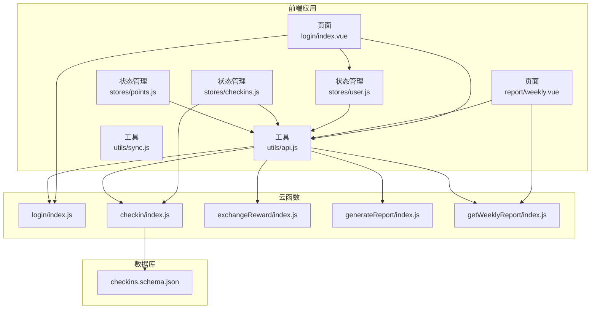
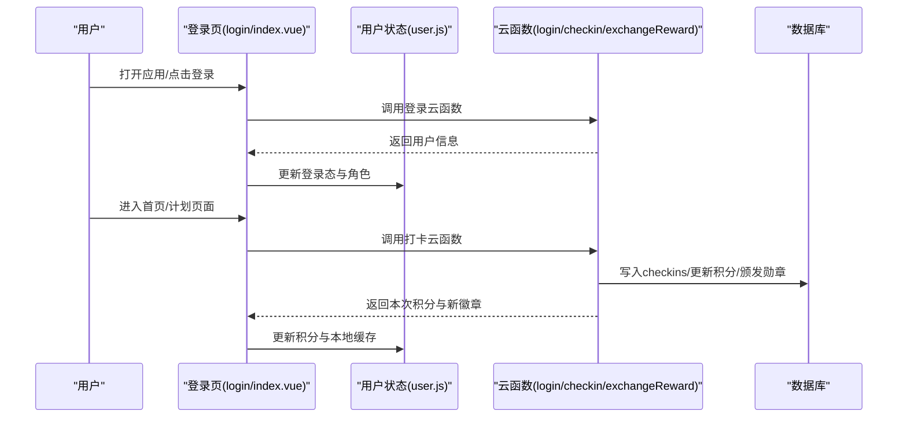
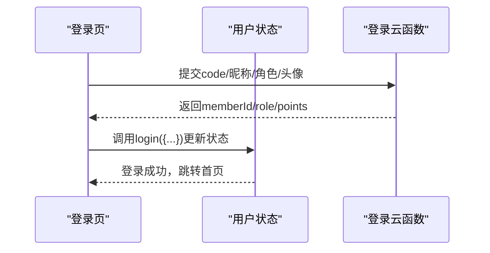
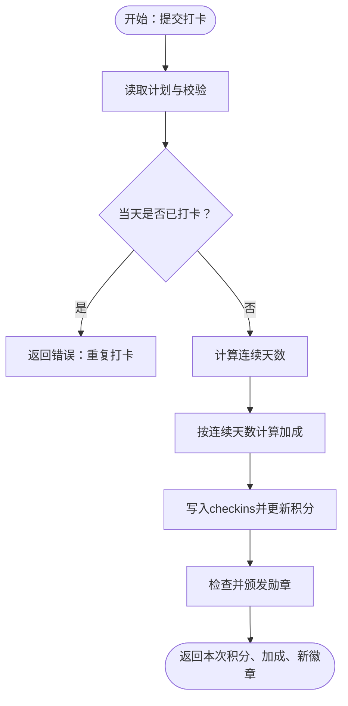
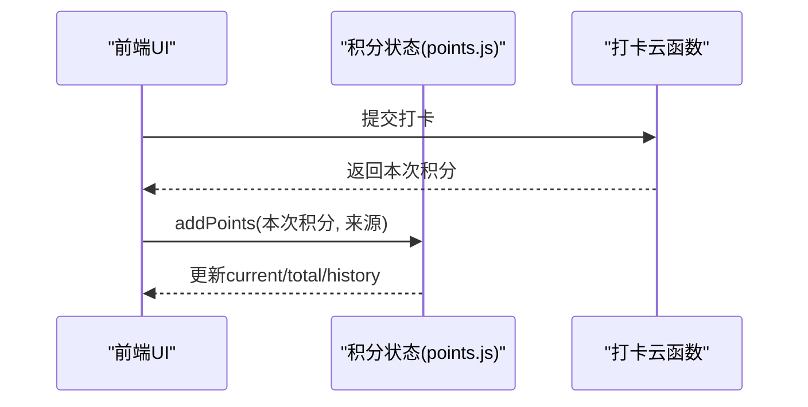
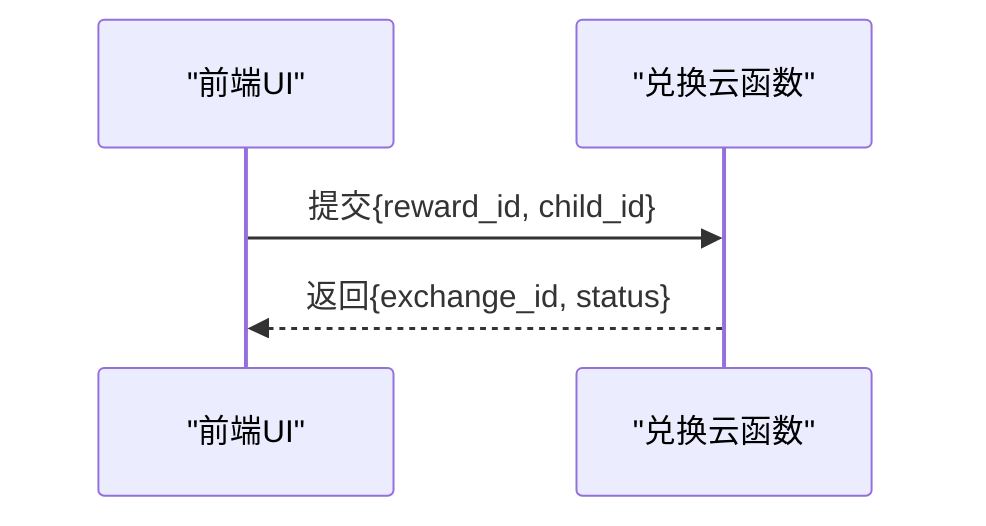
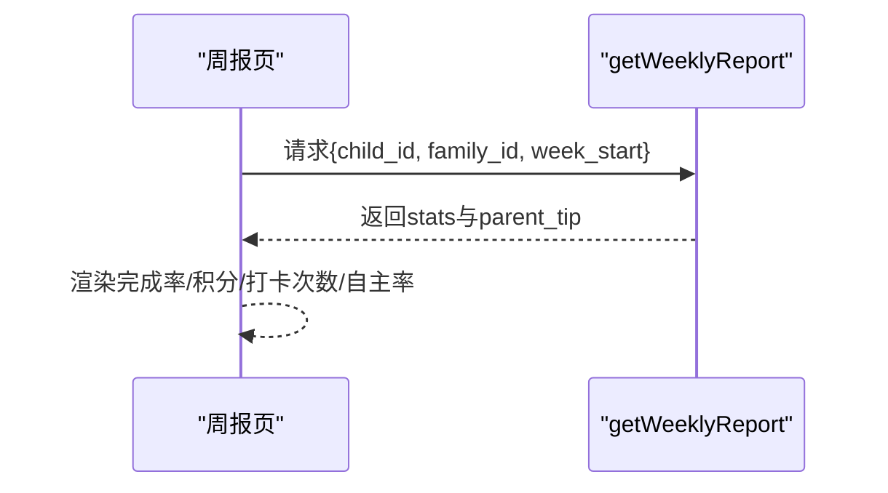
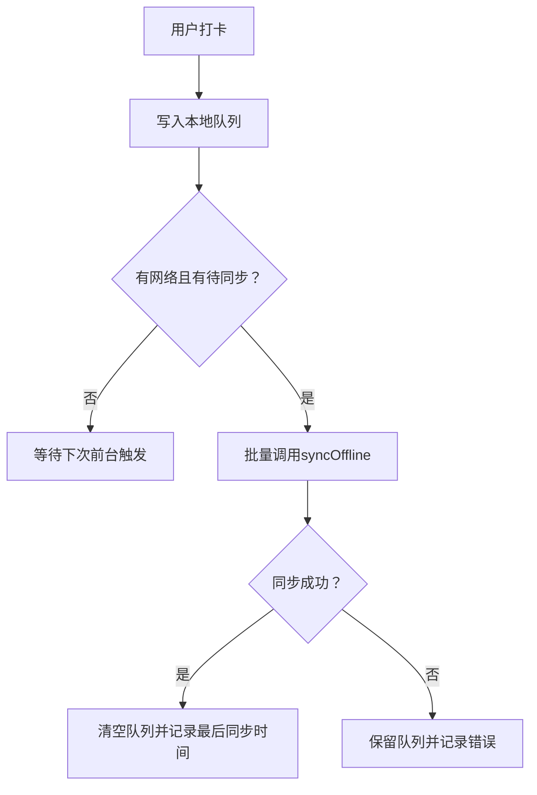
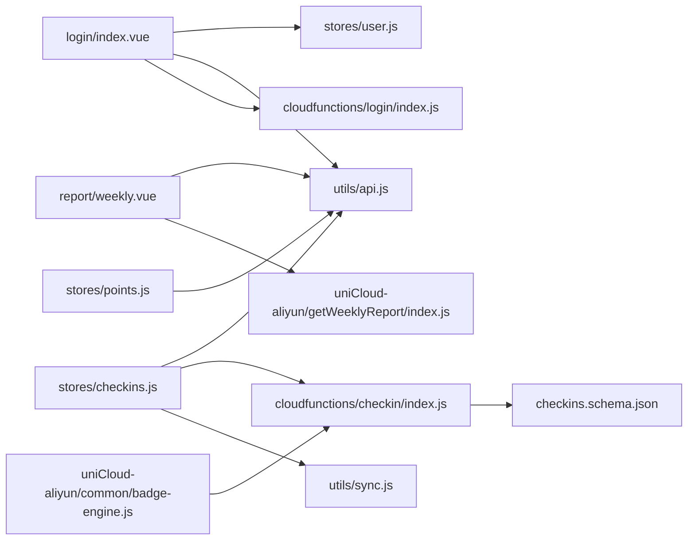
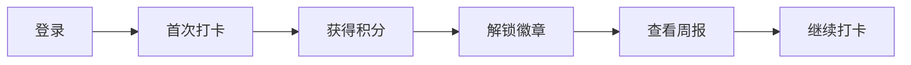

# 用户行为分析

<cite>
**本文引用的文件**
- [src/stores/user.js](file://src/stores/user.js)
- [src/stores/checkins.js](file://src/stores/checkins.js)
- [src/stores/points.js](file://src/stores/points.js)
- [src/utils/api.js](file://src/utils/api.js)
- [src/utils/sync.js](file://src/utils/sync.js)
- [src/pages/login/index.vue](file://src/pages/login/index.vue)
- [src/pages/report/weekly.vue](file://src/pages/report/weekly.vue)
- [src/cloudfunctions/login/index.js](file://src/cloudfunctions/login/index.js)
- [src/cloudfunctions/checkin/index.js](file://src/cloudfunctions/checkin/index.js)
- [src/cloudfunctions/exchangeReward/index.js](file://src/cloudfunctions/exchangeReward/index.js)
- [src/cloudfunctions/generateReport/index.js](file://src/cloudfunctions/generateReport/index.js)
- [uniCloud-aliyun/cloudfunctions/getWeeklyReport/index.js](file://uniCloud-aliyun/cloudfunctions/getWeeklyReport/index.js)
- [uniCloud-aliyun/common/badge-engine.js](file://uniCloud-aliyun/common/badge-engine.js)
- [uniCloud-aliyun/database/checkins.schema.json](file://uniCloud-aliyun/database/checkins.schema.json)
</cite>

## 目录
1. [引言](#引言)
2. [项目结构](#项目结构)
3. [核心组件](#核心组件)
4. [架构总览](#架构总览)
5. [详细组件分析](#详细组件分析)
6. [依赖关系分析](#依赖关系分析)
7. [性能与可用性考量](#性能与可用性考量)
8. [故障排查指南](#故障排查指南)
9. [结论](#结论)
10. [附录](#附录)

## 引言
本文件面向Star Grow项目，系统化阐述用户行为分析的设计与实现，覆盖以下主题：
- 关键事件埋点：登录、打卡、积分获取、奖励兑换
- 活跃度指标：日活跃用户(DAU)、月活跃用户(MAU)、留存率
- 用户路径与转化漏斗：从登录到首次打卡
- 用户画像与偏好：习惯养成进度、奖励偏好、使用频率
- A/B测试与效果评估监控方案
- 隐私保护与数据合规

## 项目结构
项目采用“前端应用 + 云开发云函数 + 数据库Schema”的分层组织方式：
- 前端应用：页面、组件、Pinia状态管理、工具函数
- 云函数：登录、打卡、积分、奖励、周报等业务逻辑
- 数据库：checkins等集合的Schema定义与权限控制

图示来源
- [src/pages/login/index.vue:1-289](file://src/pages/login/index.vue#L1-L289)
- [src/pages/report/weekly.vue:1-130](file://src/pages/report/weekly.vue#L1-L130)
- [src/stores/user.js:1-119](file://src/stores/user.js#L1-L119)
- [src/stores/checkins.js:1-163](file://src/stores/checkins.js#L1-L163)
- [src/stores/points.js:1-44](file://src/stores/points.js#L1-L44)
- [src/utils/api.js:1-18](file://src/utils/api.js#L1-L18)
- [src/utils/sync.js:1-96](file://src/utils/sync.js#L1-L96)
- [src/cloudfunctions/login/index.js:1-13](file://src/cloudfunctions/login/index.js#L1-L13)
- [src/cloudfunctions/checkin/index.js:1-142](file://src/cloudfunctions/checkin/index.js#L1-L142)
- [src/cloudfunctions/exchangeReward/index.js:1-28](file://src/cloudfunctions/exchangeReward/index.js#L1-L28)
- [src/cloudfunctions/generateReport/index.js:1-33](file://src/cloudfunctions/generateReport/index.js#L1-L33)
- [uniCloud-aliyun/cloudfunctions/getWeeklyReport/index.js:1-45](file://uniCloud-aliyun/cloudfunctions/getWeeklyReport/index.js#L1-L45)
- [uniCloud-aliyun/database/checkins.schema.json:1-52](file://uniCloud-aliyun/database/checkins.schema.json#L1-L52)

章节来源
- [src/pages/login/index.vue:1-289](file://src/pages/login/index.vue#L1-L289)
- [src/pages/report/weekly.vue:1-130](file://src/pages/report/weekly.vue#L1-L130)
- [src/stores/user.js:1-119](file://src/stores/user.js#L1-L119)
- [src/stores/checkins.js:1-163](file://src/stores/checkins.js#L1-L163)
- [src/stores/points.js:1-44](file://src/stores/points.js#L1-L44)
- [src/utils/api.js:1-18](file://src/utils/api.js#L1-L18)
- [src/utils/sync.js:1-96](file://src/utils/sync.js#L1-L96)
- [src/cloudfunctions/login/index.js:1-13](file://src/cloudfunctions/login/index.js#L1-L13)
- [src/cloudfunctions/checkin/index.js:1-142](file://src/cloudfunctions/checkin/index.js#L1-L142)
- [src/cloudfunctions/exchangeReward/index.js:1-28](file://src/cloudfunctions/exchangeReward/index.js#L1-L28)
- [src/cloudfunctions/generateReport/index.js:1-33](file://src/cloudfunctions/generateReport/index.js#L1-L33)
- [uniCloud-aliyun/cloudfunctions/getWeeklyReport/index.js:1-45](file://uniCloud-aliyun/cloudfunctions/getWeeklyReport/index.js#L1-L45)
- [uniCloud-aliyun/database/checkins.schema.json:1-52](file://uniCloud-aliyun/database/checkins.schema.json#L1-L52)

## 核心组件
- 用户状态管理：负责登录态、角色切换、积分持久化
- 打卡状态管理：负责当日/当周打卡、连续天数计算、离线缓存与同步
- 积分状态管理：负责积分增减、历史记录、累计积分
- 云函数调用封装：统一调用云函数，处理错误与返回
- 离线同步工具：优先离线、静默同步、冲突处理

章节来源
- [src/stores/user.js:1-119](file://src/stores/user.js#L1-L119)
- [src/stores/checkins.js:1-163](file://src/stores/checkins.js#L1-L163)
- [src/stores/points.js:1-44](file://src/stores/points.js#L1-L44)
- [src/utils/api.js:1-18](file://src/utils/api.js#L1-L18)
- [src/utils/sync.js:1-96](file://src/utils/sync.js#L1-L96)

## 架构总览
下图展示用户行为分析的关键流程：登录、打卡、积分与勋章、周报生成。

图示来源
- [src/pages/login/index.vue:164-230](file://src/pages/login/index.vue#L164-L230)
- [src/stores/user.js:23-53](file://src/stores/user.js#L23-L53)
- [src/cloudfunctions/login/index.js:4-12](file://src/cloudfunctions/login/index.js#L4-L12)
- [src/cloudfunctions/checkin/index.js:12-83](file://src/cloudfunctions/checkin/index.js#L12-L83)
- [src/stores/checkins.js:26-89](file://src/stores/checkins.js#L26-L89)
- [src/stores/points.js:26-33](file://src/stores/points.js#L26-L33)

## 详细组件分析

### 登录行为追踪
- 前端页面负责收集昵称、角色、微信头像等信息，并调用云函数登录
- 云函数返回用户标识、角色、初始积分等，前端更新Pinia状态并持久化
- 登录态变化触发后续行为追踪（如周报、积分）

图示来源
- [src/pages/login/index.vue:164-230](file://src/pages/login/index.vue#L164-L230)
- [src/stores/user.js:23-53](file://src/stores/user.js#L23-L53)
- [src/cloudfunctions/login/index.js:4-12](file://src/cloudfunctions/login/index.js#L4-L12)

章节来源
- [src/pages/login/index.vue:164-230](file://src/pages/login/index.vue#L164-L230)
- [src/stores/user.js:23-53](file://src/stores/user.js#L23-L53)
- [src/cloudfunctions/login/index.js:4-12](file://src/cloudfunctions/login/index.js#L4-L12)

### 打卡行为追踪与连续天数计算
- 前端调用云函数进行打卡，写入checkins集合，计算基础积分与连续加成，更新成员积分，颁发勋章
- 云函数根据最近若干天的打卡日期计算连续天数，按阈值发放加成
- 勋章系统包含首次打卡、连续天数里程碑、自主打卡等

图示来源
- [src/cloudfunctions/checkin/index.js:12-83](file://src/cloudfunctions/checkin/index.js#L12-L83)
- [src/cloudfunctions/checkin/index.js:86-107](file://src/cloudfunctions/checkin/index.js#L86-L107)
- [src/cloudfunctions/checkin/index.js:110-141](file://src/cloudfunctions/checkin/index.js#L110-L141)
- [uniCloud-aliyun/common/badge-engine.js:52-122](file://uniCloud-aliyun/common/badge-engine.js#L52-L122)

章节来源
- [src/stores/checkins.js:26-89](file://src/stores/checkins.js#L26-L89)
- [src/cloudfunctions/checkin/index.js:12-83](file://src/cloudfunctions/checkin/index.js#L12-L83)
- [uniCloud-aliyun/common/badge-engine.js:52-122](file://uniCloud-aliyun/common/badge-engine.js#L52-L122)

### 积分获取与历史追踪
- 前端在成功打卡后增加当前/累计积分，并写入积分历史（含来源、金额、日期）
- 云函数侧在写入checkins后更新成员积分字段

图示来源
- [src/stores/points.js:26-33](file://src/stores/points.js#L26-L33)
- [src/stores/checkins.js:51-51](file://src/stores/checkins.js#L51-L51)
- [src/cloudfunctions/checkin/index.js:57-62](file://src/cloudfunctions/checkin/index.js#L57-L62)

章节来源
- [src/stores/points.js:26-33](file://src/stores/points.js#L26-L33)
- [src/stores/checkins.js:51-51](file://src/stores/checkins.js#L51-L51)
- [src/cloudfunctions/checkin/index.js:57-62](file://src/cloudfunctions/checkin/index.js#L57-L62)

### 奖励兑换追踪
- 前端发起兑换请求，云函数校验积分、扣减积分、创建兑换记录（待家长确认）
- 当前云函数骨架中包含参数解析与返回占位，实际业务可在此扩展

图示来源
- [src/cloudfunctions/exchangeReward/index.js:4-18](file://src/cloudfunctions/exchangeReward/index.js#L4-L18)

章节来源
- [src/cloudfunctions/exchangeReward/index.js:4-18](file://src/cloudfunctions/exchangeReward/index.js#L4-L18)

### 周报与活跃度指标
- 周报云函数统计本周完成次数、完成率、获得积分、自主打卡比例等
- 前端页面展示周报卡片、家长指南与本周反思

图示来源
- [src/pages/report/weekly.vue:73-90](file://src/pages/report/weekly.vue#L73-L90)
- [uniCloud-aliyun/cloudfunctions/getWeeklyReport/index.js:4-44](file://uniCloud-aliyun/cloudfunctions/getWeeklyReport/index.js#L4-L44)

章节来源
- [src/pages/report/weekly.vue:73-90](file://src/pages/report/weekly.vue#L73-L90)
- [uniCloud-aliyun/cloudfunctions/getWeeklyReport/index.js:4-44](file://uniCloud-aliyun/cloudfunctions/getWeeklyReport/index.js#L4-L44)

### 离线与同步机制
- 前端优先离线：打卡直接写入本地Storage，不阻塞用户
- 静默同步：App前台/启动时自动检测并批量上传未同步队列
- 冲突处理：以云端为准，避免重复写入

图示来源
- [src/stores/checkins.js:78-88](file://src/stores/checkins.js#L78-L88)
- [src/utils/sync.js:25-53](file://src/utils/sync.js#L25-L53)
- [src/utils/sync.js:84-95](file://src/utils/sync.js#L84-L95)

章节来源
- [src/stores/checkins.js:78-88](file://src/stores/checkins.js#L78-L88)
- [src/utils/sync.js:25-53](file://src/utils/sync.js#L25-L53)
- [src/utils/sync.js:84-95](file://src/utils/sync.js#L84-L95)

## 依赖关系分析
- 页面依赖状态管理与工具函数；状态管理依赖云函数封装；云函数依赖数据库Schema与权限配置
- 勋章引擎独立于云函数，便于复用与扩展

图示来源
- [src/pages/login/index.vue:104-105](file://src/pages/login/index.vue#L104-L105)
- [src/stores/user.js:1-119](file://src/stores/user.js#L1-L119)
- [src/utils/api.js:9-17](file://src/utils/api.js#L9-L17)
- [src/cloudfunctions/login/index.js:4-12](file://src/cloudfunctions/login/index.js#L4-L12)
- [src/pages/report/weekly.vue:58-59](file://src/pages/report/weekly.vue#L58-L59)
- [uniCloud-aliyun/cloudfunctions/getWeeklyReport/index.js:4-44](file://uniCloud-aliyun/cloudfunctions/getWeeklyReport/index.js#L4-L44)
- [src/stores/checkins.js:4-7](file://src/stores/checkins.js#L4-L7)
- [src/cloudfunctions/checkin/index.js:12-83](file://src/cloudfunctions/checkin/index.js#L12-L83)
- [src/utils/sync.js:25-53](file://src/utils/sync.js#L25-L53)
- [src/stores/points.js:9-43](file://src/stores/points.js#L9-L43)
- [uniCloud-aliyun/common/badge-engine.js:52-122](file://uniCloud-aliyun/common/badge-engine.js#L52-L122)
- [uniCloud-aliyun/database/checkins.schema.json:10-50](file://uniCloud-aliyun/database/checkins.schema.json#L10-L50)

章节来源
- [src/pages/login/index.vue:104-105](file://src/pages/login/index.vue#L104-L105)
- [src/stores/user.js:1-119](file://src/stores/user.js#L1-L119)
- [src/utils/api.js:9-17](file://src/utils/api.js#L9-L17)
- [src/cloudfunctions/login/index.js:4-12](file://src/cloudfunctions/login/index.js#L4-L12)
- [src/pages/report/weekly.vue:58-59](file://src/pages/report/weekly.vue#L58-L59)
- [uniCloud-aliyun/cloudfunctions/getWeeklyReport/index.js:4-44](file://uniCloud-aliyun/cloudfunctions/getWeeklyReport/index.js#L4-L44)
- [src/stores/checkins.js:4-7](file://src/stores/checkins.js#L4-L7)
- [src/cloudfunctions/checkin/index.js:12-83](file://src/cloudfunctions/checkin/index.js#L12-L83)
- [src/utils/sync.js:25-53](file://src/utils/sync.js#L25-L53)
- [src/stores/points.js:9-43](file://src/stores/points.js#L9-L43)
- [uniCloud-aliyun/common/badge-engine.js:52-122](file://uniCloud-aliyun/common/badge-engine.js#L52-L122)
- [uniCloud-aliyun/database/checkins.schema.json:10-50](file://uniCloud-aliyun/database/checkins.schema.json#L10-L50)

## 性能与可用性考量
- 离线优先：打卡立即落盘本地，避免网络抖动影响体验
- 批量同步：按日期排序、批量上传，减少请求次数
- 幂等设计：云端去重，避免重复写入
- 缓存策略：本地缓存当日打卡与积分历史，降低重复请求

章节来源
- [src/stores/checkins.js:78-88](file://src/stores/checkins.js#L78-L88)
- [src/utils/sync.js:25-53](file://src/utils/sync.js#L25-L53)
- [src/stores/points.js:31-33](file://src/stores/points.js#L31-L33)

## 故障排查指南
- 登录失败：检查云函数返回错误码与白名单限制；确认前端提示与本地存储
- 打卡失败：查看离线队列是否堆积；检查网络类型与同步结果
- 积分异常：核对checkins记录与成员积分更新；检查历史记录截断逻辑
- 勋章未解锁：确认连续天数计算边界与勋章类型映射

章节来源
- [src/pages/login/index.vue:181-193](file://src/pages/login/index.vue#L181-L193)
- [src/utils/sync.js:49-52](file://src/utils/sync.js#L49-L52)
- [src/stores/checkins.js:78-88](file://src/stores/checkins.js#L78-L88)
- [src/stores/points.js:31-33](file://src/stores/points.js#L31-L33)
- [uniCloud-aliyun/common/badge-engine.js:52-122](file://uniCloud-aliyun/common/badge-engine.js#L52-L122)

## 结论
本项目通过前端状态管理与云函数协同，实现了登录、打卡、积分、奖励、周报等关键用户行为的闭环追踪。结合离线优先与静默同步机制，保障了用户体验与数据一致性。建议后续补充埋点上报与可视化看板，完善A/B测试与合规审计。

## 附录

### 用户活跃度指标计算方法
- 日活跃用户(DAU)：按自然日聚合唯一用户数
- 月活跃用户(MAU)：按自然月聚合唯一用户数
- 留存率：以新用户次日/7日/30日仍登录的比例衡量

说明：当前代码未直接暴露DAU/MAU/留存率计算逻辑，可在周报或报表云函数中扩展相应聚合统计。

章节来源
- [uniCloud-aliyun/cloudfunctions/getWeeklyReport/index.js:4-44](file://uniCloud-aliyun/cloudfunctions/getWeeklyReport/index.js#L4-L44)

### 用户路径与转化漏斗
- 登录 → 首次打卡 → 获得积分与徽章 → 查看周报 → 继续日常打卡
- 转化率：从登录到完成首次打卡的比率，可基于checkins集合统计

图示来源
- [src/pages/login/index.vue:164-230](file://src/pages/login/index.vue#L164-L230)
- [src/cloudfunctions/checkin/index.js:65-78](file://src/cloudfunctions/checkin/index.js#L65-L78)
- [src/pages/report/weekly.vue:73-90](file://src/pages/report/weekly.vue#L73-L90)

### 用户画像与偏好分析
- 习惯养成进度：连续天数、周完成率、自主打卡比例
- 奖励偏好：兑换记录频次与奖励类别分布
- 使用频率：每日/每周打卡次数、积分获取趋势

章节来源
- [src/stores/checkins.js:96-123](file://src/stores/checkins.js#L96-L123)
- [uniCloud-aliyun/cloudfunctions/getWeeklyReport/index.js:16-31](file://uniCloud-aliyun/cloudfunctions/getWeeklyReport/index.js#L16-L31)
- [src/stores/points.js:14-24](file://src/stores/points.js#L14-L24)

### A/B测试与效果评估监控方案
- 实验设计：随机分配实验组/对照组（如不同徽章激励策略）
- 指标采集：转化漏斗、留存率、使用频率、满意度
- 分析方法：显著性检验、置信区间估计
- 工具建议：引入埋点SDK或服务端埋点上报，配合可视化看板

说明：当前代码未包含埋点上报逻辑，建议在云函数返回结果处补充事件上报调用。

章节来源
- [src/cloudfunctions/checkin/index.js:65-78](file://src/cloudfunctions/checkin/index.js#L65-L78)
- [src/stores/checkins.js:26-89](file://src/stores/checkins.js#L26-L89)

### 隐私保护与数据合规
- 最小化原则：仅收集必要信息（昵称、头像、角色、设备信息）
- 数据生命周期：明确积分历史、打卡记录的保留期限
- 用户权利：提供查阅、更正、删除个人数据的入口
- 合规审计：对敏感操作（家长密码切换、兑换确认）记录审计日志

章节来源
- [src/stores/user.js:56-77](file://src/stores/user.js#L56-L77)
- [src/stores/checkins.js:78-88](file://src/stores/checkins.js#L78-L88)