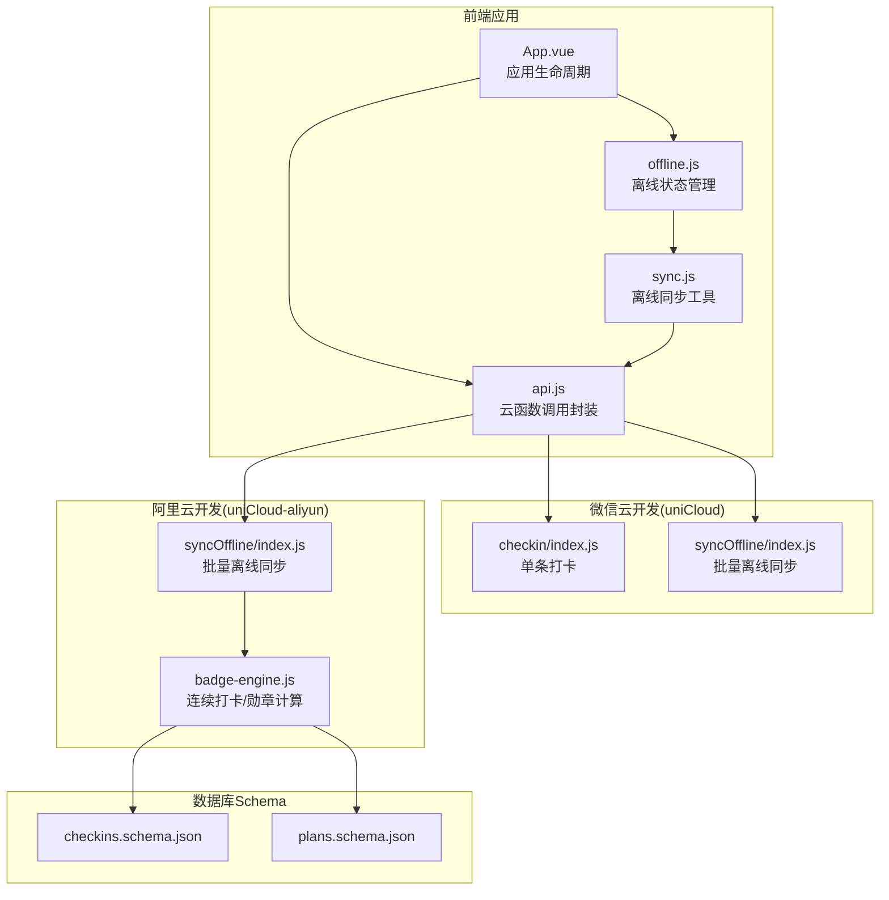
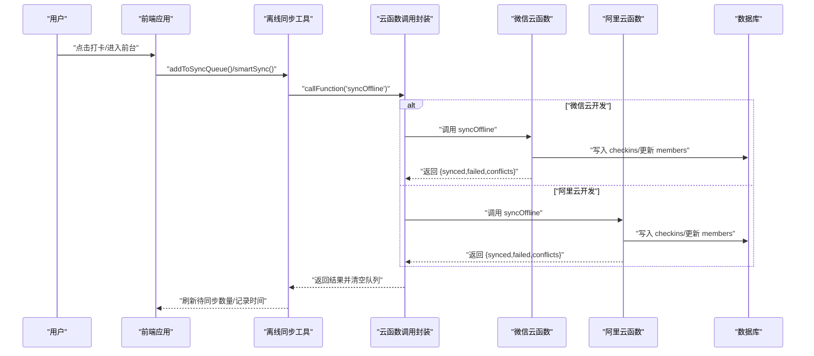
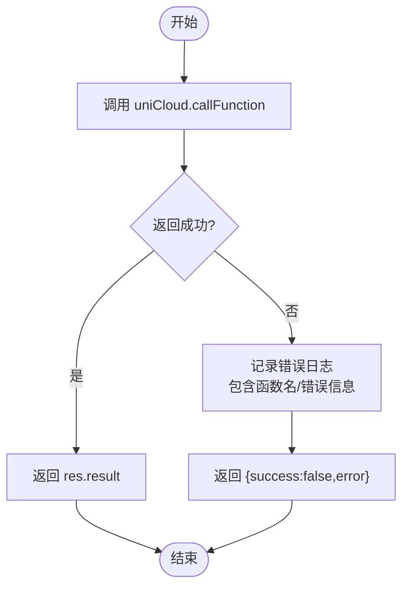
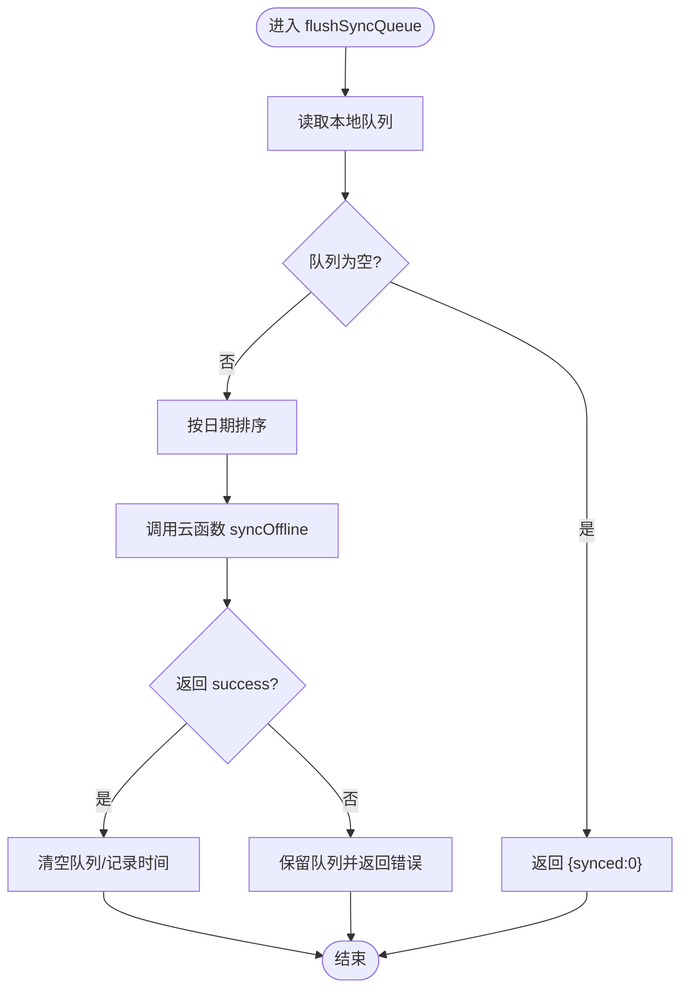
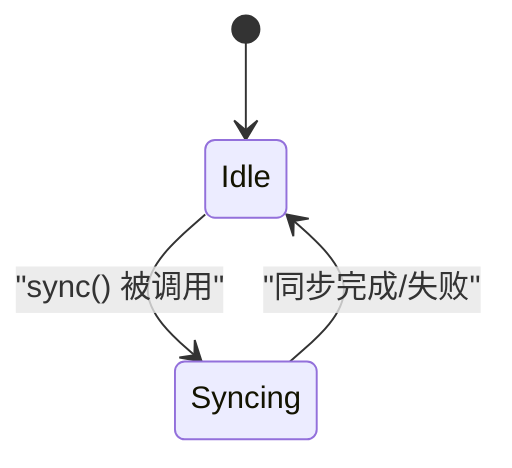
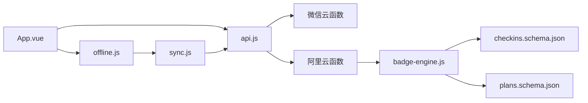

# 监控日志

<cite>
**本文引用的文件**
- [src/utils/api.js](file://src/utils/api.js)
- [src/utils/sync.js](file://src/utils/sync.js)
- [src/stores/offline.js](file://src/stores/offline.js)
- [src/App.vue](file://src/App.vue)
- [src/cloudfunctions/checkin/index.js](file://src/cloudfunctions/checkin/index.js)
- [src/cloudfunctions/syncOffline/index.js](file://src/cloudfunctions/syncOffline/index.js)
- [uniCloud-aliyun/cloudfunctions/syncOffline/index.js](file://uniCloud-aliyun/cloudfunctions/syncOffline/index.js)
- [uniCloud-aliyun/common/badge-engine.js](file://uniCloud-aliyun/common/badge-engine.js)
- [uniCloud-aliyun/database/checkins.schema.json](file://uniCloud-aliyun/database/checkins.schema.json)
- [uniCloud-aliyun/database/plans.schema.json](file://uniCloud-aliyun/database/plans.schema.json)
</cite>

## 目录
1. [简介](#简介)
2. [项目结构](#项目结构)
3. [核心组件](#核心组件)
4. [架构总览](#架构总览)
5. [详细组件分析](#详细组件分析)
6. [依赖关系分析](#依赖关系分析)
7. [性能与监控指标](#性能与监控指标)
8. [日志分级与过滤](#日志分级与过滤)
9. [故障排查指南](#故障排查指南)
10. [结论](#结论)
11. [附录](#附录)

## 简介
本文件面向 Star Grow 项目的监控与日志体系，聚焦 uniCloud 云开发的监控配置与前端错误捕获、上报机制，覆盖访问统计、错误监控、性能指标、离线数据同步监控与日志记录、用户行为分析与埋点配置、日志分级与过滤、性能指标与告警、以及日志分析与问题定位方法。文档基于仓库现有代码进行梳理与扩展建议，帮助在不侵入业务的前提下建立完善的可观测性。

## 项目结构
项目采用“前端应用 + 云函数 + 数据库 Schema + 云开发公共模块”的分层组织方式：
- 前端层：Vue 应用、Pinia 状态、工具函数（API 调用、离线同步）、页面组件
- 云函数层：微信云开发与阿里云开发两套实现，分别对应不同后端
- 数据层：MongoDB 风格 Schema 定义，约束字段与默认值
- 公共模块：跨云平台复用的业务逻辑（如勋章引擎）

图表来源
- [src/App.vue:1-64](file://src/App.vue#L1-L64)
- [src/utils/api.js:1-18](file://src/utils/api.js#L1-L18)
- [src/utils/sync.js:1-96](file://src/utils/sync.js#L1-L96)
- [src/stores/offline.js:1-30](file://src/stores/offline.js#L1-L30)
- [src/cloudfunctions/checkin/index.js:1-142](file://src/cloudfunctions/checkin/index.js#L1-L142)
- [src/cloudfunctions/syncOffline/index.js:1-20](file://src/cloudfunctions/syncOffline/index.js#L1-L20)
- [uniCloud-aliyun/cloudfunctions/syncOffline/index.js:1-90](file://uniCloud-aliyun/cloudfunctions/syncOffline/index.js#L1-L90)
- [uniCloud-aliyun/common/badge-engine.js:1-125](file://uniCloud-aliyun/common/badge-engine.js#L1-L125)
- [uniCloud-aliyun/database/checkins.schema.json:1-52](file://uniCloud-aliyun/database/checkins.schema.json#L1-L52)
- [uniCloud-aliyun/database/plans.schema.json:1-50](file://uniCloud-aliyun/database/plans.schema.json#L1-L50)

章节来源
- [src/App.vue:1-64](file://src/App.vue#L1-L64)
- [src/utils/api.js:1-18](file://src/utils/api.js#L1-L18)
- [src/utils/sync.js:1-96](file://src/utils/sync.js#L1-L96)
- [src/stores/offline.js:1-30](file://src/stores/offline.js#L1-L30)
- [src/cloudfunctions/checkin/index.js:1-142](file://src/cloudfunctions/checkin/index.js#L1-L142)
- [src/cloudfunctions/syncOffline/index.js:1-20](file://src/cloudfunctions/syncOffline/index.js#L1-L20)
- [uniCloud-aliyun/cloudfunctions/syncOffline/index.js:1-90](file://uniCloud-aliyun/cloudfunctions/syncOffline/index.js#L1-L90)
- [uniCloud-aliyun/common/badge-engine.js:1-125](file://uniCloud-aliyun/common/badge-engine.js#L1-L125)
- [uniCloud-aliyun/database/checkins.schema.json:1-52](file://uniCloud-aliyun/database/checkins.schema.json#L1-L52)
- [uniCloud-aliyun/database/plans.schema.json:1-50](file://uniCloud-aliyun/database/plans.schema.json#L1-L50)

## 核心组件
- 云函数调用封装：统一捕获调用异常，返回标准化结果，便于前端统一处理与上报
- 离线同步工具：本地队列 + 智能同步（网络检测）+ 成功后清空队列 + 记录最后同步时间
- 离线状态管理：Pinia Store 维护待同步数量与同步中状态，避免并发与空转
- 微信云开发初始化：应用启动时初始化云能力，开启 traceUser 便于用户级追踪
- 阿里云开发批量同步：幂等处理、冲突计数、积分累计、成员表 upsert
- 勋章引擎：连续打卡、自主打卡、多维度徽章判定与发放

章节来源
- [src/utils/api.js:1-18](file://src/utils/api.js#L1-L18)
- [src/utils/sync.js:1-96](file://src/utils/sync.js#L1-L96)
- [src/stores/offline.js:1-30](file://src/stores/offline.js#L1-L30)
- [src/App.vue:1-64](file://src/App.vue#L1-L64)
- [uniCloud-aliyun/cloudfunctions/syncOffline/index.js:1-90](file://uniCloud-aliyun/cloudfunctions/syncOffline/index.js#L1-L90)
- [uniCloud-aliyun/common/badge-engine.js:1-125](file://uniCloud-aliyun/common/badge-engine.js#L1-L125)

## 架构总览
下图展示从用户操作到云函数执行、再到数据库落库与勋章计算的完整链路，并标注监控关注点（错误、性能、离线同步）：

图表来源
- [src/utils/sync.js:25-53](file://src/utils/sync.js#L25-L53)
- [src/utils/api.js:9-17](file://src/utils/api.js#L9-L17)
- [src/cloudfunctions/syncOffline/index.js:1-20](file://src/cloudfunctions/syncOffline/index.js#L1-L20)
- [uniCloud-aliyun/cloudfunctions/syncOffline/index.js:5-89](file://uniCloud-aliyun/cloudfunctions/syncOffline/index.js#L5-L89)

## 详细组件分析

### 云函数调用封装与错误捕获
- 统一调用入口，捕获异常并返回 { success, error } 结构，便于前端统一处理
- 建议：在调用前记录请求上下文（函数名、参数摘要、时间戳），在 catch 中输出结构化错误日志，包含 traceId 以便跨端关联

图表来源
- [src/utils/api.js:9-17](file://src/utils/api.js#L9-L17)

章节来源
- [src/utils/api.js:1-18](file://src/utils/api.js#L1-L18)

### 离线同步工具与智能同步
- 队列管理：本地存储键维护待同步队列；去重（同天同计划）；按日期排序
- 批量同步：调用云函数，成功则清空队列并记录最后同步时间
- 网络感知：仅在网络可用时执行；无网络时跳过
- 建议：在 flushSyncQueue 前后记录队列长度、耗时、返回码；对异常分支补充重试与退避策略

图表来源
- [src/utils/sync.js:25-53](file://src/utils/sync.js#L25-L53)

章节来源
- [src/utils/sync.js:1-96](file://src/utils/sync.js#L1-L96)

### 离线状态管理（Pinia Store）
- 维护 pendingCount 与 syncing 状态，避免重复同步与竞态
- 在应用前台可见时触发智能同步，提升用户体验与数据一致性

图表来源
- [src/stores/offline.js:6-29](file://src/stores/offline.js#L6-L29)

章节来源
- [src/stores/offline.js:1-30](file://src/stores/offline.js#L1-L30)

### 微信云开发初始化与用户追踪
- 应用启动时初始化云开发，开启 traceUser，便于后续用户级日志与性能追踪

章节来源
- [src/App.vue:5-18](file://src/App.vue#L5-L18)

### 阿里云开发批量同步与幂等处理
- 对每条离线记录先查重，避免重复写入；累计积分并 upsert 成员表；返回结构化统计
- 建议：在循环中记录每条记录的处理结果（成功/失败/冲突），用于后续重试与审计

章节来源
- [uniCloud-aliyun/cloudfunctions/syncOffline/index.js:1-90](file://uniCloud-aliyun/cloudfunctions/syncOffline/index.js#L1-L90)

### 勋章引擎与连续打卡计算
- 计算连续天数、加成积分、颁发多类勋章（含自打、感受、全类别等）
- 建议：在颁发勋章前后记录事件日志，包含 child_id、badge_type、触发条件，便于审计与回放

章节来源
- [uniCloud-aliyun/common/badge-engine.js:1-125](file://uniCloud-aliyun/common/badge-engine.js#L1-L125)

## 依赖关系分析
- 前端依赖关系：App.vue 依赖微信云初始化；offline store 依赖 sync 工具；sync 工具依赖 api 封装
- 云函数依赖关系：阿里云 batch 同步依赖 badge 引擎；两者均依赖数据库 Schema 约束
- 数据依赖关系：checkins 与 plans 的字段定义决定查询与聚合的可观察性

图表来源
- [src/App.vue:1-64](file://src/App.vue#L1-L64)
- [src/utils/api.js:1-18](file://src/utils/api.js#L1-L18)
- [src/utils/sync.js:1-96](file://src/utils/sync.js#L1-L96)
- [src/stores/offline.js:1-30](file://src/stores/offline.js#L1-L30)
- [uniCloud-aliyun/cloudfunctions/syncOffline/index.js:1-90](file://uniCloud-aliyun/cloudfunctions/syncOffline/index.js#L1-L90)
- [uniCloud-aliyun/common/badge-engine.js:1-125](file://uniCloud-aliyun/common/badge-engine.js#L1-L125)
- [uniCloud-aliyun/database/checkins.schema.json:1-52](file://uniCloud-aliyun/database/checkins.schema.json#L1-L52)
- [uniCloud-aliyun/database/plans.schema.json:1-50](file://uniCloud-aliyun/database/plans.schema.json#L1-L50)

章节来源
- [src/App.vue:1-64](file://src/App.vue#L1-L64)
- [src/utils/api.js:1-18](file://src/utils/api.js#L1-L18)
- [src/utils/sync.js:1-96](file://src/utils/sync.js#L1-L96)
- [src/stores/offline.js:1-30](file://src/stores/offline.js#L1-L30)
- [uniCloud-aliyun/cloudfunctions/syncOffline/index.js:1-90](file://uniCloud-aliyun/cloudfunctions/syncOffline/index.js#L1-L90)
- [uniCloud-aliyun/common/badge-engine.js:1-125](file://uniCloud-aliyun/common/badge-engine.js#L1-L125)
- [uniCloud-aliyun/database/checkins.schema.json:1-52](file://uniCloud-aliyun/database/checkins.schema.json#L1-L52)
- [uniCloud-aliyun/database/plans.schema.json:1-50](file://uniCloud-aliyun/database/plans.schema.json#L1-L50)

## 性能与监控指标
以下指标建议结合现有代码路径进行采集与上报（无需修改现有实现，可在调用前后增加埋点）：
- API 调用耗时：在调用前记录时间戳，返回后计算差值并上报
- API 调用成功率/失败率：基于返回的 success 字段统计
- 离线队列长度与处理耗时：在 flushSyncQueue 前后记录队列长度与耗时
- 网络类型与同步触发频率：在 smartSync 中记录网络类型与触发次数
- 勋章颁发事件：在 badge-engine 中记录颁发的 badge_type 与 child_id
- 数据库写入统计：在阿里云 batch 同步中记录 synced/failed/conflicts

告警建议：
- API 失败率超过阈值（例如 5%）持续 5 分钟
- 离线队列堆积超过阈值（例如 10 条）持续 10 分钟
- 勋章颁发异常（例如连续 N 次失败）触发告警

章节来源
- [src/utils/api.js:9-17](file://src/utils/api.js#L9-L17)
- [src/utils/sync.js:25-53](file://src/utils/sync.js#L25-L53)
- [uniCloud-aliyun/cloudfunctions/syncOffline/index.js:5-89](file://uniCloud-aliyun/cloudfunctions/syncOffline/index.js#L5-L89)
- [uniCloud-aliyun/common/badge-engine.js:52-122](file://uniCloud-aliyun/common/badge-engine.js#L52-L122)

## 日志分级与过滤
- 调试日志：用于开发与联调，包含请求上下文、中间结果（如队列长度、网络类型）
- 错误日志：统一捕获异常，包含函数名、错误信息、traceId
- 业务日志：记录关键业务事件（如勋章颁发、批量同步统计）
- 过滤机制：按级别（debug/error/business）与标签（traceId、functionName、badgeType）过滤

章节来源
- [src/utils/api.js:13-16](file://src/utils/api.js#L13-L16)
- [src/utils/sync.js:49-51](file://src/utils/sync.js#L49-L51)
- [uniCloud-aliyun/cloudfunctions/syncOffline/index.js:50-56](file://uniCloud-aliyun/cloudfunctions/syncOffline/index.js#L50-L56)

## 故障排查指南
- API 调用失败
  - 检查返回的 error 字段与控制台日志
  - 确认云函数名称与参数正确
- 离线同步失败
  - 检查网络类型与队列内容
  - 关注返回的 failed/failed 与冲突计数
- 勋章未颁发
  - 核对连续天数与条件判断
  - 检查成员表 upsert 是否成功

章节来源
- [src/utils/api.js:13-16](file://src/utils/api.js#L13-L16)
- [src/utils/sync.js:49-51](file://src/utils/sync.js#L49-L51)
- [uniCloud-aliyun/cloudfunctions/syncOffline/index.js:59-77](file://uniCloud-aliyun/cloudfunctions/syncOffline/index.js#L59-L77)
- [uniCloud-aliyun/common/badge-engine.js:52-122](file://uniCloud-aliyun/common/badge-engine.js#L52-L122)

## 结论
通过在现有代码基础上增加结构化日志与监控指标采集，结合统一的错误捕获与上报机制，可以有效提升系统的可观测性。离线同步的智能策略与幂等处理为稳定性提供了保障，而勋章引擎的事件化记录则为用户行为分析与运营埋点提供了基础。

## 附录
- 用户行为分析与埋点建议
  - 页面曝光/点击：在页面 onShow/onHide 与交互事件处记录
  - 业务事件：如“打卡成功”、“离线同步完成”、“勋章颁发”
  - 设备与网络：记录设备型号、系统版本、网络类型
- 日志分析与问题定位
  - 使用 traceId 关联前端请求、云函数执行与数据库写入
  - 基于错误日志与业务日志构建仪表盘，设置告警阈值
  - 对异常路径进行抽样回放，结合数据库快照验证