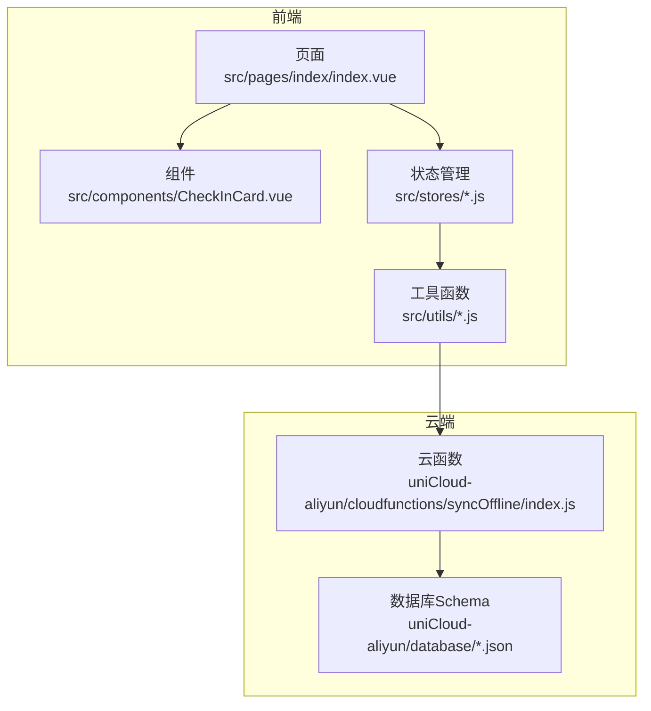
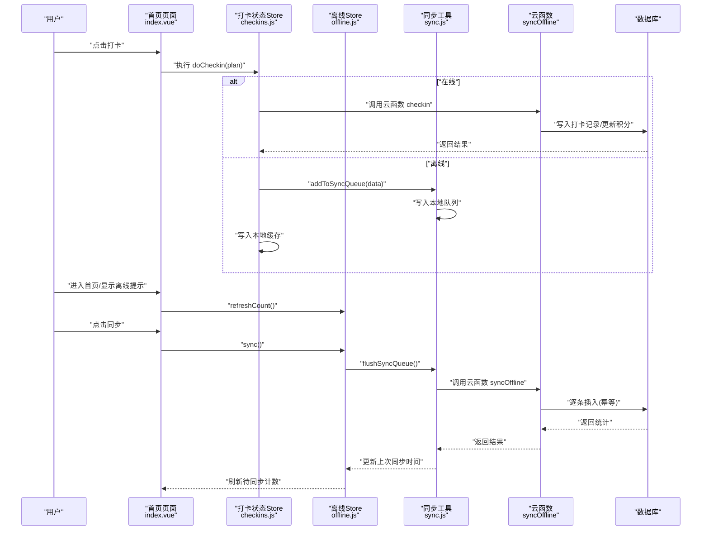
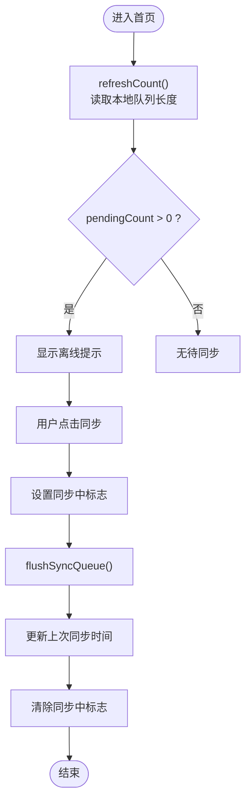
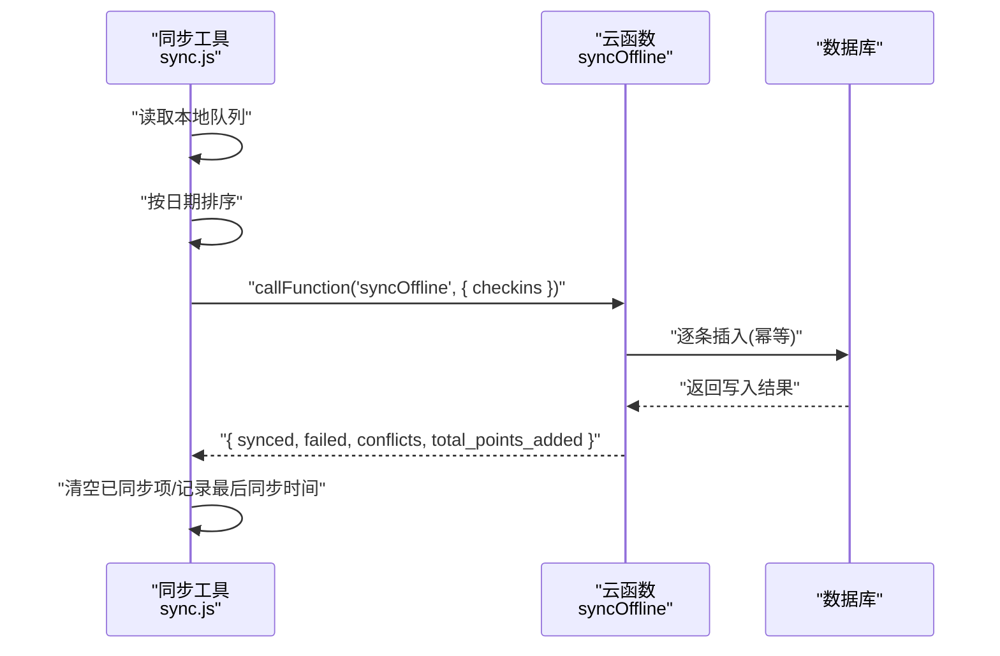
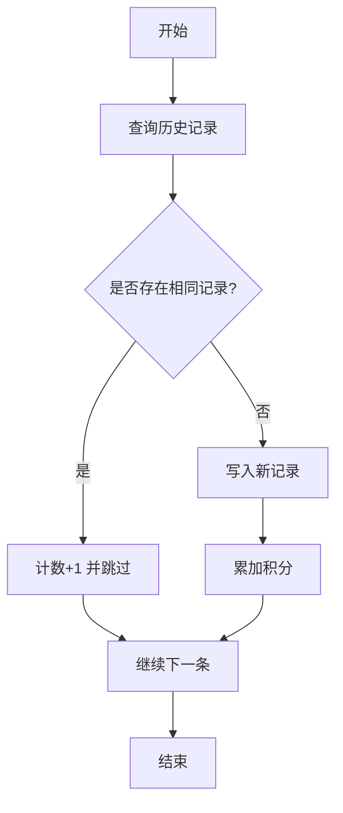
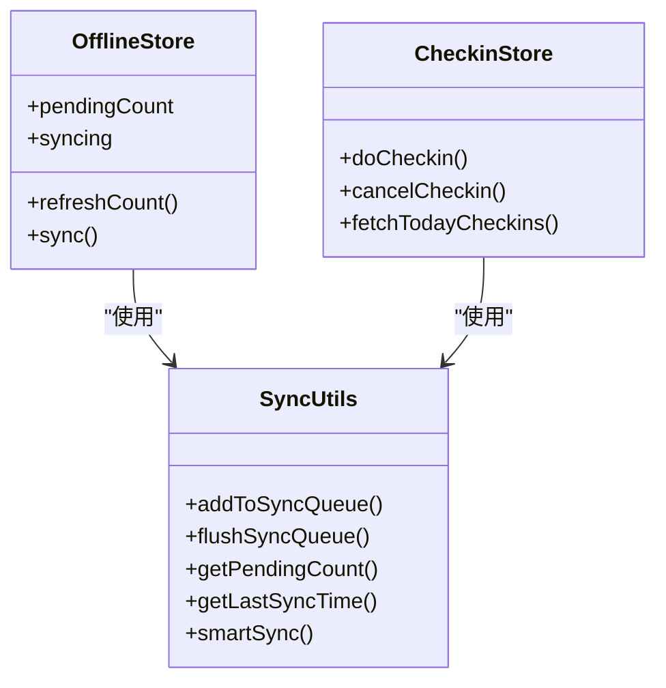
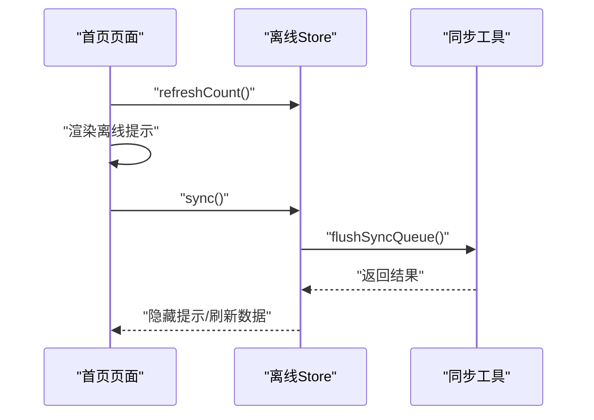
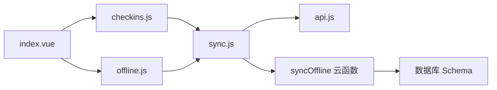

# 离线同步监控

<cite>
**本文引用的文件**
- [src/stores/offline.js](file://src/stores/offline.js)
- [src/utils/sync.js](file://src/utils/sync.js)
- [src/utils/api.js](file://src/utils/api.js)
- [src/stores/checkins.js](file://src/stores/checkins.js)
- [src/pages/index/index.vue](file://src/pages/index/index.vue)
- [src/components/CheckInCard.vue](file://src/components/CheckInCard.vue)
- [src/stores/plans.js](file://src/stores/plans.js)
- [src/stores/points.js](file://src/stores/points.js)
- [uniCloud-aliyun/cloudfunctions/syncOffline/index.js](file://uniCloud-aliyun/cloudfunctions/syncOffline/index.js)
- [uniCloud-aliyun/database/checkins.schema.json](file://uniCloud-aliyun/database/checkins.schema.json)
- [uniCloud-aliyun/database/members.schema.json](file://uniCloud-aliyun/database/members.schema.json)
</cite>

## 目录
1. [简介](#简介)
2. [项目结构](#项目结构)
3. [核心组件](#核心组件)
4. [架构总览](#架构总览)
5. [详细组件分析](#详细组件分析)
6. [依赖关系分析](#依赖关系分析)
7. [性能考量](#性能考量)
8. [故障排查指南](#故障排查指南)
9. [结论](#结论)
10. [附录](#附录)

## 简介
本文件面向 Star Grow 项目的离线同步监控，聚焦以下目标：
- 离线数据队列状态监控：待同步任务数量、同步成功率、失败重试次数等指标
- 离线数据缓存监控策略：缓存大小、存储使用情况、数据完整性检查
- 批量同步过程的进度跟踪与状态报告机制
- 离线同步冲突解决监控：数据版本比较、冲突检测算法、手动干预记录
- 离线模式下的用户体验监控：离线提示、同步状态反馈、网络恢复检测
- 离线数据安全性与完整性保障措施

## 项目结构
离线同步涉及前端 Pinia Store、工具函数、页面组件以及云端云函数与数据库 Schema 的协同工作。

图表来源
- [src/pages/index/index.vue:1-204](file://src/pages/index/index.vue#L1-L204)
- [src/components/CheckInCard.vue:1-67](file://src/components/CheckInCard.vue#L1-L67)
- [src/stores/offline.js:1-30](file://src/stores/offline.js#L1-L30)
- [src/stores/checkins.js:1-163](file://src/stores/checkins.js#L1-L163)
- [src/utils/sync.js:1-96](file://src/utils/sync.js#L1-L96)
- [uniCloud-aliyun/cloudfunctions/syncOffline/index.js:1-90](file://uniCloud-aliyun/cloudfunctions/syncOffline/index.js#L1-L90)
- [uniCloud-aliyun/database/checkins.schema.json:1-52](file://uniCloud-aliyun/database/checkins.schema.json#L1-L52)
- [uniCloud-aliyun/database/members.schema.json:1-46](file://uniCloud-aliyun/database/members.schema.json#L1-L46)

章节来源
- [src/pages/index/index.vue:1-204](file://src/pages/index/index.vue#L1-L204)
- [src/stores/offline.js:1-30](file://src/stores/offline.js#L1-L30)
- [src/stores/checkins.js:1-163](file://src/stores/checkins.js#L1-L163)
- [src/utils/sync.js:1-96](file://src/utils/sync.js#L1-L96)
- [uniCloud-aliyun/cloudfunctions/syncOffline/index.js:1-90](file://uniCloud-aliyun/cloudfunctions/syncOffline/index.js#L1-L90)
- [uniCloud-aliyun/database/checkins.schema.json:1-52](file://uniCloud-aliyun/database/checkins.schema.json#L1-L52)
- [uniCloud-aliyun/database/members.schema.json:1-46](file://uniCloud-aliyun/database/members.schema.json#L1-L46)

## 核心组件
- 离线队列管理 Store：负责待同步任务数量统计、同步状态标记、触发批量同步
- 同步工具函数：负责将离线记录加入队列、按日期排序、调用云函数批量同步、获取上次同步时间、智能同步
- 打卡状态 Store：负责执行打卡、离线场景下的本地缓存与队列写入、取消打卡的回滚与积分回退
- 页面与组件：首页展示离线提示与一键同步；打卡卡片组件承载交互
- 云函数：批量处理离线打卡，进行冲突检测、积分累加、新徽章判定占位
- 数据库 Schema：定义 checkins 与 members 字段约束，确保数据一致性

章节来源
- [src/stores/offline.js:1-30](file://src/stores/offline.js#L1-L30)
- [src/utils/sync.js:1-96](file://src/utils/sync.js#L1-L96)
- [src/stores/checkins.js:1-163](file://src/stores/checkins.js#L1-L163)
- [src/pages/index/index.vue:1-204](file://src/pages/index/index.vue#L1-L204)
- [src/components/CheckInCard.vue:1-67](file://src/components/CheckInCard.vue#L1-L67)
- [uniCloud-aliyun/cloudfunctions/syncOffline/index.js:1-90](file://uniCloud-aliyun/cloudfunctions/syncOffline/index.js#L1-L90)
- [uniCloud-aliyun/database/checkins.schema.json:1-52](file://uniCloud-aliyun/database/checkins.schema.json#L1-L52)
- [uniCloud-aliyun/database/members.schema.json:1-46](file://uniCloud-aliyun/database/members.schema.json#L1-L46)

## 架构总览
离线同步采用“本地优先 + 静默批量”的设计：用户在离线状态下进行打卡，数据先写入本地缓存与同步队列；应用进入前台或用户主动触发时，按日期排序批量上传至云端，云端进行幂等写入与冲突检测，并更新积分与可能的新徽章。

图表来源
- [src/pages/index/index.vue:127-162](file://src/pages/index/index.vue#L127-L162)
- [src/stores/checkins.js:26-89](file://src/stores/checkins.js#L26-L89)
- [src/stores/offline.js:10-26](file://src/stores/offline.js#L10-L26)
- [src/utils/sync.js:13-53](file://src/utils/sync.js#L13-L53)
- [uniCloud-aliyun/cloudfunctions/syncOffline/index.js:5-89](file://uniCloud-aliyun/cloudfunctions/syncOffline/index.js#L5-L89)

## 详细组件分析

### 离线队列管理与状态监控
- 待同步任务数量：通过读取本地存储键值获取长度，用于界面提示与统计
- 同步状态标记：避免并发同步，防止重复提交
- 触发批量同步：在满足条件时调用批量同步工具函数，完成后刷新计数

图表来源
- [src/stores/offline.js:10-26](file://src/stores/offline.js#L10-L26)
- [src/utils/sync.js:58-67](file://src/utils/sync.js#L58-L67)
- [src/pages/index/index.vue:156-162](file://src/pages/index/index.vue#L156-L162)

章节来源
- [src/stores/offline.js:1-30](file://src/stores/offline.js#L1-L30)
- [src/utils/sync.js:58-67](file://src/utils/sync.js#L58-L67)
- [src/pages/index/index.vue:58-61](file://src/pages/index/index.vue#L58-L61)

### 批量同步流程与进度跟踪
- 排序与上传：按日期升序排序后一次性发送给云函数
- 进度与结果：云函数返回已同步、失败、冲突数量，前端据此更新界面与统计数据
- 上次同步时间：成功后写入本地时间戳，便于后续审计与健康检查

图表来源
- [src/utils/sync.js:25-53](file://src/utils/sync.js#L25-L53)
- [uniCloud-aliyun/cloudfunctions/syncOffline/index.js:19-89](file://uniCloud-aliyun/cloudfunctions/syncOffline/index.js#L19-L89)

章节来源
- [src/utils/sync.js:25-53](file://src/utils/sync.js#L25-L53)
- [uniCloud-aliyun/cloudfunctions/syncOffline/index.js:19-89](file://uniCloud-aliyun/cloudfunctions/syncOffline/index.js#L19-L89)

### 冲突检测与版本比较
- 冲突检测：云端按“计划ID + 孩子ID + 日期”查询是否存在记录，若存在则计为冲突并跳过
- 版本比较：以云端现有记录为准，本地重复记录视为冗余，不覆盖
- 手动干预：当前实现未提供冲突详情与选择性合并，建议扩展返回冲突明细并在前端提供选择面板

图表来源
- [uniCloud-aliyun/cloudfunctions/syncOffline/index.js:20-57](file://uniCloud-aliyun/cloudfunctions/syncOffline/index.js#L20-L57)

章节来源
- [uniCloud-aliyun/cloudfunctions/syncOffline/index.js:20-57](file://uniCloud-aliyun/cloudfunctions/syncOffline/index.js#L20-L57)

### 离线数据缓存监控策略
- 缓存键与结构：本地存储包含“待同步队列”和“当日打卡缓存”，分别用于离线同步与离线查看
- 缓存大小与使用：通过读取数组长度与对象键值估算占用；建议定期清理过期数据与限制最大条目数
- 完整性检查：校验必填字段（计划ID、孩子ID、日期）与积分一致性；结合 Schema 约束进行二次验证

图表来源
- [src/stores/offline.js:6-28](file://src/stores/offline.js#L6-L28)
- [src/utils/sync.js:13-67](file://src/utils/sync.js#L13-L67)
- [src/stores/checkins.js:26-89](file://src/stores/checkins.js#L26-L89)

章节来源
- [src/stores/offline.js:1-30](file://src/stores/offline.js#L1-L30)
- [src/utils/sync.js:13-67](file://src/utils/sync.js#L13-L67)
- [src/stores/checkins.js:26-89](file://src/stores/checkins.js#L26-L89)

### 用户体验监控
- 离线提示：当存在待同步任务时，在首页显示提示区域，点击可触发同步
- 同步状态反馈：显示加载与提示信息，同步完成后刷新数据
- 网络恢复检测：智能同步在无网络时跳过，有网络且有待同步时自动执行

图表来源
- [src/pages/index/index.vue:122-162](file://src/pages/index/index.vue#L122-L162)
- [src/stores/offline.js:10-26](file://src/stores/offline.js#L10-L26)
- [src/utils/sync.js:84-95](file://src/utils/sync.js#L84-L95)

章节来源
- [src/pages/index/index.vue:58-61](file://src/pages/index/index.vue#L58-L61)
- [src/pages/index/index.vue:156-162](file://src/pages/index/index.vue#L156-L162)
- [src/utils/sync.js:84-95](file://src/utils/sync.js#L84-L95)

### 数据安全性与完整性保障
- 幂等写入：云端按复合键查询，避免重复写入
- 积分更新：统一在云端累加，防止本地篡改导致的积分偏差
- Schema 约束：checkins 与 members 的字段类型与必填项约束，减少脏数据
- 回滚路径：取消打卡时支持回退积分与删除记录，保障一致性

章节来源
- [uniCloud-aliyun/cloudfunctions/syncOffline/index.js:20-77](file://uniCloud-aliyun/cloudfunctions/syncOffline/index.js#L20-L77)
- [uniCloud-aliyun/database/checkins.schema.json:10-51](file://uniCloud-aliyun/database/checkins.schema.json#L10-L51)
- [uniCloud-aliyun/database/members.schema.json:10-45](file://uniCloud-aliyun/database/members.schema.json#L10-L45)
- [src/stores/checkins.js:125-159](file://src/stores/checkins.js#L125-L159)

## 依赖关系分析
- 组件耦合：页面依赖 Store，Store 依赖工具函数；工具函数依赖云函数调用封装
- 外部依赖：uniCloud 云函数与数据库；本地存储（Storage）
- 关键接口契约：云函数输入输出约定、本地键值命名规范

图表来源
- [src/pages/index/index.vue:65-79](file://src/pages/index/index.vue#L65-L79)
- [src/stores/checkins.js:1-8](file://src/stores/checkins.js#L1-L8)
- [src/stores/offline.js:1-4](file://src/stores/offline.js#L1-L4)
- [src/utils/sync.js:1-10](file://src/utils/sync.js#L1-L10)
- [src/utils/api.js:1-18](file://src/utils/api.js#L1-L18)
- [uniCloud-aliyun/cloudfunctions/syncOffline/index.js:1-10](file://uniCloud-aliyun/cloudfunctions/syncOffline/index.js#L1-L10)

章节来源
- [src/pages/index/index.vue:65-79](file://src/pages/index/index.vue#L65-L79)
- [src/stores/checkins.js:1-8](file://src/stores/checkins.js#L1-L8)
- [src/stores/offline.js:1-4](file://src/stores/offline.js#L1-L4)
- [src/utils/sync.js:1-10](file://src/utils/sync.js#L1-L10)
- [src/utils/api.js:1-18](file://src/utils/api.js#L1-L18)
- [uniCloud-aliyun/cloudfunctions/syncOffline/index.js:1-10](file://uniCloud-aliyun/cloudfunctions/syncOffline/index.js#L1-L10)

## 性能考量
- 批量上传：按日期排序后一次性上传，减少网络往返
- 并发控制：同步中状态避免重复触发
- 本地存储：合理设置缓存上限，定期清理过期数据
- 云端超时：云函数配置了合理的超时时间，建议根据数据量评估

## 故障排查指南
- 同步失败：检查网络状态与云函数返回错误；确认本地队列是否被清空
- 冲突过多：检查是否重复打卡或数据重复导入；建议在前端展示冲突详情
- 积分异常：核对云端积分更新逻辑与本地缓存；确保取消打卡流程正确回退
- 离线不可见：确认本地缓存键值与读取逻辑；检查页面加载流程

章节来源
- [src/utils/sync.js:49-52](file://src/utils/sync.js#L49-L52)
- [src/stores/checkins.js:156-159](file://src/stores/checkins.js#L156-L159)
- [uniCloud-aliyun/cloudfunctions/syncOffline/index.js:79-89](file://uniCloud-aliyun/cloudfunctions/syncOffline/index.js#L79-L89)

## 结论
当前实现以“本地优先 + 静默批量 + 幂等写入”为核心，具备基本的离线提示、同步状态反馈与冲突跳过能力。为进一步提升可观测性与可靠性，建议补充：冲突详情与选择性合并、同步进度可视化、缓存容量与健康检查、失败重试与告警机制、以及更完善的离线数据校验与修复工具。

## 附录
- 指标建议
  - 待同步任务数量：pendingCount
  - 同步成功率：(已同步 - 失败) / 已同步 × 100%
  - 失败重试次数：记录失败后自动重试次数
  - 冲突率：冲突数 / 总数
  - 缓存命中率：本地缓存读取次数 / 总读取次数
  - 云端写入延迟：批量请求到返回的时间
- 建议扩展
  - 在云函数中返回更详细的统计与冲突明细
  - 在前端增加同步进度条与错误提示
  - 引入缓存清理策略与容量阈值告警
  - 提供手动干预入口（冲突选择、重试、回滚）