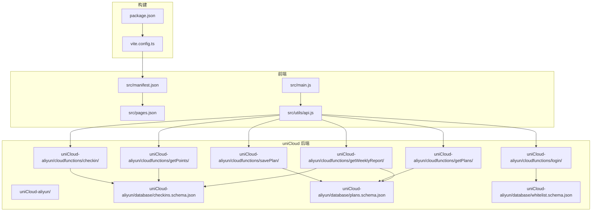
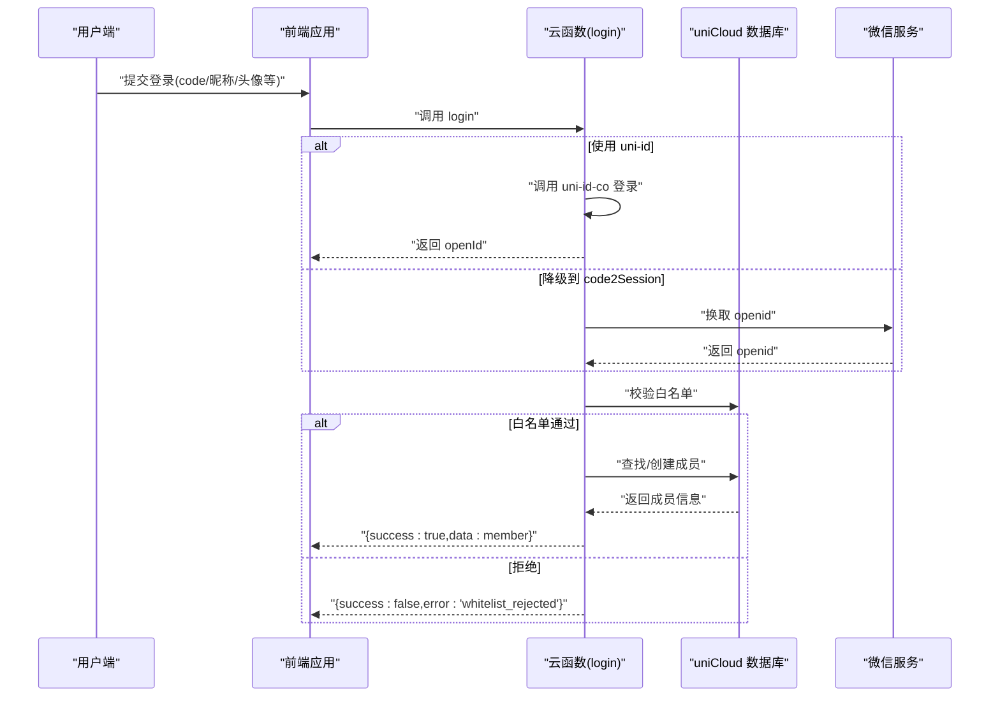
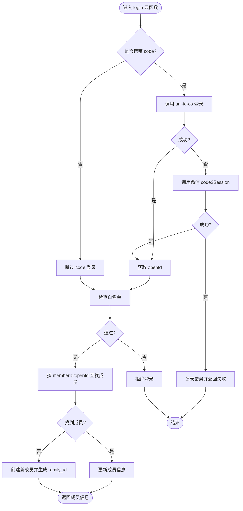
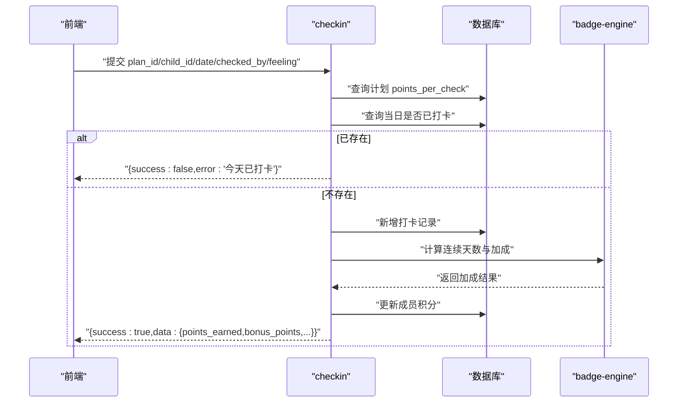
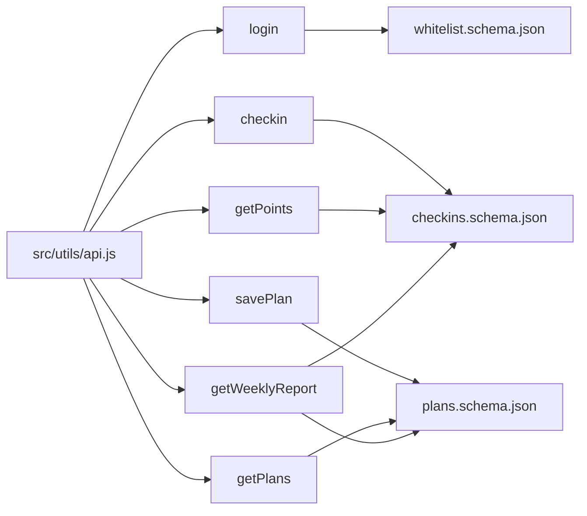

# 部署运维

<cite>
**本文引用的文件**
- [package.json](file://package.json)
- [vite.config.ts](file://vite.config.ts)
- [src/manifest.json](file://src/manifest.json)
- [src/pages.json](file://src/pages.json)
- [src/utils/api.js](file://src/utils/api.js)
- [src/main.js](file://src/main.js)
- [uniCloud-aliyun/cloudfunctions/common/package.json](file://uniCloud-aliyun/cloudfunctions/common/package.json)
- [uniCloud-aliyun/cloudfunctions/login/package.json](file://uniCloud-aliyun/cloudfunctions/login/package.json)
- [uniCloud-aliyun/cloudfunctions/login/index.js](file://uniCloud-aliyun/cloudfunctions/login/index.js)
- [uniCloud-aliyun/cloudfunctions/checkin/package.json](file://uniCloud-aliyun/cloudfunctions/checkin/package.json)
- [uniCloud-aliyun/cloudfunctions/checkin/index.js](file://uniCloud-aliyun/cloudfunctions/checkin/index.js)
- [uniCloud-aliyun/cloudfunctions/savePlan/package.json](file://uniCloud-aliyun/cloudfunctions/savePlan/package.json)
- [uniCloud-aliyun/cloudfunctions/savePlan/index.js](file://uniCloud-aliyun/cloudfunctions/savePlan/index.js)
- [uniCloud-aliyun/cloudfunctions/getPoints/package.json](file://uniCloud-aliyun/cloudfunctions/getPoints/package.json)
- [uniCloud-aliyun/cloudfunctions/getPoints/index.js](file://uniCloud-aliyun/cloudfunctions/getPoints/index.js)
- [uniCloud-aliyun/cloudfunctions/getPlans/package.json](file://uniCloud-aliyun/cloudfunctions/getPlans/package.json)
- [uniCloud-aliyun/cloudfunctions/getPlans/index.js](file://uniCloud-aliyun/cloudfunctions/getPlans/index.js)
- [uniCloud-aliyun/cloudfunctions/getWeeklyReport/package.json](file://uniCloud-aliyun/cloudfunctions/getWeeklyReport/package.json)
- [uniCloud-aliyun/cloudfunctions/getWeeklyReport/index.js](file://uniCloud-aliyun/cloudfunctions/getWeeklyReport/index.js)
- [uniCloud-aliyun/database/checkins.schema.json](file://uniCloud-aliyun/database/checkins.schema.json)
- [uniCloud-aliyun/database/plans.schema.json](file://uniCloud-aliyun/database/plans.schema.json)
- [uniCloud-aliyun/database/whitelist.schema.json](file://uniCloud-aliyun/database/whitelist.schema.json)
</cite>

## 目录
1. [简介](#简介)
2. [项目结构](#项目结构)
3. [核心组件](#核心组件)
4. [架构总览](#架构总览)
5. [详细组件分析](#详细组件分析)
6. [依赖关系分析](#依赖关系分析)
7. [性能与容量规划](#性能与容量规划)
8. [CI/CD 流水线与自动化部署](#cicd-流水线与自动化部署)
9. [环境变量与敏感信息管理](#环境变量与敏感信息管理)
10. [监控与日志](#监控与日志)
11. [故障排除与应急响应](#故障排除与应急响应)
12. [版本管理与回滚策略](#版本管理与回滚策略)
13. [安全加固与权限控制](#安全加固与权限控制)
14. [数据备份与灾难恢复](#数据备份与灾难恢复)
15. [结论](#结论)

## 简介
本运维文档面向 Star Grow 项目的生产环境部署与日常维护，覆盖多端构建（含微信小程序、支付宝小程序等）、uniCloud 阿里云版的云开发部署与配置、生产环境环境变量与敏感信息管理、CI/CD 自动化部署策略、性能监控与日志分析、故障排除与应急响应、版本管理与回滚、安全加固与权限控制、以及数据备份与灾难恢复。文档以仓库现有代码为依据，结合实际可操作的步骤与最佳实践，帮助运维人员高效管理生产环境。

## 项目结构
项目采用 uni-app 多端统一框架，前端源码位于 src 目录，uniCloud 阿里云版后端资源位于 uniCloud-aliyun 目录。构建工具使用 Vite 插件 uni，通过 npm scripts 提供多端 dev/build 命令；manifest.json 定义各平台配置与 uniCloud 供应商；pages.json 定义页面路由与 tabBar；云函数位于 uniCloud-aliyun/cloudfunctions 下，数据库 schema 位于 uniCloud-aliyun/database。

图表来源
- [package.json:1-74](file://package.json#L1-L74)
- [vite.config.ts:1-8](file://vite.config.ts#L1-L8)
- [src/manifest.json:1-77](file://src/manifest.json#L1-L77)
- [src/pages.json:1-56](file://src/pages.json#L1-L56)
- [src/main.js:1-10](file://src/main.js#L1-L10)
- [src/utils/api.js:1-18](file://src/utils/api.js#L1-L18)
- [uniCloud-aliyun/cloudfunctions/login/index.js:1-103](file://uniCloud-aliyun/cloudfunctions/login/index.js#L1-L103)
- [uniCloud-aliyun/cloudfunctions/checkin/index.js:1-83](file://uniCloud-aliyun/cloudfunctions/checkin/index.js#L1-L83)
- [uniCloud-aliyun/cloudfunctions/savePlan/index.js:1-31](file://uniCloud-aliyun/cloudfunctions/savePlan/index.js#L1-L31)
- [uniCloud-aliyun/cloudfunctions/getPoints/index.js:1-18](file://uniCloud-aliyun/cloudfunctions/getPoints/index.js#L1-L18)
- [uniCloud-aliyun/cloudfunctions/getPlans/index.js:1-15](file://uniCloud-aliyun/cloudfunctions/getPlans/index.js#L1-L15)
- [uniCloud-aliyun/cloudfunctions/getWeeklyReport/index.js:1-45](file://uniCloud-aliyun/cloudfunctions/getWeeklyReport/index.js#L1-L45)
- [uniCloud-aliyun/database/checkins.schema.json:1-52](file://uniCloud-aliyun/database/checkins.schema.json#L1-L52)
- [uniCloud-aliyun/database/plans.schema.json:1-50](file://uniCloud-aliyun/database/plans.schema.json#L1-L50)
- [uniCloud-aliyun/database/whitelist.schema.json:1-27](file://uniCloud-aliyun/database/whitelist.schema.json#L1-L27)

章节来源
- [package.json:1-74](file://package.json#L1-L74)
- [vite.config.ts:1-8](file://vite.config.ts#L1-L8)
- [src/manifest.json:1-77](file://src/manifest.json#L1-L77)
- [src/pages.json:1-56](file://src/pages.json#L1-L56)

## 核心组件
- 构建与多端支持：通过 npm scripts 提供多端开发与构建命令，Vite 插件 uni 驱动 uni-app 编译。
- 前端入口与云函数封装：main.js 提供应用初始化；api.js 封装 uniCloud.callFunction 调用，统一封装错误处理。
- 平台配置：manifest.json 中定义微信、支付宝等小程序平台参数及 uniCloud 供应商信息。
- 页面与导航：pages.json 定义页面路由、全局样式与 tabBar。
- 云函数：登录、打卡、计划管理、积分查询、周报统计等核心业务云函数。
- 数据模型：checkins、plans、whitelist 的 schema 定义字段与权限。

章节来源
- [package.json:4-38](file://package.json#L4-L38)
- [vite.config.ts:1-8](file://vite.config.ts#L1-L8)
- [src/main.js:1-10](file://src/main.js#L1-L10)
- [src/utils/api.js:1-18](file://src/utils/api.js#L1-L18)
- [src/manifest.json:52-75](file://src/manifest.json#L52-L75)
- [src/pages.json:1-56](file://src/pages.json#L1-L56)

## 架构总览
前端通过 uniCloud 调用后端云函数，云函数访问 uniCloud 数据库集合，完成用户登录、打卡、计划管理、积分统计与周报生成等业务闭环。微信小程序登录流程支持 uni-id 与 code2Session 双通道，并结合白名单控制访问。

图表来源
- [src/utils/api.js:9-17](file://src/utils/api.js#L9-L17)
- [uniCloud-aliyun/cloudfunctions/login/index.js:6-48](file://uniCloud-aliyun/cloudfunctions/login/index.js#L6-L48)
- [uniCloud-aliyun/database/whitelist.schema.json:1-27](file://uniCloud-aliyun/database/whitelist.schema.json#L1-L27)

## 详细组件分析

### 多端构建配置与发布流程
- 开发与构建命令
  - H5 开发/构建：dev:h5、build:h5
  - 小程序开发/构建：dev:mp-weixin、build:mp-weixin、dev:mp-alipay、build:mp-alipay 等
  - 其他平台：mp-baidu、mp-toutiao、mp-qq、mp-jd、mp-kuaishou、mp-lark、mp-harmony、quickapp-webview 等
- 构建工具链：Vite 插件 uni 驱动编译，manifest.json 决定平台特性与 uniCloud 供应商
- 发布要点
  - 在各平台开发者后台配置 appid、版本号、基础库要求等
  - 本地构建后上传至对应平台审核；H5 部署至目标服务器或 CDN
  - uniCloud 供应商在 manifest.json 中指定为阿里云，需在 uniCloud 控制台完成资源绑定与部署

章节来源
- [package.json:4-38](file://package.json#L4-L38)
- [vite.config.ts:1-8](file://vite.config.ts#L1-L8)
- [src/manifest.json:52-75](file://src/manifest.json#L52-L75)

### uniCloud 部署与配置
- 供应商与应用标识
  - vendor: 阿里云
  - dcloudAppId: 用于 uniCloud 绑定的应用标识
- 云函数配置示例
  - login：内存 256MB，超时 20 秒
  - checkin/getWeeklyReport：内存 256MB，超时 15 秒
  - savePlan/getPlans/getPoints：内存 256MB，超时 10 秒
- 数据库 schema
  - checkins：包含 plan_id、child_id、date、checked_by、feeling、points_earned、bonus_points、bonus_type、created_at
  - plans：包含 title、description、family_id、points_per_check、category、icon、status、created_at
  - whitelist：包含 openId、remark、created_at

章节来源
- [src/manifest.json:72-75](file://src/manifest.json#L72-L75)
- [uniCloud-aliyun/cloudfunctions/login/package.json:1-10](file://uniCloud-aliyun/cloudfunctions/login/package.json#L1-L10)
- [uniCloud-aliyun/cloudfunctions/checkin/package.json:1-10](file://uniCloud-aliyun/cloudfunctions/checkin/package.json#L1-L10)
- [uniCloud-aliyun/cloudfunctions/getWeeklyReport/package.json:1-10](file://uniCloud-aliyun/cloudfunctions/getWeeklyReport/package.json#L1-L10)
- [uniCloud-aliyun/cloudfunctions/savePlan/package.json:1-10](file://uniCloud-aliyun/cloudfunctions/savePlan/package.json#L1-L10)
- [uniCloud-aliyun/cloudfunctions/getPlans/package.json:1-10](file://uniCloud-aliyun/cloudfunctions/getPlans/package.json#L1-L10)
- [uniCloud-aliyun/cloudfunctions/getPoints/package.json:1-10](file://uniCloud-aliyun/cloudfunctions/getPoints/package.json#L1-L10)
- [uniCloud-aliyun/database/checkins.schema.json:1-52](file://uniCloud-aliyun/database/checkins.schema.json#L1-L52)
- [uniCloud-aliyun/database/plans.schema.json:1-50](file://uniCloud-aliyun/database/plans.schema.json#L1-L50)
- [uniCloud-aliyun/database/whitelist.schema.json:1-27](file://uniCloud-aliyun/database/whitelist.schema.json#L1-L27)

### 关键云函数流程

#### 登录流程
- 支持两种登录路径：优先使用 uni-id，失败时降级为微信 code2Session
- 白名单校验：仅允许白名单中的 openId 登录
- 成员管理：根据 openId 或 memberId 查找/创建成员，首次创建自动生成 family_id 实现数据隔离

图表来源
- [uniCloud-aliyun/cloudfunctions/login/index.js:6-48](file://uniCloud-aliyun/cloudfunctions/login/index.js#L6-L48)
- [uniCloud-aliyun/database/whitelist.schema.json:14-16](file://uniCloud-aliyun/database/whitelist.schema.json#L14-L16)

章节来源
- [uniCloud-aliyun/cloudfunctions/login/index.js:1-103](file://uniCloud-aliyun/cloudfunctions/login/index.js#L1-L103)

#### 打卡流程
- 校验当日是否已打卡
- 新增打卡记录，计算连续天数与加成积分
- 更新成员积分，触发勋章检查

图表来源
- [uniCloud-aliyun/cloudfunctions/checkin/index.js:5-65](file://uniCloud-aliyun/cloudfunctions/checkin/index.js#L5-L65)

章节来源
- [uniCloud-aliyun/cloudfunctions/checkin/index.js:1-83](file://uniCloud-aliyun/cloudfunctions/checkin/index.js#L1-L83)

#### 计划管理与积分查询
- 保存计划：支持新建与更新，返回最新 plan
- 获取计划：按 family_id 查询并按创建时间倒序
- 获取积分：按 member_id 返回当前与累计积分

章节来源
- [uniCloud-aliyun/cloudfunctions/savePlan/index.js:1-31](file://uniCloud-aliyun/cloudfunctions/savePlan/index.js#L1-L31)
- [uniCloud-aliyun/cloudfunctions/getPlans/index.js:1-15](file://uniCloud-aliyun/cloudfunctions/getPlans/index.js#L1-L15)
- [uniCloud-aliyun/cloudfunctions/getPoints/index.js:1-18](file://uniCloud-aliyun/cloudfunctions/getPoints/index.js#L1-L18)

#### 周报统计
- 计算最近七天打卡数量、完成率、自签率与总积分
- 返回统计数据与鼓励语句

章节来源
- [uniCloud-aliyun/cloudfunctions/getWeeklyReport/index.js:1-45](file://uniCloud-aliyun/cloudfunctions/getWeeklyReport/index.js#L1-L45)

## 依赖关系分析
- 前端对云函数的依赖：通过 api.js 统一调用，降低耦合度
- 云函数对数据库的依赖：围绕 checkins、plans、members、exchanges、rewards、badges 等集合进行读写
- 平台配置对构建的影响：manifest.json 的 mp-weixin、mp-alipay 等节点决定小程序端能力与参数
- 构建插件对编译的影响：vite.config.ts 引入 uni 插件，驱动多端编译

图表来源
- [src/utils/api.js:9-17](file://src/utils/api.js#L9-L17)
- [uniCloud-aliyun/cloudfunctions/login/index.js:6-48](file://uniCloud-aliyun/cloudfunctions/login/index.js#L6-L48)
- [uniCloud-aliyun/cloudfunctions/checkin/index.js:5-65](file://uniCloud-aliyun/cloudfunctions/checkin/index.js#L5-L65)
- [uniCloud-aliyun/cloudfunctions/savePlan/index.js:4-30](file://uniCloud-aliyun/cloudfunctions/savePlan/index.js#L4-L30)
- [uniCloud-aliyun/cloudfunctions/getPlans/index.js:4-14](file://uniCloud-aliyun/cloudfunctions/getPlans/index.js#L4-L14)
- [uniCloud-aliyun/cloudfunctions/getPoints/index.js:4-16](file://uniCloud-aliyun/cloudfunctions/getPoints/index.js#L4-L16)
- [uniCloud-aliyun/cloudfunctions/getWeeklyReport/index.js:4-44](file://uniCloud-aliyun/cloudfunctions/getWeeklyReport/index.js#L4-L44)
- [uniCloud-aliyun/database/whitelist.schema.json:1-27](file://uniCloud-aliyun/database/whitelist.schema.json#L1-L27)
- [uniCloud-aliyun/database/checkins.schema.json:1-52](file://uniCloud-aliyun/database/checkins.schema.json#L1-L52)
- [uniCloud-aliyun/database/plans.schema.json:1-50](file://uniCloud-aliyun/database/plans.schema.json#L1-L50)

## 性能与容量规划
- 云函数资源配置建议
  - login：256MB 内存，超时 20 秒（考虑网络请求与数据库查询）
  - checkin/getWeeklyReport：256MB 内存，超时 15 秒（涉及多次集合查询与计算）
  - savePlan/getPlans/getPoints：256MB 内存，超时 10 秒（常规查询与更新）
- 数据库索引与查询优化
  - 为 checkins 的 plan_id、child_id、date 建立复合索引，提升打卡查询效率
  - 为 plans 的 family_id、status 建立索引，提升计划查询效率
  - 为 members 的 openId、family_id 建立索引，提升登录与成员查询效率
- 前端缓存与懒加载
  - 对周报、计划列表等静态/半静态数据进行本地缓存
  - 页面切换与图片资源使用懒加载，减少首屏压力

[本节为通用性能建议，不直接分析具体文件]

## CI/CD 流水线与自动化部署
- 触发条件
  - 主分支合并/标签推送触发构建与部署
- 步骤建议
  - 代码检出与依赖安装
  - 多端构建：分别执行 build:mp-weixin、build:mp-alipay、build:h5 等命令
  - uniCloud 部署：使用 uniCloud CLI 或平台提供的部署工具，选择阿里云供应商并绑定应用
  - H5 部署：将 dist 或构建产物上传至目标服务器或 CDN
  - 回滚策略：保留最近 N 个版本，支持一键回滚
- 安全与审计
  - 密钥与凭据通过 CI 凭据管理，避免硬编码
  - 部署日志审计，记录部署者、时间、版本与产物摘要

[本节为通用流程建议，不直接分析具体文件]

## 环境变量与敏感信息管理
- 敏感信息
  - 微信登录密钥：在 login 云函数中调用微信接口时需要 secret，应置于 uniCloud 控制台的环境变量或密钥管理中
  - uniCloud 供应商密钥与应用 ID：由 manifest.json 中 uniCloud 字段声明，部署时在 uniCloud 控制台绑定
- 环境变量建议
  - 运行时参数通过 uniCloud 环境变量注入，前端通过 uniCloud.getSystemInfoSync 获取运行环境
  - 不在前端代码中暴露任何密钥或敏感参数
- 访问控制
  - 云函数仅通过 uniCloud 网关访问，避免公网直连数据库
  - 白名单机制限制登录范围，降低未授权访问风险

章节来源
- [uniCloud-aliyun/cloudfunctions/login/index.js:28-46](file://uniCloud-aliyun/cloudfunctions/login/index.js#L28-L46)
- [src/manifest.json:72-75](file://src/manifest.json#L72-L75)

## 监控与日志
- 云函数日志
  - 使用 uniCloud 控制台查看云函数执行日志，定位异常与耗时
  - 对高频调用的云函数（如 checkin、getWeeklyReport）设置日志阈值告警
- 前端埋点与错误上报
  - 在 api.js 中捕获调用失败并上报错误，记录函数名、参数摘要与错误信息
  - 对登录失败、打卡重复等业务异常进行专项统计
- 性能指标
  - 关注云函数平均耗时、超时次数与并发峰值
  - 监控数据库查询耗时与慢查询

章节来源
- [src/utils/api.js:10-16](file://src/utils/api.js#L10-L16)
- [uniCloud-aliyun/cloudfunctions/checkin/package.json:6-9](file://uniCloud-aliyun/cloudfunctions/checkin/package.json#L6-L9)
- [uniCloud-aliyun/cloudfunctions/getWeeklyReport/package.json:6-9](file://uniCloud-aliyun/cloudfunctions/getWeeklyReport/package.json#L6-L9)

## 故障排除与应急响应
- 常见问题
  - 登录失败：检查微信 secret 是否正确配置；确认 openId 是否在白名单
  - 打卡重复：确认 checkins 的 plan_id、child_id、date 组合唯一性；检查前端去重逻辑
  - 云函数超时：优化查询与计算逻辑，必要时拆分任务或增加内存
- 应急响应
  - 快速回滚至上一个稳定版本
  - 临时关闭高风险功能（如周报统计），释放资源
  - 通过白名单临时放行测试账号，验证修复

章节来源
- [uniCloud-aliyun/cloudfunctions/login/index.js:50-56](file://uniCloud-aliyun/cloudfunctions/login/index.js#L50-L56)
- [uniCloud-aliyun/cloudfunctions/checkin/index.js:14-20](file://uniCloud-aliyun/cloudfunctions/checkin/index.js#L14-L20)
- [uniCloud-aliyun/cloudfunctions/checkin/package.json:6-9](file://uniCloud-aliyun/cloudfunctions/checkin/package.json#L6-L9)

## 版本管理与回滚策略
- 版本命名
  - 使用语义化版本（主.次.修订），在 manifest.json 中维护 versionName 与 versionCode
- 发布节奏
  - 主分支稳定发布，hotfix 从稳定基线切出
- 回滚策略
  - 云函数与数据库变更均需灰度发布；回滚时优先回滚到上一个可用版本
  - H5 产物保留最近 3 个版本，支持一键回滚

章节来源
- [src/manifest.json:5-6](file://src/manifest.json#L5-L6)

## 安全加固与权限控制
- 访问控制
  - 白名单机制：仅允许白名单 openId 登录
  - 数据隔离：基于 family_id 隔离不同用户的业务数据
- 授权与鉴权
  - 云函数内部通过上下文与数据库权限控制读写
  - 前端仅通过云函数访问数据库，避免直连
- 输入校验与防刷
  - 对关键接口（如 checkin）进行重复性校验与频率限制
  - 对外部接口调用（微信 code2Session）进行超时与重试控制

章节来源
- [uniCloud-aliyun/database/whitelist.schema.json:14-16](file://uniCloud-aliyun/database/whitelist.schema.json#L14-L16)
- [uniCloud-aliyun/cloudfunctions/login/index.js:84-99](file://uniCloud-aliyun/cloudfunctions/login/index.js#L84-L99)
- [uniCloud-aliyun/cloudfunctions/checkin/index.js:14-20](file://uniCloud-aliyun/cloudfunctions/checkin/index.js#L14-L20)

## 数据备份与灾难恢复
- 备份策略
  - 定期导出数据库集合（checkins、plans、members 等）为备份集
  - 保留至少 7 天增量备份与 4 周全量备份
- 恢复流程
  - 从最近可用备份恢复；先恢复核心表（members、plans），再恢复明细表（checkins）
  - 恢复后验证关键接口（登录、打卡、积分）功能正常
- 灾难场景
  - 供应商区域故障：切换至备用供应商或跨区域复制
  - 数据损坏：基于备份集进行点恢复，核对一致性

[本节为通用方案建议，不直接分析具体文件]

## 结论
本运维文档基于仓库现有代码，给出了多端构建、uniCloud 部署、环境变量与敏感信息管理、CI/CD 自动化、监控与日志、故障排除、版本回滚、安全加固与数据备份的完整实践指南。建议在生产环境中严格执行上述流程与规范，确保系统稳定、安全、可追溯。