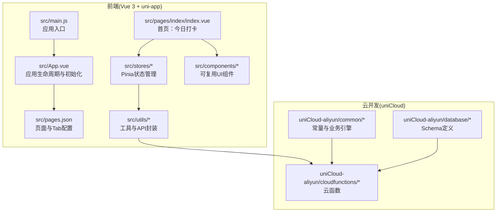
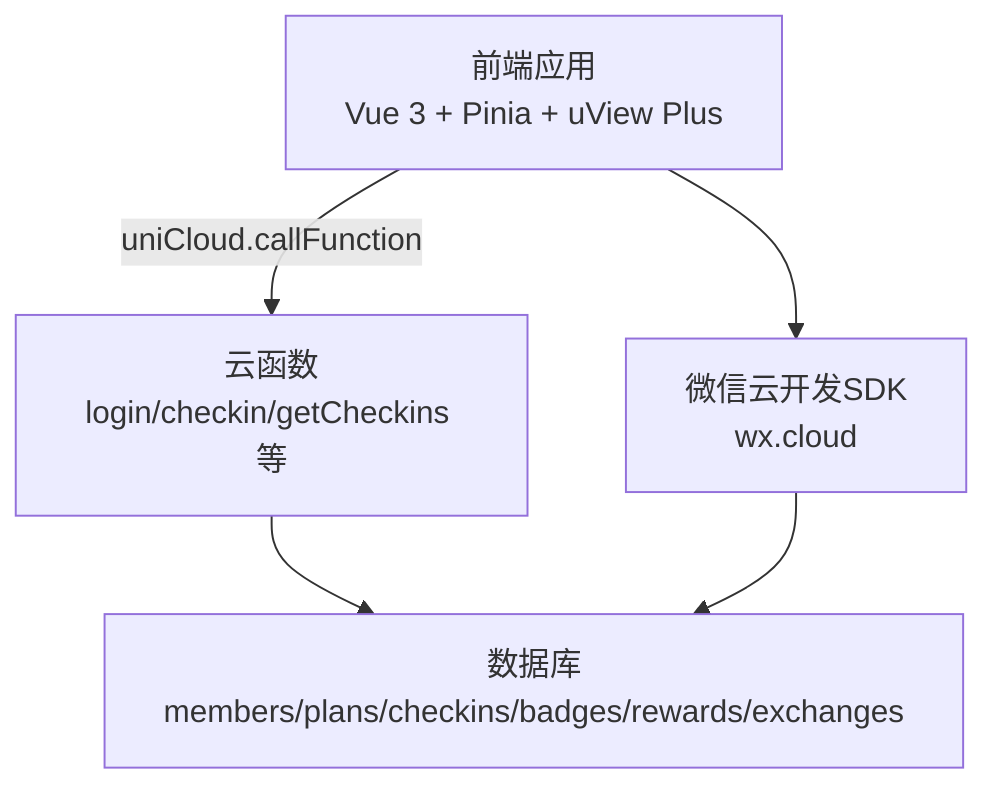
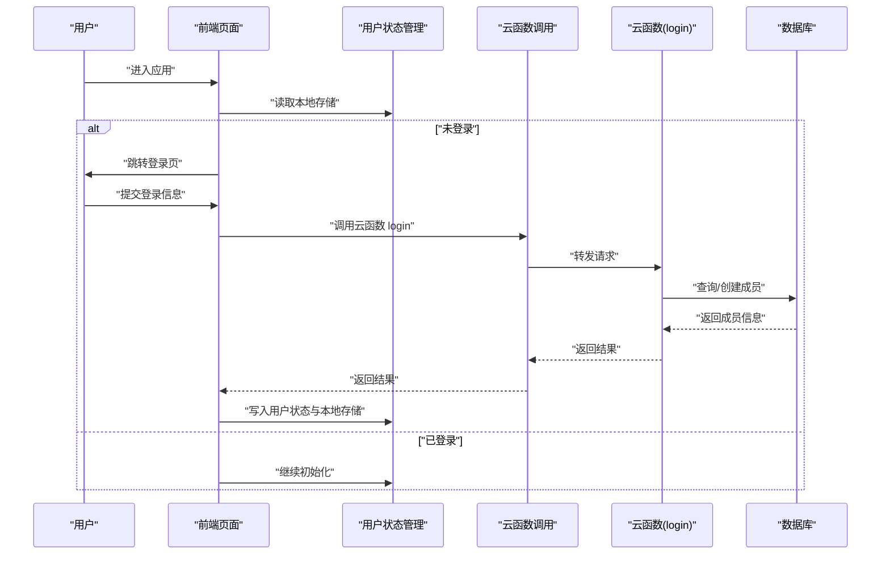
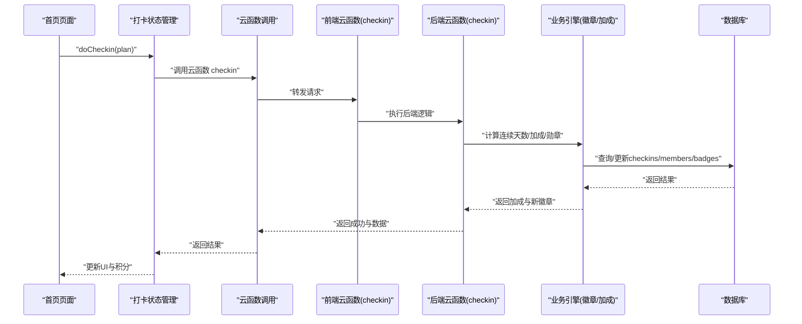
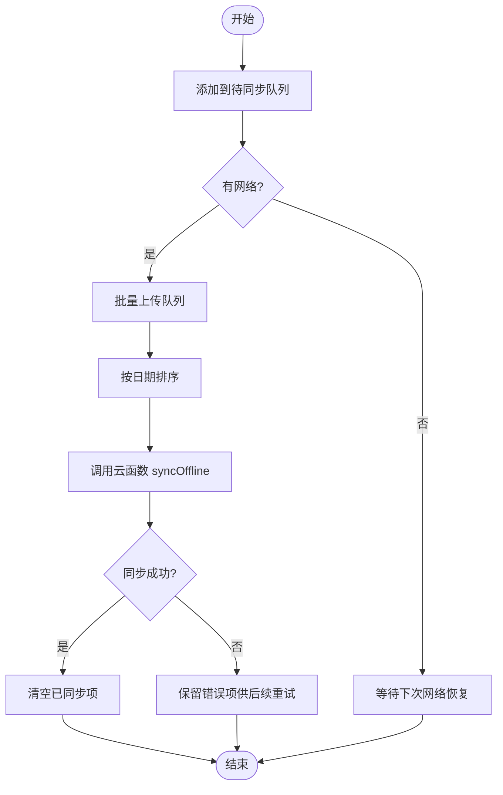
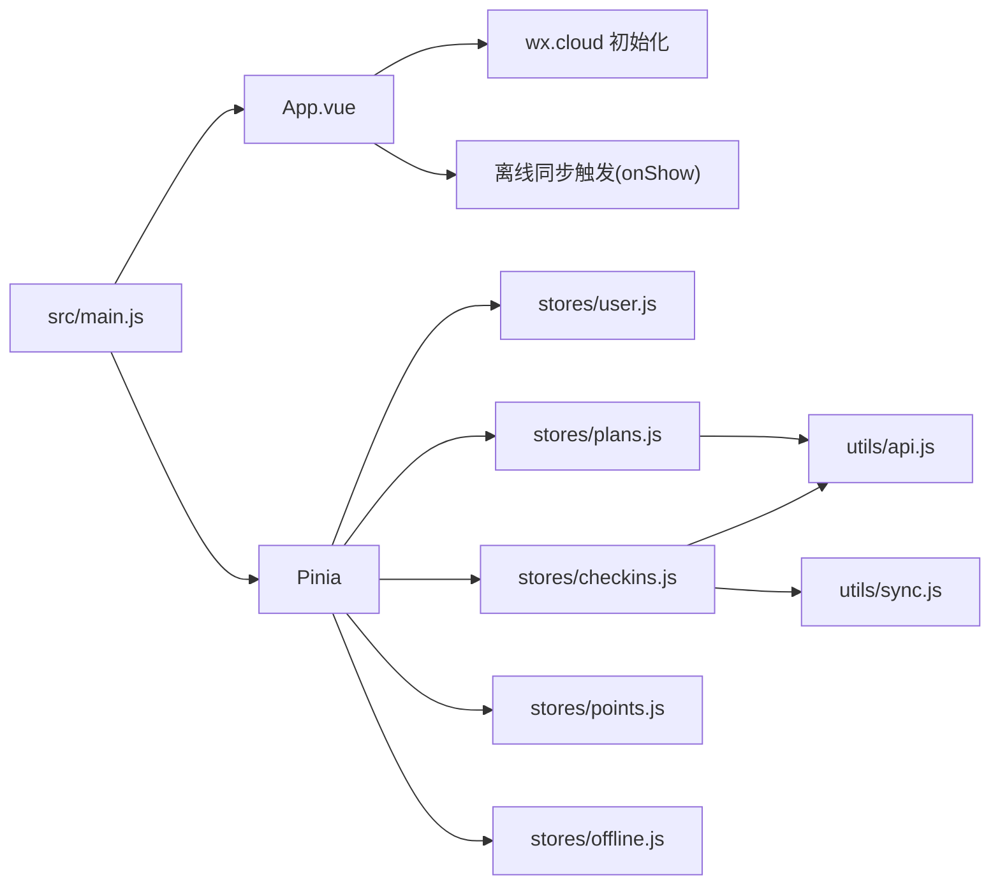

# 项目概述

<cite>
**本文引用的文件**
- [package.json](file://package.json)
- [src/App.vue](file://src/App.vue)
- [src/main.js](file://src/main.js)
- [src/pages.json](file://src/pages.json)
- [src/utils/api.js](file://src/utils/api.js)
- [src/stores/user.js](file://src/stores/user.js)
- [src/stores/checkins.js](file://src/stores/checkins.js)
- [src/stores/plans.js](file://src/stores/plans.js)
- [src/stores/points.js](file://src/stores/points.js)
- [src/stores/offline.js](file://src/stores/offline.js)
- [src/utils/sync.js](file://src/utils/sync.js)
- [src/components/CheckInCard.vue](file://src/components/CheckInCard.vue)
- [src/pages/index/index.vue](file://src/pages/index/index.vue)
- [src/cloudfunctions/login/index.js](file://src/cloudfunctions/login/index.js)
- [src/cloudfunctions/checkin/index.js](file://src/cloudfunctions/checkin/index.js)
- [uniCloud-aliyun/common/const.js](file://uniCloud-aliyun/common/const.js)
- [uniCloud-aliyun/common/badge-engine.js](file://uniCloud-aliyun/common/badge-engine.js)
- [uniCloud-aliyun/cloudfunctions/checkin/index.js](file://uniCloud-aliyun/cloudfunctions/checkin/index.js)
</cite>

## 目录
1. [引言](#引言)
2. [项目结构](#项目结构)
3. [核心组件](#核心组件)
4. [架构总览](#架构总览)
5. [详细组件分析](#详细组件分析)
6. [依赖关系分析](#依赖关系分析)
7. [性能考虑](#性能考虑)
8. [故障排查指南](#故障排查指南)
9. [结论](#结论)
10. [附录](#附录)

## 引言
Star Grow 是一款面向儿童的习惯养成小程序，基于 uni-app 框架开发，支持多端部署（如微信小程序、快应用等）。项目通过“打卡—积分—勋章—奖励”的正向激励闭环，帮助孩子建立规律的生活与学习习惯。系统采用前后端分离架构：前端为 Vue 3 + Pinia 的 uni-app 应用，后端采用 uniCloud 云开发服务，结合云函数与数据库实现业务逻辑与数据持久化。

本项目旨在为不同层次的读者提供清晰的背景介绍与深入的技术分析：
- 对初学者：解释项目目标、核心功能与使用场景，帮助快速理解产品价值。
- 对有经验的开发者：深入解析技术栈、架构设计、状态管理、离线同步策略与云开发集成方式。

## 项目结构
项目采用典型的 uni-app 分层组织方式，前端源码位于 src 目录，云开发相关代码位于 uniCloud-aliyun 目录，二者通过云函数进行交互。

图表来源
- [src/main.js:1-11](file://src/main.js#L1-L11)
- [src/App.vue:1-64](file://src/App.vue#L1-L64)
- [src/pages.json:1-56](file://src/pages.json#L1-L56)
- [src/pages/index/index.vue:1-204](file://src/pages/index/index.vue#L1-L204)
- [uniCloud-aliyun/common/const.js:1-27](file://uniCloud-aliyun/common/const.js#L1-L27)
- [uniCloud-aliyun/cloudfunctions/checkin/index.js:1-83](file://uniCloud-aliyun/cloudfunctions/checkin/index.js#L1-L83)

章节来源
- [package.json:1-74](file://package.json#L1-L74)
- [src/pages.json:1-56](file://src/pages.json#L1-L56)

## 核心组件
- 用户认证与角色切换：通过用户状态管理模块实现微信登录、角色（家长/孩子）切换、家长密码校验与积分信息维护。
- 打卡系统：提供计划列表、今日打卡卡片、连续打卡加成、撤销打卡与离线记录。
- 积分体系：实时展示当前积分与历史积分，支持离线时显示“待同步”标识。
- 勋章成就：基于连续打卡、自主打卡、情绪记录、覆盖多个计划分类等条件自动颁发。
- 奖励兑换：提供奖励商店、兑换记录与后台管理（云函数）。
- 离线同步：本地存储待同步队列，网络可用时自动批量上传，保证用户体验与数据一致性。

章节来源
- [src/stores/user.js:1-119](file://src/stores/user.js#L1-L119)
- [src/stores/checkins.js:1-163](file://src/stores/checkins.js#L1-L163)
- [src/stores/plans.js:1-73](file://src/stores/plans.js#L1-L73)
- [src/utils/sync.js:1-96](file://src/utils/sync.js#L1-L96)
- [uniCloud-aliyun/common/badge-engine.js:1-125](file://uniCloud-aliyun/common/badge-engine.js#L1-L125)

## 架构总览
系统采用“前端 uni-app + uniCloud 云开发”的分离架构。前端负责界面与交互，通过云函数调用实现登录、打卡、查询、统计等功能；后端云函数负责业务逻辑与数据库操作，并提供统一的数据模型与规则。

图表来源
- [src/utils/api.js:1-18](file://src/utils/api.js#L1-L18)
- [src/cloudfunctions/checkin/index.js:1-83](file://src/cloudfunctions/checkin/index.js#L1-L83)
- [uniCloud-aliyun/cloudfunctions/checkin/index.js:1-83](file://uniCloud-aliyun/cloudfunctions/checkin/index.js#L1-L83)

## 详细组件分析

### 用户认证与角色管理
- 功能要点
  - 支持微信登录与普通登录两种路径，生成稳定 member 标识并与 family 组织隔离。
  - 角色切换：家长模式需密码校验，孩子模式无需密码。
  - 家长密码设置与校验，用于保护家长权限。
  - 积分信息持久化与读取。
- 关键流程
  - 登录成功后写入本地存储，后续页面加载时读取并初始化状态。
  - 首页加载时若未登录则重定向至登录页。

图表来源
- [src/stores/user.js:22-53](file://src/stores/user.js#L22-L53)
- [src/utils/api.js:9-17](file://src/utils/api.js#L9-L17)
- [src/cloudfunctions/login/index.js:1-13](file://src/cloudfunctions/login/index.js#L1-L13)

章节来源
- [src/stores/user.js:1-119](file://src/stores/user.js#L1-L119)
- [src/pages/index/index.vue:101-107](file://src/pages/index/index.vue#L101-L107)

### 打卡系统与连续加成
- 功能要点
  - 今日任务列表展示计划，支持自主打卡与家长代打卡。
  - 连续打卡加成：按3/7/14天阶梯式奖励，加成叠加到当日积分。
  - 勋章自动颁发：首次打卡、连续天数、自主打卡、连续写感受、覆盖多分类等。
  - 撤销打卡：支持当日撤销并退回相应积分。
  - 离线打卡：网络异常时记录本地，上线后自动同步。
- 数据流
  - 前端发起打卡请求 → 云函数创建打卡记录 → 计算连续天数与加成 → 更新成员积分 → 检查并颁发勋章 → 返回结果并更新前端状态。

图表来源
- [src/stores/checkins.js:26-89](file://src/stores/checkins.js#L26-L89)
- [src/utils/api.js:9-17](file://src/utils/api.js#L9-L17)
- [src/cloudfunctions/checkin/index.js:1-83](file://src/cloudfunctions/checkin/index.js#L1-L83)
- [uniCloud-aliyun/common/badge-engine.js:52-122](file://uniCloud-aliyun/common/badge-engine.js#L52-L122)
- [uniCloud-aliyun/cloudfunctions/checkin/index.js:1-83](file://uniCloud-aliyun/cloudfunctions/checkin/index.js#L1-L83)

章节来源
- [src/stores/checkins.js:1-163](file://src/stores/checkins.js#L1-L163)
- [src/components/CheckInCard.vue:1-67](file://src/components/CheckInCard.vue#L1-L67)
- [src/pages/index/index.vue:127-136](file://src/pages/index/index.vue#L127-L136)

### 离线同步机制
- 设计原则
  - 优先离线：用户操作立即写入本地存储，不阻塞交互。
  - 静默同步：应用回到前台或主动触发时，检测待同步队列并批量上传。
  - 冲突处理：以云端为准，避免重复同步。
- 关键流程

图表来源
- [src/utils/sync.js:13-53](file://src/utils/sync.js#L13-L53)
- [src/utils/sync.js:84-95](file://src/utils/sync.js#L84-L95)

章节来源
- [src/utils/sync.js:1-96](file://src/utils/sync.js#L1-L96)
- [src/App.vue:21-27](file://src/App.vue#L21-L27)

### 勋章与加成规则
- 连续打卡加成：3天+5星、7天+15星、14天+30星。
- 勋章类型：初出茅庐、三连击、一周坚持、两周达人、月度冠军、自主小达人、全能之星、心情记录员、自律之星、阅读百分钟等。
- 颁发条件：基于连续天数、自主打卡、连续写感受、覆盖多分类计划等。

章节来源
- [uniCloud-aliyun/common/const.js:1-27](file://uniCloud-aliyun/common/const.js#L1-L27)
- [uniCloud-aliyun/common/badge-engine.js:52-122](file://uniCloud-aliyun/common/badge-engine.js#L52-L122)

### 页面与导航
- 页面清单：登录、首页打卡、计划列表/编辑、积分总览/明细、奖励商店/管理/记录、勋章墙、周报、家长指南、设置等。
- Tab 导航：打卡、积分、勋章、我的四个主入口，配合自定义导航栏风格。

章节来源
- [src/pages.json:1-56](file://src/pages.json#L1-L56)

## 依赖关系分析
- 技术栈
  - 前端：Vue 3、Pinia、uView Plus、uni-app 生态（多端编译与运行）。
  - 后端：uniCloud 云开发（云函数、数据库、云存储）。
  - 开发工具：Vite、TypeScript、vue-tsc。
- 关键依赖
  - 应用入口与状态管理：main.js 引入 Pinia 并挂载到应用实例。
  - API 封装：统一通过云函数调用封装，屏蔽平台差异。
  - 生命周期：App.vue 在启动时初始化微信云开发，回到前台时尝试离线同步。

图表来源
- [src/main.js:1-11](file://src/main.js#L1-L11)
- [src/App.vue:1-28](file://src/App.vue#L1-L28)
- [src/stores/user.js:1-119](file://src/stores/user.js#L1-L119)
- [src/stores/checkins.js:1-163](file://src/stores/checkins.js#L1-L163)
- [src/stores/plans.js:1-73](file://src/stores/plans.js#L1-L73)
- [src/utils/api.js:1-18](file://src/utils/api.js#L1-L18)
- [src/utils/sync.js:1-96](file://src/utils/sync.js#L1-L96)

章节来源
- [package.json:39-72](file://package.json#L39-L72)
- [src/main.js:1-11](file://src/main.js#L1-L11)
- [src/App.vue:1-64](file://src/App.vue#L1-L64)

## 性能考虑
- 前端渲染优化
  - 使用 computed 与响应式 ref 减少不必要的重渲染。
  - 列表渲染使用 v-for + 合理 key，避免整组重排。
- 网络与离线
  - 优先离线策略降低首屏与交互延迟。
  - 批量同步减少网络请求次数，提升吞吐。
- 数据访问
  - Pinia 状态集中管理，避免跨组件重复请求。
  - 本地缓存兜底，提升弱网与断网体验。

## 故障排查指南
- 登录失败
  - 检查云函数 login 的实现与微信登录凭证流转。
  - 确认本地存储的角色与 openId 是否正确写入。
- 打卡失败或重复
  - 查看云函数 checkin 的重复打卡校验逻辑。
  - 确认前端 doCheckin 的异常分支是否正确写入本地队列。
- 积分不更新
  - 核对云函数中成员积分字段更新命令。
  - 检查前端 pointsStore 的 fetch 与 add 流程。
- 勋章未颁发
  - 检查 badge-engine 的条件判断与数据库查询。
  - 确认新徽章写入是否成功。
- 离线同步未执行
  - 检查网络状态检测与智能同步触发条件。
  - 确认 syncOffline 云函数参数与返回值格式。

章节来源
- [src/cloudfunctions/login/index.js:1-13](file://src/cloudfunctions/login/index.js#L1-L13)
- [src/cloudfunctions/checkin/index.js:14-20](file://src/cloudfunctions/checkin/index.js#L14-L20)
- [src/stores/checkins.js:77-88](file://src/stores/checkins.js#L77-L88)
- [uniCloud-aliyun/common/badge-engine.js:52-122](file://uniCloud-aliyun/common/badge-engine.js#L52-L122)
- [src/utils/sync.js:84-95](file://src/utils/sync.js#L84-L95)

## 结论
Star Grow 通过清晰的功能模块划分与严谨的架构设计，构建了一个适合儿童使用的习惯养成系统。前端采用 uni-app 与 Vue 3，配合 Pinia 实现高效的状态管理；后端依托 uniCloud 提供稳定可靠的云函数与数据库能力。项目在用户体验方面强调“先离线、后同步”，在激励机制方面通过积分与勋章形成正向反馈闭环，具备良好的扩展性与可维护性。

## 附录
- 开发与构建
  - 多端开发脚本：支持微信、百度、QQ、头条、快手、Harmony 等平台的开发与构建命令。
  - 类型检查：使用 vue-tsc 与 TypeScript 配置保障类型安全。
- 常见问题
  - 微信云开发环境 ID 配置：在 App.vue 中初始化 wx.cloud.env。
  - 云函数调试：建议在 uniCloud 控制台查看日志与调用链路。

章节来源
- [package.json:4-38](file://package.json#L4-L38)
- [tsconfig.json](file://tsconfig.json)
- [src/App.vue:8-18](file://src/App.vue#L8-L18)